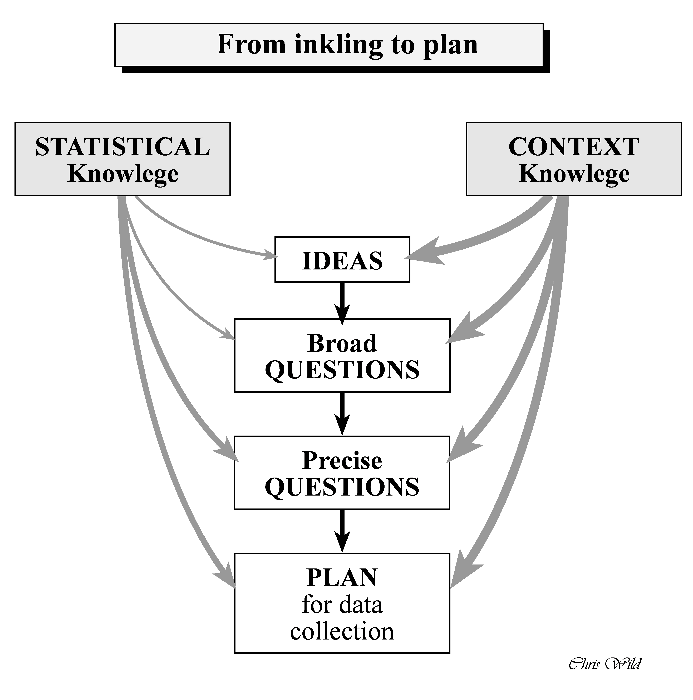

```{r set-options, echo=FALSE, cache=FALSE}
knitr::opts_chunk$set(comment=NA)
options(width = 60)
```


## from *The Art of Statistics* 

**Chapter 2**: Summarizing and Communicating Numbers. Lots of Numbers.

- A variety of statistics can be used to summarize the empirical distribution of data points, including measures of location and spread.
- Skewed data distributions are common, and some summary statistics are very sensitive to outlying values.
- Data summaries always hide some detail, and care is required so that important information is not lost.
- Single sets of numbers can be visualised in strip-charts, box-and-whisker plots and histograms.
- Consider transformations to better reveal patterns, and use the eye to detect patterns, outliers, similarities and clusters.

(*list continues on next slide*)

## *The Art of Statistics*

**Chapter 2**: Summarizing and Communicating Numbers. Lots of Numbers.

(*continuing from previous slide*)

- Look at pairs of numbers as scatter-plots, and time series as line-graphs.
- When exploring data, a primary aim is to find factors that explain the overall variation.
- Graphics can be both interactive and animated.
- Infographics highlight interesting features and can guide the viewer through a story, but should be used with awareness of their purpose and their impact.

## How might we mostly effectively summarize these data?

Question 1. Excitement about statistics and data science?

- 1 = I have nightmares about this class. 
- 10 = Nate Silver is my hero.

```
45566 77777 77788 88888 88888 88999 99999 99999 99000 00000
```

Question 2. Interest in US Democratic Primary?

- 10 = I am obsessed with it.  
- 1 = I would have difficulty caring less.

```
00009 99999 98888 88888 88877 77777 76666 65555 55422 22211
```

# Working with a Large Survey

## BRFSS and SMART 

The Centers for Disease Control analyzes Behavioral Risk Factor Surveillance System (BRFSS) survey data for specific metropolitan and micropolitan statistical areas (MMSAs) in a program called the [Selected Metropolitan/Micropolitan Area Risk Trends of BRFSS](https://www.cdc.gov/brfss/smart/Smart_data.htm) (SMART BRFSS.)

In this work, we will focus on [data from the 2017 SMART](https://www.cdc.gov/brfss/smart/smart_2017.html), and in particular on data from the Cleveland-Elyria, OH, Metropolitan Statistical Area. 

Note that the Course Notes (from Chapter 2) describe the work of cleaning the data in gruesome detail. Today, we'll work with a smaller chunk of the data developed there.

## Setup

```{r, warning = FALSE, message = FALSE}
library(here); library(magrittr); library(janitor)
library(broom); library(simputation); library(patchwork)
library(tidyverse)

theme_set(theme_bw())

smart0 <- read_csv(here("data/smart_ohio.csv")) 
```

Get the data on the [\color{blue}{Data and Code page}](https://github.com/THOMASELOVE/432-data) (green button to download all)

## Winnowing the Variables

```{r}
dim(smart0)
names(smart0)
```

## For our In-Class Work ...

```{r}
smart1 <- smart0 %>%
    mutate(SEQNO = as.character(SEQNO)) %>%
    select(SEQNO, mmsa, mmsa_wt, landline, 
           age_imp, healthplan, dm_status,
           fruit_day, drinks_wk, activity,
           smoker, physhealth, bmi, genhealth)

dim(smart1)
```

## Our 14 Variables in `smart1`

```{r}
str(smart1)
```

## Metropolitan Statistical Areas

```{r}
smart1 %>% count(mmsa)
```

## Bar Chart, version 1 (code)

```{r, eval = FALSE}
ggplot(smart1, aes(x = mmsa)) +
  geom_bar()
```

## Bar Chart, version 1

```{r, echo = FALSE}
ggplot(smart1, aes(x = mmsa)) +
  geom_bar()
```

## Bar Chart, version 2 (code)

```{r, eval = FALSE}
ggplot(smart1, aes(x = fct_infreq(mmsa), fill = mmsa)) +
  geom_bar() 
```

## Bar Chart, version 2

```{r, echo = FALSE}
ggplot(smart1, aes(x = fct_infreq(mmsa), fill = mmsa)) +
  geom_bar() 
```

## Bar Chart, version 3 (code)

```{r, eval = FALSE}
ggplot(smart1, aes(x = fct_infreq(mmsa), fill = mmsa)) +
  geom_bar() + 
  geom_text(aes(label = ..count..), stat = "count", 
            hjust = 1.2, size = 5, col = "white") +
  coord_flip() +
  guides(fill = FALSE) +
  labs(x = "",
       y = "Number of Respondents",
       title = "BRFSS / SMART 2017 Respondents by Ohio MMSA")
```

## Bar Chart, version 3 

```{r, echo = FALSE}
ggplot(smart1, aes(x = fct_infreq(mmsa), fill = mmsa)) +
  geom_bar() + 
  geom_text(aes(label = ..count..), stat = "count", 
            hjust = 1.2, size = 5, col = "white") +
  coord_flip() +
  guides(fill = FALSE) +
  labs(x = "",
       y = "Number of Respondents",
       title = "BRFSS / SMART 2017 Respondents by Ohio MMSA")
```

## Cleveland Dot Plot (code)

```{r}
smart1 %>% tabyl(mmsa)
```

```{r, eval = FALSE}
smart1 %>% tabyl(mmsa) %>%
  ggplot(., aes(x = n, y = reorder(mmsa, n))) +
  geom_point(size = 3) +
  labs(y = "",
       x = "Number of Respondents",
       title = "BRFSS / SMART 2017 Ohio MMSA Respondents")
```

## Cleveland Dot Plot

```{r, echo = FALSE}
smart1 %>% tabyl(mmsa) %>%
  ggplot(., aes(x = n, y = reorder(mmsa, n))) +
  geom_point(size = 3) +
  labs(y = "",
       x = "Number of Respondents",
       title = "BRFSS / SMART 2017 Ohio MMSA Respondents")
```

## Subject Identifiers

```{r}
smart1 %>% select(SEQNO, mmsa_wt) %>% head()
```


## Our Remaining Variables, by Type

Variable | Type | Description
--------- | :----: | --------------------------------
`landline` | Binary (1/0) | survey conducted by landline? (vs. cell)
`healthplan` | Binary (1/0) | subject has health insurance?
`age_imp` | Quantitative | age (imputed from groups - see Notes)
`fruit_day` | Quantitative | mean servings of fruit / day
`drinks_wk` | Quantitative | mean alcoholic drinks / week
`bmi` | Quantitative | body-mass index (in kg/m^2^)
`physhealth` | Count (0-30) | of last 30 days, # in poor physical health
`dm_status` | Categorical | diabetes status (4 levels)
`activity` | Categorical | physical activity level (4 levels)
`smoker` | Categorical | smoking status (4 levels)
`genhealth` | Categorical | self-reported overall health (5 levels)

## *The Art of Statistics*

**Chapter 1**: Getting Things in Proportion: Categorical Data and Percentages

- Binary variables are yes/no questions, sets of which can be summarized as proportions.
- Positive or negative framing of proportions can change their emotional impact.
- Relative risks tend to convey an exaggerated importance, and absolute risks should be provided for clarity.
- Expected frequencies promote understanding and an appropriate sense of importance.
- Odds ratios arise from scientific studies but should not be used for general communication.
- Graphics need to be chosen with care and awareness of their impact.

## Managing our Binary Variables

```{r}
smart1 %>% count(landline)
```

```{r}
smart1 %>% tabyl(healthplan)
```

## Can we impute the missing `healthplan` information?

Take a random draw from the existing distribution of `healthplan`?

```{r}
set.seed(2020432)
smart1 <- smart1 %>%
    mutate(healthplan_i1 = healthplan) %>%
  data.frame() %>%
    impute_rhd(., healthplan_i1 ~ 1) %>%
  tbl_df()
```

- Why do we need the `data.frame` to `tbl_df()` shuffle here?

## Simple imputation of `healthplan`: another option?

Use a model based on other (known) variables to impute `healthplan`?

```{r}
set.seed(2020432)
smart1 <- smart1 %>%
    mutate(healthplan_i2 = factor(healthplan)) %>%
  data.frame() %>%
    impute_cart(., healthplan_i2 ~ landline + mmsa) %>%
  tbl_df()
```

- Why is it important to include `factor` here?

## After simple imputation of `healthplan`

```{r}
smart1 %>% 
  count(healthplan, healthplan_i1, healthplan_i2)
```

## Was survey mode associated with `healthplan`?

Let's ignore the missing data for a moment...

```{r}
sm1 <- smart1 %>% 
  filter(complete.cases(landline, healthplan)) 

sm1 %>% tabyl(landline, healthplan)
```

## Building a Better Table

```{r}
sm1 %>% tabyl(landline, healthplan) %>%
  adorn_totals() %>%
  adorn_percentages() %>%
  adorn_pct_formatting() %>%
  adorn_ns(position = "front")
```

## Rearranging to form a useful 2 by 2 table

```{r}
sm1 <- sm1 %>%
  mutate(insurance = 
           fct_recode(factor(healthplan),
                      Insured = "1",
                      No_Ins = "0"),
         insurance = fct_relevel(insurance, "Insured"),
         style = 
           fct_recode(factor(landline),
                      Land = "1",
                      Cell = "0"),
         style = fct_relevel(style, "Land"))

sm1 %$% table(style, insurance)         
```

## Various 2x2 Table Analyses all at once...

```{r}
Epi::twoby2(sm1 %$% table(style, insurance), 
            conf.level = 0.9)
```

## What's the best way to describe the results?

- Probability comparison?

96.8% of those reached by landline had insurance.
92.5% of those reached by cell phone had insurance.

- probability difference is 4.3 percentage points
- relative risk is 1.0467 (0.968/0.925)

Probability of having insurance was 4.67% higher among those contacted by landline.

## What's the best way to describe the results?

- odds ratio = 2.4646

Those contacted by landline had almost 2.5 times the odds of having insurance as compared those contacted by cell phone.

- Difference in Expectation?

282 of the 3755 who answered by cell phone had no insurance.
If the rate for those reached by landline applied to these people, too, then only 120 would have been expected to be without insurance.

## Our Quantitative Variables

```{r, message = FALSE}
smart1 %>% 
  select(age_imp, fruit_day, drinks_wk, bmi) %>%
  mosaic::inspect()
```

## Before we deal with the missingness... (code)

```{r, eval = FALSE}
p_age <- ggplot(smart1, aes(x = age_imp)) + 
  geom_histogram(bins = 30)

p_fru <- ggplot(smart1, aes(x = fruit_day)) +
  geom_histogram(bins = 30)

p_dri <- ggplot(smart1, aes(x = drinks_wk)) +
  geom_histogram(bins = 30)

p_bmi <- ggplot(smart1, aes(x = bmi)) +
  geom_histogram(bins = 30)

(p_age + p_fru) / (p_dri + p_bmi)
```

## Histograms (suppressing NA warning message)

```{r, echo = FALSE, warning = FALSE}
p_age <- ggplot(smart1, aes(x = age_imp)) + 
  geom_histogram(bins = 30)

p_fru <- ggplot(smart1, aes(x = fruit_day)) +
  geom_histogram(bins = 30)

p_dri <- ggplot(smart1, aes(x = drinks_wk)) +
  geom_histogram(bins = 30)

p_bmi <- ggplot(smart1, aes(x = bmi)) +
  geom_histogram(bins = 30)

(p_age + p_fru) / (p_dri + p_bmi)
```

## Should we put `fruit_day` on a log scale? (code)

```{r, eval = FALSE, warning = FALSE}
p_1 <- ggplot(smart1, aes(x = fruit_day + 0.01)) +
  geom_histogram(bins = 30) +
  scale_x_log10() +
  labs(title = "Original data plotted on log scale")

p_2 <- ggplot(smart1, aes(x = log10(fruit_day + 0.01))) +
  geom_histogram(bins = 30) +
  labs(title = "Logged data plotted on linear scale")

p_1 / p_2
```

## Should we put `fruit_day` on a log scale?

```{r, echo = FALSE, warning = FALSE}
p_1 <- ggplot(smart1, aes(x = fruit_day + 0.01)) +
  geom_histogram(bins = 30) +
  scale_x_log10() +
  labs(title = "Original data plotted on log scale")

p_2 <- ggplot(smart1, aes(x = log10(fruit_day + 0.01))) +
  geom_histogram(bins = 30) +
  labs(title = "Logged data plotted on linear scale")

p_1 / p_2
```


## Simple Imputation of Quantities based on other variables?

```{r}
set.seed(2020432)
smart1 <- smart1 %>%
    mutate(age_imp_i = age_imp,
           fruit_day_i = fruit_day,
           drinks_wk_i = drinks_wk,
           bmi_i = bmi) %>%
  data.frame() %>%
    impute_rlm(., 
                age_imp_i + fruit_day_i + 
                  drinks_wk_i + bmi_i ~ 
                  mmsa + landline + healthplan_i1) %>%
  tbl_df()
```

## Impact of Imputation here?

```{r, echo = FALSE, message = FALSE}
smart1 %>% 
  select(age_imp, age_imp_i, bmi, bmi_i) %>%
  mosaic::inspect() 
```

## Is fruit consumption associated with BMI?

```{r, eval = FALSE}
ggplot(smart1, 
       aes(x = log(fruit_day_i + 0.01), y = bmi_i)) +
  geom_point() +
  geom_smooth(method = "lm", se = TRUE, col = "red") +
  geom_smooth(method = "loess", se = FALSE, col = "blue") +
  labs(x = "Natural logarithm of fruit consumption",
       y = "Body-Mass Index")
```

What do you think you'll see?

## Is fruit consumption associated with BMI?

```{r, echo = FALSE}
ggplot(smart1, 
       aes(x = log(fruit_day_i + 0.01), y = bmi_i)) +
  geom_point() +
  geom_smooth(method = "lm", se = TRUE, col = "red") +
  geom_smooth(method = "loess", se = FALSE, col = "blue") +
  labs(x = "Natural logarithm of fruit consumption",
       y = "Body-Mass Index")
```


## A Count (days of poor physical health in last 30)

```{r}
a <- smart1 %>% tabyl(physhealth) %>% adorn_pct_formatting()
head(a, 3); tail(a, 3); rm(a)
```

```{r}
smart1 %$% mosaic::favstats(~ physhealth)
```

## Simple Imputation for `physhealth` based on `bmi`

```{r}
set.seed(2020432)
smart1 <- smart1 %>%
    mutate(physhealth_i = physhealth) %>%
  data.frame() %>%
    impute_knn(., physhealth_i ~ bmi_i) %>%
  tbl_df()
```

- Why k-nearest neighbors here?

## Results of imputation for `physhealth`

```{r}
a <- smart1 %>% filter(is.na(physhealth)) %>% 
  tabyl(physhealth_i) 

head(a, 3); tail(a, 3); rm(a)
```

## Our Multi-Categorical Variables 

```{r}
smart1 %>% 
  select(SEQNO, dm_status, activity, smoker, genhealth) %>% 
  slice(201:204)
```

What should we do here?

## Using `type.convert()`

```{r}
smart1 <- smart1 %>% type.convert() 
smart1 %>% 
  select(SEQNO, dm_status, activity, smoker, genhealth) %>% 
  slice(431:432)
```

- What does `type.convert()` do here?

## `dm_status` is now a factor

```{r}
smart1 %>% tabyl(dm_status)
```

## We could collapse to a binary (Yes/No) factor here...

```{r}
smart1 <- smart1 %>%
  mutate(dm_f = 
           fct_collapse(factor(dm_status),
                        Yes = "Diabetes",
                        No = c("No-Diabetes", 
                               "Pre-Diabetes", 
                               "Pregnancy-Induced")))
```

## Simple Hot Deck Imputation for `dm_f`

```{r}
set.seed(2020432)
smart1 <- smart1 %>%
    mutate(dm_f_i = dm_f) %>%
  data.frame() %>%
    impute_rhd(., dm_f_i ~ 1) %>%
  tbl_df()
```

## Sanity Check

```{r}
smart1 %>% count(dm_status, dm_f, dm_f_i)
```

## Is diabetes status associated with BMI?

```{r, eval = FALSE}
ggplot(smart1, 
       aes(x = dm_f_i, y = bmi_i, fill = dm_f_i)) +
  geom_violin(alpha = 0.3) +
  geom_boxplot(width = 0.3) +
  scale_fill_brewer(type = "qual") +
  guides(fill = FALSE) +
  coord_flip() +
  labs(x = "Does the subject have diabetes?",
       y = "Body-Mass Index")
```

## Is diabetes status associated with BMI?

```{r, echo = FALSE}
ggplot(smart1, 
       aes(x = dm_f_i, y = bmi_i, fill = dm_f_i)) +
  geom_violin(alpha = 0.3) +
  geom_boxplot(width = 0.3) +
  scale_fill_brewer(type = "qual") +
  guides(fill = FALSE) +
  coord_flip() +
  labs(x = "Does the subject have diabetes?",
       y = "Body-Mass Index")
```


## `smoker`

```{r}
smart1 %>% tabyl(smoker)
```

Suppose we want to collapse the two "Current" categories together, and then impute?

## Collapsing then imputing `smoker` into `smoker_i`

```{r}
set.seed(2020432)
smart1 <- smart1 %>%
  mutate(smoker_f = 
           fct_collapse(factor(smoker), 
                        Current = c("Current_not_daily",
                                    "Current_daily")),
         smoker_i = smoker_f) %>%
  data.frame() %>%
    impute_rhd(., smoker_i ~ 1) %>%
  tbl_df()
```


## Sanity Check

```{r}
smart1 %>% tabyl(smoker, smoker_i)
```

## `activity`

```{r}
smart1 %>% tabyl(activity)
```

What should we clean up here?

## Imputing then Re-sorting the levels of `activity`

```{r}
set.seed(2020432)
smart1 <- smart1 %>%
  mutate(activity_i = factor(activity)) %>%
  data.frame() %>%
    impute_rhd(., activity_i ~ 1) %>%
  tbl_df() %>%
  mutate(activity_i = 
           fct_relevel(activity_i,
                       "Highly_Active",
                       "Active", "Insufficiently_Active",
                       "Inactive"))
```

## Sanity Check

```{r, warning = FALSE}
smart1 %>% count(activity_i, activity)
```


## `genhealth`

```{r}
smart1 %>% tabyl(genhealth)
```

Let's impute here with `activity_i`, `physhealth_i`, `mmsa` and `healthplan`

## Simple Imputation of `genhealth`

```{r}
set.seed(2020432)
smart1 <- smart1 %>%
  mutate(genhealth_i = factor(genhealth)) %>%
  data.frame() %>%
    impute_cart(., genhealth_i ~ activity_i + physhealth_i +
                  factor(mmsa) + healthplan) %>%
  tbl_df()
```

## Checking the Imputation's Impact

```{r}
smart1 %>% tabyl(genhealth, genhealth_i)
```

## Fitting a Huge Regression Model

Without Imputation

```{r}
model1 <- lm(bmi ~ mmsa + healthplan + age_imp + fruit_day +
               drinks_wk + physhealth + dm_f + activity +
               smoker_f + genhealth, data = smart1)
```

Using the Imputed Values

```{r}
model1_i <- lm(bmi_i ~ mmsa + healthplan_i1 + age_imp_i + 
               fruit_day_i + drinks_wk_i + physhealth_i + 
               dm_f_i + activity_i + smoker_i + 
               genhealth_i, data = smart1)
```

## Compare the Two Models?

```{r}
glance(model1) %>% 
  select(r.squared, sigma, df, df.residual, AIC, BIC)
glance(model1_i) %>% 
  select(r.squared, sigma, df, df.residual, AIC, BIC)
```

- Why are the `df` different?

## From model1 (no imputation)

```{r}
tidy(model1, conf.int = TRUE, conf.level = 0.9) %>% 
  select(term, estimate, std.error, conf.low, conf.high) %>%
  slice(1:2)
```

```{r}
tidy(model1_i, conf.int = TRUE, conf.level = 0.9) %>% 
  select(term, estimate, std.error, conf.low, conf.high) %>%
  slice(1:2)
```


## *The Art of Statistics*: How to **Learn** From Data

**Introduction**: Why We Need Statistics / Turning the World into Data 

- Turning experiences into data is not straightforward, and data is inevitably limited in its capacity to describe the world.
- Statistical science has a long and successful history, but is now changing in the light of increased availability of data.
- Skill in statistical methods plays an important part of being a data scientist.
- Teaching statistics is changing from a focus on mathematical methods to one based on an entire problem-solving cycle.
- The PPDAC cycle provides a convenient framework...
    - Problem - Plan - Data - Analysis - Conclusion and communication.
- Data literacy is a key skill for the modern world.

---


- Chris Wild, https://www.stat.auckland.ac.nz/~wild/StatThink/

---




