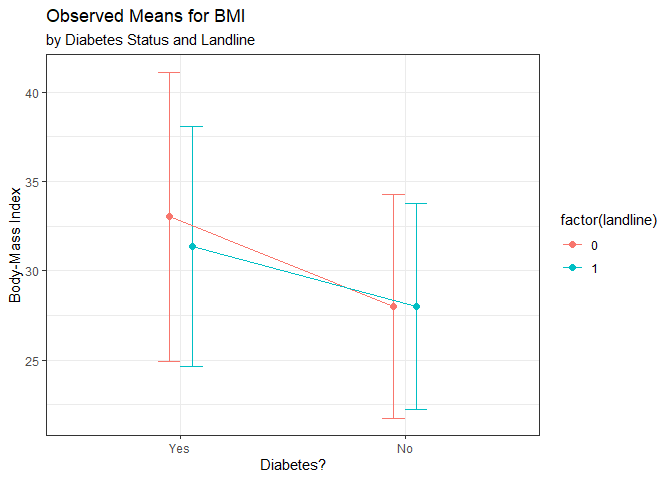
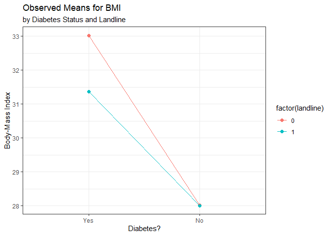
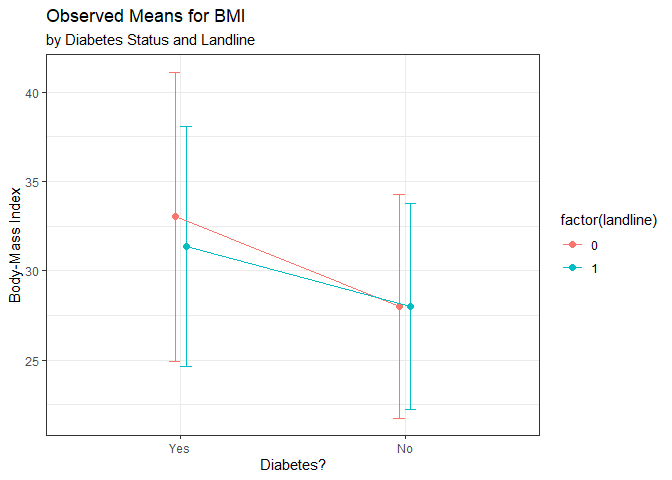

Interaction Plots and Jitter Example
================
Thomas E. Love
posted 2020-01-25

``` r
library(here); library(magrittr); library(janitor)
library(broom); library(simputation); library(patchwork)
library(naniar); library(visdat)
library(tidyverse)

theme_set(theme_bw())

smart1 <- readRDS(here("data/smart1.Rds"))
smart1_sh <- readRDS(here("data/smart1_sh.Rds"))
```

``` r
summ0 <- smart1_sh %>% 
  group_by(dm_status, landline) %>%
  summarize(n = n(), mean = mean(bmi), stdev = sd(bmi))

summ0 %>% knitr::kable(digits = 2)
```

| dm\_status | landline |    n |  mean | stdev |
| :--------- | -------: | ---: | ----: | ----: |
| Yes        |        0 |  411 | 33.02 |  8.11 |
| Yes        |        1 |  691 | 31.36 |  6.71 |
| No         |        0 | 3352 | 28.02 |  6.27 |
| No         |        1 | 2958 | 28.01 |  5.76 |

## Original Interaction Plot

``` r
pd <- position_dodge(0.2)
ggplot(summ0, aes(x = dm_status, y = mean,
                       col = factor(landline))) +
  geom_errorbar(aes(ymin = mean - stdev,
                    ymax = mean + stdev),
                width = 0.2, position = pd) +
  geom_point(size = 2, position = pd) +
  geom_line(aes(group = factor(landline)), position = pd) +
  labs(y = "Body-Mass Index",
       x = "Diabetes?",
       title = "Observed Means for BMI", 
       subtitle = "by Diabetes Status and Landline")
```

<!-- -->

## Revised Plot without “Dodging” or Error Bars

``` r
ggplot(summ0, aes(x = dm_status, y = mean,
                       col = factor(landline))) +
  geom_point(size = 2) +
  geom_line(aes(group = factor(landline))) +
  labs(y = "Body-Mass Index",
       x = "Diabetes?",
       title = "Observed Means for BMI", 
       subtitle = "by Diabetes Status and Landline")
```

<!-- -->

## Interaction Plot with Error Bars but Half the “Dodging”

``` r
pd <- position_dodge(0.1)
ggplot(summ0, aes(x = dm_status, y = mean,
                       col = factor(landline))) +
  geom_errorbar(aes(ymin = mean - stdev,
                    ymax = mean + stdev),
                width = 0.1, position = pd) +
  geom_point(size = 2, position = pd) +
  geom_line(aes(group = factor(landline)), position = pd) +
  labs(y = "Body-Mass Index",
       x = "Diabetes?",
       title = "Observed Means for BMI", 
       subtitle = "by Diabetes Status and Landline")
```

<!-- -->
