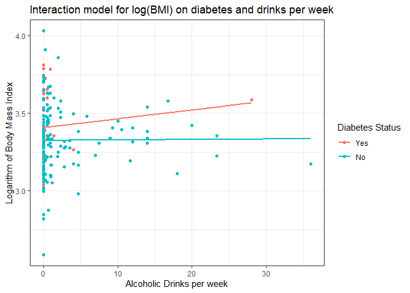
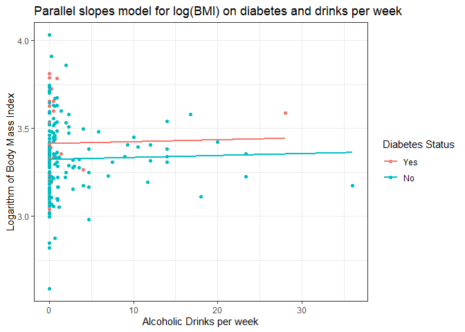

Modern Dive Tools: A Quick Example
================
432 Class 6: 2020-01-30

``` r
library(here); library(magrittr); library(janitor)
library(broom); library(patchwork)
library(moderndive)
library(tidyverse)

theme_set(theme_bw())

smart1_sh <- readRDS(here("data/smart1_sh.Rds"))
```

It will be helpful for our little example here to take a sample of 200
subjects.

``` r
set.seed(4322020)
small_smart <- smart1_sh %>% 
    sample_n(size = 200, replace = FALSE)

small_smart %>% tabyl(dm_status)
```

``` 
 dm_status   n percent
       Yes  33   0.165
        No 167   0.835
```

We’re also going to predict the logarithm of BMI, and I’ll create a
variable containing that information.

``` r
small_smart <- small_smart %>%
    mutate(logbmi = log(bmi))
```

We’ll fit a linear regression model to predict the natural logarithm of
`bmi` using one categorical variable (`dm_status`) and one quantitative
variable (`drinks_wk`). We’ll include an interaction term between the
two predictors.

``` r
model1_interaction <- small_smart %$%
    lm(logbmi ~ dm_status * drinks_wk)
```

## Summarizing a Linear Model (with `moderndive` tools)

The `moderndive` package includes several tools for presenting a
regression model quickly, including `get_regression_table`,
`get_regression_summaries` and `get_regression_points`. All of these
tools do the same thing (essentially) as the tools we’ve developed using
the `broom` package.

### `get_regression_table()` and `broom::tidy()`

``` r
get_regression_table(model1_interaction)
```

    # A tibble: 4 x 7
      term                  estimate std_error statistic p_value lower_ci upper_ci
      <chr>                    <dbl>     <dbl>     <dbl>   <dbl>    <dbl>    <dbl>
    1 intercept                3.41      0.037    91.0     0        3.33     3.48 
    2 dm_statusNo             -0.082     0.041    -1.99    0.048   -0.164   -0.001
    3 drinks_wk                0.006     0.008     0.753   0.453   -0.009    0.021
    4 dm_statusNo:drinks_wk   -0.005     0.008    -0.659   0.511   -0.022    0.011

  - We can mirror this `get_regression_table()` output using the
    `tidy()` function in the `broom` package.

<!-- end list -->

``` r
tidy(model1_interaction, conf.int = TRUE)
```

``` 
# A tibble: 4 x 7
  term                 estimate std.error statistic   p.value conf.low conf.high
  <chr>                   <dbl>     <dbl>     <dbl>     <dbl>    <dbl>     <dbl>
1 (Intercept)           3.41      0.0375     91.0   2.99e-162  3.33     3.48    
2 dm_statusNo          -0.0824    0.0414     -1.99  4.81e-  2 -0.164   -0.000685
3 drinks_wk             0.00570   0.00758     0.753 4.53e-  1 -0.00925  0.0207  
4 dm_statusNo:drinks_~ -0.00540   0.00820    -0.659 5.11e-  1 -0.0216   0.0108  
```

### `get_regression_summaries()` and `broom::glance()`

``` r
get_regression_summaries(model1_interaction)
```

    # A tibble: 1 x 8
      r_squared adj_r_squared    mse  rmse sigma statistic p_value    df
          <dbl>         <dbl>  <dbl> <dbl> <dbl>     <dbl>   <dbl> <dbl>
    1     0.027         0.012 0.0428 0.207 0.209      1.84   0.142     4

  - The `get_regression_summaries` tool mostly mirrors what we get from
    the `glance()` function in `broom`.

<!-- end list -->

``` r
glance(model1_interaction)
```

    # A tibble: 1 x 11
      r.squared adj.r.squared sigma statistic p.value    df logLik   AIC   BIC
          <dbl>         <dbl> <dbl>     <dbl>   <dbl> <int>  <dbl> <dbl> <dbl>
    1    0.0273        0.0124 0.209      1.84   0.142     4   31.4 -52.8 -36.3
    # ... with 2 more variables: deviance <dbl>, df.residual <int>

### `get_regression_points()` and `broom::augment()`

``` r
get_regression_points(model1_interaction)
```

    # A tibble: 200 x 6
          ID logbmi dm_status drinks_wk logbmi_hat residual
       <int>  <dbl> <fct>         <dbl>      <dbl>    <dbl>
     1     1   3.24 Yes            0          3.41   -0.167
     2     2   3.59 No             0          3.32    0.269
     3     3   3.47 No             2.33       3.32    0.147
     4     4   3.15 No             2.8        3.32   -0.173
     5     5   3.91 No             0.23       3.32    0.586
     6     6   3.58 No            16.8        3.33    0.252
     7     7   3.40 No             0          3.32    0.071
     8     8   3.35 No             0          3.32    0.026
     9     9   3.20 No             0          3.32   -0.124
    10    10   3.53 No             0          3.32    0.206
    # ... with 190 more rows

The `get_regression_points()` function is, of course, similar to what we
get from `broom`’s `augment()`.

``` r
augment(model1_interaction)
```

    # A tibble: 200 x 10
       logbmi dm_status drinks_wk .fitted .se.fit  .resid    .hat .sigma .cooksd
        <dbl> <fct>         <dbl>   <dbl>   <dbl>   <dbl>   <dbl>  <dbl>   <dbl>
     1   3.24 Yes            0       3.41  0.0375 -0.167  0.0321   0.209 5.51e-3
     2   3.59 No             0       3.32  0.0177  0.269  0.00714  0.209 3.01e-3
     3   3.47 No             2.33    3.33  0.0162  0.147  0.00599  0.209 7.47e-4
     4   3.15 No             2.8     3.33  0.0163 -0.173  0.00605  0.209 1.05e-3
     5   3.91 No             0.23    3.32  0.0174  0.586  0.00692  0.205 1.38e-2
     6   3.58 No            16.8     3.33  0.0481  0.252  0.0530   0.209 2.15e-2
     7   3.40 No             0       3.32  0.0177  0.0706 0.00714  0.209 2.07e-4
     8   3.35 No             0       3.32  0.0177  0.0260 0.00714  0.209 2.81e-5
     9   3.20 No             0       3.32  0.0177 -0.124  0.00714  0.209 6.37e-4
    10   3.53 No             0       3.32  0.0177  0.206  0.00714  0.209 1.76e-3
    # ... with 190 more rows, and 1 more variable: .std.resid <dbl>

## Plotting the Model with and without Interaction (`geom_parallel_slopes`)

### Model with Interaction

Suppose we want to plot our `model1_interaction`, which includes the
interaction between `dm_status` and `drinks_wk`. We’d use something like
this:

``` r
ggplot(small_smart, aes(x = drinks_wk, y = logbmi, color = dm_status)) + 
    geom_point() +
    geom_smooth(method = "lm", se = FALSE) +
    labs(x = "Alcoholic Drinks per week", 
         y = "Logarithm of Body Mass Index",
         color = "Diabetes Status",
         title = "Interaction model for log(BMI) on diabetes and drinks per week") 
```

<!-- -->

The slopes here are not parallel, of course, because our model includes
diabetes status, drinks per week, **and** their interaction.

### “Parallel Slopes” Model (No Interaction)

Suppose we wanted to plot what the model would look like if we fit it
without the interaction, in other words a model with parallel slopes for
the diabetes = Yes and diabetes = No groups. The `moderndive` package
provides `geom_parallel_slopes` to let us do this easily.

``` r
ggplot(small_smart, aes(x = drinks_wk, y = logbmi, color = dm_status)) + 
    geom_point() +
    geom_parallel_slopes(se = FALSE) +
    labs(x = "Alcoholic Drinks per week", 
         y = "Logarithm of Body Mass Index",
         color = "Diabetes Status",
         title = "Parallel slopes model for log(BMI) on diabetes and drinks per week") 
```

<!-- -->

We see that in the parallel slopes model, the two lines (one for those
with diabetes, one without) have the same slope but differing
intercepts. To fit the parallel slopes model in `lm`, we’d use

``` r
model1_parallel_slopes <- small_smart %$%
    lm(logbmi ~ dm_status + drinks_wk)

get_regression_table(model1_parallel_slopes)
```

    # A tibble: 3 x 7
      term        estimate std_error statistic p_value lower_ci upper_ci
      <chr>          <dbl>     <dbl>     <dbl>   <dbl>    <dbl>    <dbl>
    1 intercept      3.41      0.036    93.5     0        3.34     3.48 
    2 dm_statusNo   -0.09      0.04     -2.25    0.026   -0.168   -0.011
    3 drinks_wk      0.001     0.003     0.377   0.706   -0.005    0.007

See [ModernDive’s Chapter on Multiple
Regression](https://moderndive.com/6-multiple-regression.html) for more
information.
