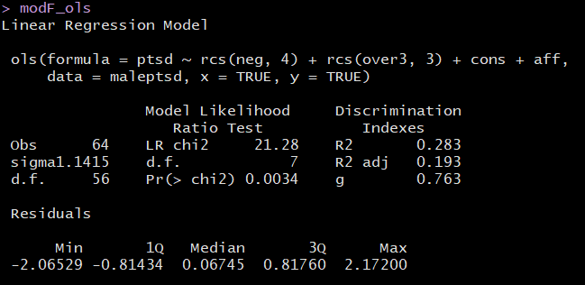

```{r set-options, echo=FALSE, cache=FALSE}
knitr::opts_chunk$set(comment=NA)
options(width = 60)
```

## Setup

```{r, warning = FALSE, message = FALSE}
library(janitor); library(magrittr); library(here)

library(skimr)
library(broom)
library(rms)
library(patchwork)
library(GGally)

library(tidyverse)

theme_set(theme_bw())
```

## Today's Materials

- The `maleptsd` data
- Using `ols` to fit a linear model
    - ANOVA in `ols`
    - Plot Effects with `summary` and `Predict`
    - Validating summary statistics like R^2^
    - Nomogram
    - Evaluating Calibration 
- Spending Degrees of Freedom on Non-Linearity
    + The Spearman $\rho^2$ (rho-squared) plot
- Building Non-Linear Predictors with 
    + Polynomial Functions
    + Splines, including Restricted Cubic Splines

# The `maleptsd` data: Background and Exploration

## The `maleptsd` data

The `maleptsd` file on our web site contains information on PTSD (post traumatic stress disorder) symptoms following childbirth for 64 fathers^[Source: Ayers et al. 2007 *J Reproductive and Infant Psychology*. The data are described in more detail in Wright DB and London K (2009) *Modern Regression Techniques Using R* Sage Publications.].  There are ten predictors and the response is a measure of PTSD symptoms. The raw, untransformed values (`ptsd_raw`) are right skewed and contain zeros, so we will work with a transformation, specifically, `ptsd = log(ptsd_raw + 1)` as our outcome, which also contains a lot of zeros. 

```{r, message = FALSE}
maleptsd <- read_csv(here("data/maleptsd.csv")) %>% 
    clean_names() %>%
    mutate(ptsd = log(ptsd_raw + 1))
```

## Skimming the `maleptsd` data


## Transformation of Outcome

```{r, echo = FALSE}
p1 <- ggplot(maleptsd, aes(x = ptsd_raw)) +
    geom_histogram(bins = 9, fill = "red", col = "white") +
    ylim(c(0, 32)) +
    labs(title = "Original PTSD scores")

p2 <- ggplot(maleptsd, aes(x = ptsd)) +
    geom_histogram(bins = 9, fill = "blue", col = "white") +
    ylim(c(0, 32)) +
    labs(title = "After Transformation")

gridExtra::grid.arrange(p1, p2, nrow = 1)
```

## Scatterplot Matrix

```{r, echo = FALSE}
temp <- maleptsd %>%
    select(over2, over3, over5, bond, posit, neg, contr, 
           sup, cons, aff, ptsd)

GGally::ggpairs(temp)
```

## Using `ols` to fit a Two-Predictor Model

- `ols` is part of the `rms` package, by Frank Harrell and colleagues.

```{r}
dd <- datadist(maleptsd)
options(datadist = "dd")

mod_first <- ols(ptsd ~ over2 + over3, data = maleptsd,
                 x = TRUE, y = TRUE)
```

## Contents of `mod_first`?


## ANOVA for `mod_first` fit by `ols`

```{r}
anova(mod_first)
```

## summary for `mod_first` fit by `ols`

```{r}
summary(mod_first)
```

## Plot the summary to see effect sizes

```{r}
plot(summary(mod_first))
```

## What do the individual effects look like?

```{r}
ggplot(Predict(mod_first))
```

## Validate the summary statistics of an `ols` fit

```{r}
set.seed(432010); validate(mod_first)
```

## Build a nomogram for the `ols` fit

```{r}
plot(nomogram(mod_first))
```

## Is this model well-calibrated?

```{r, fig.height = 5}
set.seed(432); plot(calibrate(mod_first))
```

## Spending degrees of freedom wisely

- Suppose we have a data set with many possible predictors, and minimal theory or subject matter knowledge to guide us.
- We might want our final inferences to be as unbiased as possible. To accomplish this, we have to pay a penalty (in terms of degrees of freedom) for any "peeks" we make at the data in advance of fitting a model.
- So that rules out a lot of decision-making about non-linearity based on looking at the data, if our sample size isn't much larger than 15 times the number of predictors we're considering including in our model.
- In our case, we have n = 64 observations on 10 predictors. 
- In addition, adding non-linearity to our model costs additional degrees of freedom.
- What can we do?

## Spearman's $\rho^2$ plot: A smart first step?

Spearman's $\rho^2$ is an indicator (not a perfect one) of potential predictive punch, but doesn't give away the game.

- Idea: Perhaps we should focus our efforts re: non-linearity on predictors that score better on this measure.

```{r}
spear_ptsd <- spearman2(ptsd ~ over2 + over3 + over5 + bond +
                   posit + neg + contr + sup + cons + aff, 
               data = maleptsd)
```

## Spearman's $\rho^2$ Plot

```{r, fig.height = 5}
plot(spear_ptsd)
```

## Conclusions from Spearman $\rho^2$ Plot

- `neg` is the most attractive candidate for a non-linear term, as it packs the most potential predictive punch, so if it does turn out to need non-linear terms, our degrees of freedom will be well spent. 
    + By no means is this suggesting that `neg` actually needs a non-linear term, or will show significant non-linearity. We'd have to fit a model with and without non-linearity in `neg` to know that.
    + Non-linearity will often take the form of a product term, a polynomial term, or a restricted cubic spline.
    + Since all of these predictors are quantitative, we'll think about polynomial or spline terms, soon.
- `over3`, also quantitative, has the next most potential predictive punch
- these are followed by `cons` and `aff`

## Grim Reality

With 64 observations (63 df) we should be thinking about models with relatively tiny numbers of regression inputs. 

- Non-linear terms (polynomials, splines) just add to the problem, as they need additional df to be estimated.

In this case, we might choose between 

- including non-linearity in one (or maybe 2) variables (and that's it),
- or a linear model including maybe 3-4 predictors, tops

and even that would be tough to justify with this small sample size.

## Contents of `spear_ptsd`

```{r}
spear_ptsd
```

# Actually Building Non-Linear Models

## Predicting `ptsd` from `over2`

```{r, echo = FALSE}
ggplot(maleptsd, aes(x = over2, y = ptsd)) +
    geom_point() + 
    geom_smooth(method = "lm", se = FALSE, col = "blue") +
    geom_smooth(method = "loess", se = FALSE, col = "red") +
    labs(title = "Linear and Loess Smooths of ptsd vs. over2")
```

## Linear Fit - does this work well?

```{r, fig.height = 5}
plot(lm(ptsd ~ over2, data = maleptsd), which = 1)
```

## Polynomial Regression

A polynomial in the variable `x` of degree D is a linear combination of the powers of `x` up to D.

For example:

- Linear: $y = \beta_0 + \beta_1 x$
- Quadratic: $y = \beta_0 + \beta_1 x + \beta_2 x^2$
- Cubic: $y = \beta_0 + \beta_1 x + \beta_2 x^2 + \beta_3 x^3$
- Quartic: $y = \beta_0 + \beta_1 x + \beta_2 x^2 + \beta_3 x^3 + \beta_4 x^4$
- Quintic: $y = \beta_0 + \beta_1 x + \beta_2 x^2 + \beta_3 x^3 + \beta_4 x^4 + \beta_5 x^5$

Fitting such a model creates a **polynomial regression**.

## Raw Quadratic Model for `ptsd` using `over2`

```{r}
modA <- lm(ptsd ~ over2 + I(over2^2), data = maleptsd)
modA
```

$$
ptsd = 1.234 + 0.411 (over2) - 0.042 (over2)^2
$$

## Summary of Quadratic Fit


## Plot Fitted Values of Quadratic Fit

```{r, echo = FALSE}
modA_aug <- augment(modA, maleptsd)

ggplot(modA_aug, aes(x = over2, y = ptsd)) +
    geom_point() +
    geom_line(aes(x = over2, y = .fitted), 
              col = "red") +
    labs(title = "Model A: Quadratic fit")
```

## Code for Previous Slide

```{r, eval = FALSE}
modA_aug <- augment(modA, maleptsd)

ggplot(modA_aug, aes(x = over2, y = ptsd)) +
    geom_point() +
    geom_line(aes(x = over2, y = .fitted), 
              col = "red") +
    labs(title = "Model A: Quadratic fit")
```

## Another Way to fit the Identical Model

```{r}
modA2 <- lm(ptsd ~ pol(over2, degree = 2, raw = TRUE), 
            data = maleptsd)
```


### Do models give same fitted values?

```{r}
temp <- fitted(modA2) - fitted(modA)
sum(temp != 0)
```

## Orthogonal Polynomials

Now, let's fit an orthogonal polynomial of degree 2 to predict `ptsd` using `over2`.

```{r}
modB <- lm(ptsd ~ poly(over2, 2), data = maleptsd)
```

Looks very different ...


## But it fits the same model, exactly!

```{r, echo = FALSE}
modB_aug <- augment(modB, maleptsd)

p1 <- ggplot(modA_aug, aes(x = over2, y = ptsd)) +
    geom_point() +
    geom_line(aes(x = over2, y = .fitted), 
              col = "red") +
    labs(title = "Model A: Quadratic fit")

p2 <- ggplot(modB_aug, aes(x = over2, y = ptsd)) +
    geom_point() +
    geom_line(aes(x = over2, y = .fitted), 
              col = "blue") +
    labs(title = "Model B: Quadratic fit")

gridExtra::grid.arrange(p1, p2, nrow = 1)
```

## Or, if you don't believe me...

```{r, echo = FALSE}
temp <- tibble(modelA = modA_aug$.fitted,
               modelB = modB_aug$.fitted,
               diff = modelB - modelA)

p1 <- ggplot(temp, aes(x = modelA, y = modelB)) +
    geom_point(size = 2) + 
    geom_abline(slope = 1, intercept = 0) +
    labs(x = "Model A fitted value",
         y = "Model B fitted value")

p2 <- ggplot(temp, aes(x = modelA, y = round(diff,5))) +
    geom_point(size = 2) + 
    geom_hline(yintercept = 0) +
    labs(x = "Model A fitted value",
         y = "Model B - Model A difference")

gridExtra::grid.arrange(p1, p2, nrow = 1)
```

## Orthogonal Polynomial

An orthogonal polynomial sets up a model design matrix using the coding we've seen previously: `over2` and `over2^2` in our case, and then scales those columns so that each column is **orthogonal** to the previous ones. 

- Two columns are orthogonal if their correlation is zero.
- This eliminates the collinearity (correlation between predictors) and lets our t tests tell us whether the addition of any particular polynomial term improves the fit of the model over the lower orders.

## Would adding a cubic term help predict `ptsd`?

```{r}
modC <- lm(ptsd ~ poly(over2, 3), data = maleptsd)
```


## Comparing Quadratic (red) and Cubic (blue) Models

```{r, echo = FALSE}
modC_aug <- augment(modC, maleptsd)

ggplot(modC_aug, aes(x = over2, y = ptsd)) +
    geom_point() +
    geom_line(aes(x = over2, y = .fitted),
              col = "blue") +
    geom_line(data = modB_aug, aes(x = over2, y = .fitted), 
              col = "red") +
    labs(title = "Quadratic (red) vs. Cubic (blue) Polynomial Fits")
```

## What if we look instead at `over3` as a predictor?

```{r, echo = FALSE}
ggplot(maleptsd, aes(x = over3, y = ptsd)) + 
    geom_point(size = 2) +
    geom_smooth(method = "loess", se = FALSE, col = "blue") +
    geom_smooth(method = "lm", se = FALSE, col = "red") + 
    labs(title = "Linear and Loess Fits for ptsd vs. over3")
```

## What if we predict using `over3`?

```{r}
modD1 <- lm(ptsd ~ over3, data = maleptsd)
modD2 <- lm(ptsd ~ poly(over3, degree = 2), data = maleptsd)
modD3 <- lm(ptsd ~ poly(over3, degree = 3), data = maleptsd)
```


## Plotting the Fitted Models

```{r, echo = FALSE}
modD1_aug <- augment(modD1, maleptsd)
modD2_aug <- augment(modD2, maleptsd)
modD3_aug <- augment(modD3, maleptsd)

ggplot(maleptsd, aes(x = over3, y = ptsd)) +
    geom_point() +
    geom_line(data = modD1_aug, aes(x = over3, y = .fitted),
              col = "blue", size = 1.25) +
    geom_line(data = modD2_aug, aes(x = over3, y = .fitted),
              col = "black", size = 1.25) +
    geom_line(data = modD3_aug, aes(x = over3, y = .fitted),
              col = "red", size = 1.25) +
    geom_text(x = 3, y = 2.6, label = "Cubic Fit", size = 5, col = "red") +
    geom_text(x = 7, y = 2.5, label = "Quadratic Fit", size = 5, col = "black") +
    geom_text(x = 2.5, y = 1.3, label = "Linear Fit", size = 5, col = "blue") +
    labs(title = "Linear, Quadratic and Cubic Fits for ptsd using over3") 
```

# Using Restricted Cubic Splines to Capture Non-Linearity

## Splines

- A **linear spline** is a continuous function formed by connecting points (called **knots** of the spline) by line segments.
- A **restricted cubic spline** is a way to build highly complicated curves into a regression equation in a fairly easily structured way.
- A restricted cubic spline is a series of polynomial functions joined together at the knots. 
    + Such a spline gives us a way to flexibly account for non-linearity without over-fitting the model.
    + Restricted cubic splines can fit many different types of non-linearities.
    + Specifying the number of knots is all you need to do in R to get a reasonable result from a restricted cubic spline. 

The most common choices are 3, 4, or 5 knots. 

- 3 Knots, 2 degrees of freedom, allows the curve to "bend" once.
- 4 Knots, 3 degrees of freedom, lets the curve "bend" twice.
- 5 Knots, 4 degrees of freedom, lets the curve "bend" three times. 

## Fitting Restricted Cubic Splines with `lm` and `rcs`

For most applications, three to five knots strike a nice balance between complicating the model needlessly and fitting data pleasingly. Let's consider a restricted cubic spline model for `ptsd` based on `over3` again, but now with:

- in `modE3`, 3 knots, and
- in `modE4`, 4 knots,

```{r}
modE3 <- lm(ptsd ~ rcs(over3, 3), data = maleptsd)
modE4 <- lm(ptsd ~ rcs(over3, 4), data = maleptsd)
```

## Summarizing the 4-knot model coefficients

Values of the estimates, and where are the knots located?


## Plotting the spline models

```{r, echo = FALSE}
modE3_aug <- augment(modE3, maleptsd)
modE4_aug <- augment(modE4, maleptsd)

p1 <- ggplot(maleptsd, aes(x = over3, y = ptsd)) +
    geom_point() +
    geom_smooth(method = "lm", col = "black", se = F) +
    labs(title = "Linear Fit") 

p2 <- ggplot(maleptsd, aes(x = over3, y = ptsd)) +
    geom_point() +
    geom_smooth(method = "loess", col = "purple", se = F) +
    labs(title = "Loess Smooth") 

p3 <- ggplot(modE3_aug, aes(x = over3, y = ptsd)) +
    geom_point() +
    geom_line(aes(x = over3, y = .fitted), 
              col = "blue", size = 1.25) +
    labs(title = "RCS, 3 knots") 

p4 <- ggplot(modE4_aug, aes(x = over3, y = ptsd)) +
    geom_point() +
    geom_line(aes(x = over3, y = .fitted), 
              col = "red", size = 1.25) +
    labs(title = "RCS, 4 knots") 

(p1 + p2) / (p3 + p4)
```

## Does the fit improve markedly from 3 to 4 knots?

In-sample comparison via ANOVA

```{r}
anova(modE3, modE4)
```

## Does the fit improve markedly from 3 to 4 knots?

In-Sample comparisons of information criteria, etc.

```{r}
glance(modE3) %>% select(r.squared, adj.r.squared, AIC, BIC)
glance(modE4) %>% select(r.squared, adj.r.squared, AIC, BIC)
```

## Back to Spearman's $\rho^2$ Plot

```{r, fig.height = 5}
plot(spear_ptsd)
```

## Proposed New Model F

Fit a model to predict `ptsd` using:

- a 4-knot spline on `neg`
- a 3-knot spline on `over3`
- a linear term on `cons`
- a linear term on `aff`

Still more than we can reasonably do with 64 observations, but let's see how it looks.

## Fit model F

```{r}
modelF <- lm(ptsd ~ rcs(neg, 4) + rcs(over3, 3) +
                 cons + aff, data = maleptsd)
```


## ANOVA for Model F

```{r}
anova(modelF)
```

Remember that this ANOVA testing is sequential.

## Is Model F better than Model E3?

```{r}
anova(modelF, modE3)
```

## Limitations of `lm` for fitting complex linear models

We can certainly assess this big, complex model using `lm` in comparison to other models:

- with in-sample summary statistics like adjusted R^2^, AIC and BIC,
- we can assess its assumptions with residual plots, and 
- we can also compare out-of-sample predictive quality through cross-validation,

But to really delve into the details of how well this complex model works, and to help plot what is actually being fit, we'll probably want to fit the model using `ols`, from the `rms` package. 

# Using `ols` to fit a complex linear model

## Model F, fitted using `ols`

```{r}
dd <- datadist(maleptsd)
options(datadist = "dd")

modF_ols <- ols(ptsd ~ rcs(neg, 4) + rcs(over3, 3) +
                 cons + aff, data = maleptsd,
                x = TRUE, y = TRUE)
```

## `modF_ols` results (slide 1 of 2)



## `modF_ols` results (slide 2 of 2)


## Validation of Summary Statistics

```{r}
set.seed(4322019); validate(modF_ols)
```

## `anova` results for `modF_ols`

```{r}
anova(modF_ols)
```

## `summary` results for `modF_ols`

```{r}
summary(modF_ols)
```

## Plot of `summary` results for `modF_ols`

```{r, fig.height = 5}
plot(summary(modF_ols))
```

## Nomogram for `modF_ols`

```{r, fig.height = 5}
plot(nomogram(modF_ols))
```

## Seeing the impact of the modeling another way

```{r, fig.height = 5}
ggplot(Predict(modF_ols))
```

## Checking the model's calibration

```{r, fig.height = 5}
set.seed(43220191); plot(calibrate(modF_ols))
```

## Next Time

- The HERS data
- Fitting a more complex linear regression model
    - Dealing with categorical predictors
    - Dealing with interactions (another form of non-linearity)
    - Adding missing data into all of this, and running multiple imputation

