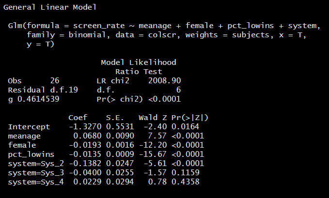
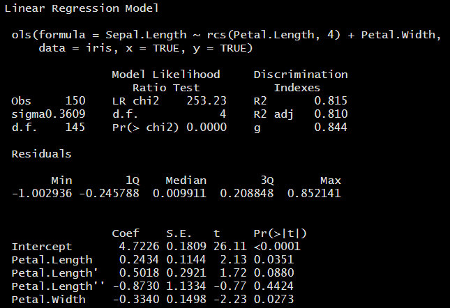

```{r set-options, include = FALSE}
knitr::opts_chunk$set(comment=NA)
options(width = 60)
```

## Setup

```{r, warning = FALSE, message = FALSE}
library(skimr)
library(rms)
library(aplore3) # for a data set
library(ResourceSelection) # for Hosmer-Lemeshow test
library(broom)
library(tidyverse)

colscr <- read.csv("data/screening.csv") %>% tbl_df
colscr2 <- read.csv("data/screening2.csv") %>% tbl_df
```


## Today's Materials

- Logistic Regression 
  - and the NNYFS1 data set
  - on Aggregated Data
  - and describing restricted cubic splines
  - and classification tables
- Probit Regression: A Useful Alternative Link

# Logistic Regression, Data Management and NNYFS

## From an Old Homework Assignment

The data come from the [NHANES National Youth Fitness Survey](http://wwwn.cdc.gov/nchs/nhanes/search/nnyfs12.aspx). Data collected in the `nnyfs1.csv` file on our site come from the **Demographics** files, and from the **Medical Conditions** and **Physical Activity** files, which are each part of the **Questionnaire** data.

I merged files on the basis of the respondent sequence number (SEQN). The seven variables available to you are shown below, and on the next slide.

1. `SEQN` - the *respondent sequence number* (there are 1,576 subjects in the `nnyfs1.csv` file made available to you)
2. `RIASEX` (from the Demographics files) - *sex of subject (1 = male, 2 = female)*

## Variables in NNYFS1 data

3. `RIDAGEYR` (from the Demographics files) - *age in years at screening (3-15)*
4. `RIDRETH1` (from the Demographics files) - *race/hispanic origin (1 = Mexican-American, 2 = Other Hispanic, 3 = Non-Hispanic White, 4 = Non-Hispanic Black, 5 = Other Race including Multi-Racial)*
5. `INDFMPIR` (from the Demographics files; **impute** all subjects with missing values on the basis of `RIDRETH1` and `RIDAGEYR`) - *ratio of family income to poverty (data show 0-4.99, and then truncated as 5 for all who are in fact greater than or equal to 5)*
6. `MCQ010` (from Medical Conditions files; all subjects have values of 1 [Yes] or 2 [No]) - *has the child ever been told they have asthma*
7. `PAQ706` (from the Physical Activity files; **drop** all subjects with values other than 0, 1, 2, 3, 4, 5, 6, or 7) - *days (in the past 7) physically active 60+ minutes* **Treat this as a quantitative count.**

## Questions 

1. What would be the impact of using `clean_names` here?

2. How many of those subjects wind up in your final data set, after applying the inclusion and exclusion criteria described above?

3. Find the cross-product odds ratio and an appropriate 95% confidence interval for that odds ratio for being told you have asthma for females as compared to males within this sample. Specify the relevant cross-tabulation (contingency table).

## Questions 

4. Use a logistic regression model to predict the following binary outcome:

- Variable Name: `MCQ010` "Ever been told you have asthma" = YES [1] 

on the basis of the following variables:

- sex (captured in an indicator of `female`)
- subject's age at screening
- Ratio of family income to poverty
- Days physically active in the past 7

Specify the equation of the model you have fit.

## Questions

5. Specify and interpret the model's odds ratio estimate for being told you have asthma for females as compared to males, after adjusting for the other variables included in the model you fit in Question 4. Provide a 95% confidence interval for this odds ratio.

6. Compare your result in Question 3 to your result in Question 5. Are they different? If so, why?

7. Specify and interpret the Question 4 model's odds ratio estimate (and a 95% confidence interval around that point estimate) associated with the "days physically active in the past 7" predictor. 

## Questions 

8. Use the model you fit in Question 4 to provide a prediction for the probability that a 10-year-old male child will have been told they have asthma, if they are active 3 days in the past 7, and have a ratio of family income to poverty of 2.5.

9. Refit the model you fit in Question 4 but now, add in an additional predictor variable that indicates if the subject's race/Hispanic origin value is Non-Hispanic White (i.e. RIDRETH1 = 3), or not. Decide whether or not an interaction term between age and race/ethnicity is required (but do not consider other interaction terms or other types of non-linearity). Specify the logistic regression equation you wind up fitting. 

## Answers to Questions 2-9

are in the `nnyfs_old_homework` section of our Data and Code page.

# Logistic Regression for Aggregated Data

## Colorectal Cancer Screening Data

The `screening.csv` data (imported into the R tibble `colscr` are simulated. They mirror a subset of the actual results from the [Better Health Partnership](http://www.betterhealthpartnership.org/data_center/)'s original pilot study of colorectal cancer screening in primary care clinics in Northeast Ohio. 

## Available to us are the following variables

Variable | Description 
----------:| ------------------------------------------
`location` | clinic code 
`subjects` | number of subjects reported by clinic 
`screen_rate` | proportion of `subjects` who were screened 
`screened` | number of `subjects` who were screened 
`notscreened` | number of `subjects` not screened 
`meanage` | mean age of clinic's subjects, years 
`female` | % of clinic's subjects who are female 
`pct_lowins` | % of clinic's subjects who have Medicaid or are uninsured 
`system` | system code

## Skim results


## Fitting a Logistic Regression Model to Proportion Data

Here, we have a binary outcome (was the subject screened or not?) but we have aggregated results. We can use the counts of the numbers of subjects at each clinic (in `subjects`) and the proportion who were screened (in `screen_rate`) to fit a logistic regression model, as follows:

```{r}
m_screen1 <-  glm(screen_rate ~ meanage + female + 
                    pct_lowins + system, family = binomial, 
                  weights = subjects, data = colscr)
```

## `tidy(m_screen1)`

```{r, echo = FALSE}
tidy(m_screen1)
```

## Fitting Counts of Successes and Failures

```{r}
m_screen2 <-  glm(cbind(screened, notscreened) ~ 
                    meanage + female + pct_lowins + system, 
           family = binomial, data = colscr)
```

## `tidy(m_screen2)`

```{r, echo = FALSE}
tidy(m_screen2)
```

## How does one address this problem in `rms`?

We can use `Glm`.

```{r}
d <- datadist(colscr)
options(datadist = "d")

mod_screen_1 <-  Glm(screen_rate ~ meanage + female + 
                         pct_lowins + system, 
                     family = binomial, weights = subjects, 
                     data = colscr, x = T, y = T)
```

## `mod_screen_1`



# Using Restricted Cubic Splines

## Explaining a Model with a Restricted Cubic Spline

Restricted cubic splines are an easy way to include an explanatory variable in a smooth and non-linear fashion in your model.

- The number of knots, k, are specified in advance, and this is the key issue to determining what the spline will do. We could use AIC to select k, or follow the general idea that for small n, k should be 3, for large n, k should be 5, and so often k = 4.
- The location of those knots is not important in most situations, so R places knots by default where the data exist, at fixed quantiles of the predictor's distribution.
- The "restricted" piece means that the tails of the spline (outside the outermost knots) behave in a linear fashion.

## The "Formula" from a Model with a Restricted Cubic Spline

- The best way to demonstrate what a spline does is to draw a picture of it. When in doubt, do that: show us how the spline affects the predictions made by the model. 
- But you can get a model equation for the spline out of R (heaven only knows what you would do with it.) Use the `latex` function in the `rms` package, for instance.

## An Example

```{r}
d <- datadist(iris)
options(datadist = "d")
m1 <- ols(Sepal.Length ~ rcs(Petal.Length, 4) + Petal.Width,
          data = iris, x = TRUE, y = TRUE)
```

## `m1` 



## `Function(m1)`

```{r}
Function(m1)
```

## What's in `Function(m1)`?

```
4.72 + 0.243  * Petal.Length 
     + 0.022  * pmax( Petal.Length-1.3,  0)^3 
     - 0.038  * pmax( Petal.Length-3.33, 0)^3 
     + 0.0003 * pmax( Petal.Length-4.8,  0)^3 
     + 0.016  * pmax( Petal.Length-6.1,  0)^3 
     - 0.334  * Petal.Width
```

where `pmax` is the maximum of the arguments inside its parentheses.

# Assessing the Quality of a Logistic Regression Model

## A Quick Example

SOURCE: Hosmer and Lemeshow (2000) Applied Logistic Regression: Second Edition. These data are copyrighted by John Wiley & Sons Inc. and must be acknowledged and used accordingly. Data were collected at Baystate Medical Center, Springfield, Massachusetts during 1986.

```{r}
# uses aplore3 package for data set
lbw <- aplore3::lowbwt
head(lbw,3)
```

## Fit a logistic regression model

```{r}
model_10 <- glm(low ~ lwt + ptl + ht, 
                data = lbw, family = binomial)
model_10
```

## What is this model predicting, exactly?

```{r}
levels(lbw$low)
lbw %>% count(low)
```

The model predicts the probability of a LOW birth weight, because < 2500 g is listed second here.

- Our `model_10` is a model fit to y = 1 when low < 2500 g
- If y = 1 indicated that low >= 2500 g, this would be the opposite of our `model_10`.

## Proving the direction of `model_10`

```{r}
lbw <- lbw %>% mutate(y1 = ifelse(low == "< 2500 g", 1, 0),
               y2 = ifelse(low == ">= 2500 g", 1, 0))
mod_1 <- glm(y1 ~ lwt + ptl + ht, 
                data = lbw, family = binomial)
mod_2 <- glm(y2 ~ lwt + ptl + ht, 
                data = lbw, family = binomial)
```

- `mod_1` predicts Pr(birth weight < 2500 g)
- `mod_2` predicts Pr(birth weight >= 2500 g)

## So, what does `model_10` predict?

- `mod_1` predicts Pr(birth weight < 2500 g)
- `mod_2` predicts Pr(birth weight >= 2500 g)

```{r}
head(fitted(mod_1),3)
head(fitted(mod_2),3)
head(fitted(model_10),3)
```

## Classification Table for this Model

```{r}
table(fitted(model_10) >= 0.5, lbw$low)
```

# Probit Regression

## Colorectal Cancer Screening Data on Individuals

The data in the `colscr2` data frame describe (disguised) data on the status of 172 adults who were eligible for colon cancer screening. The goal is to use the other variables (besides subject ID) to predict whether or not a subject is up to date. 

## `colscr2` contents

Variable  | Description
----------: | --------------------------------------
`subject` | subject ID code
`age` | subject's age (years)
`race` | subject's race (White/Black/Other)
`hispanic` | subject of Hispanic ethnicity (1 = yes / 0 = no)
`insurance` | Commercial, Medicaid, Medicare, Uninsured
`bmi` | body mass index at most recent visit
`sbp` | systolic blood pressure at most recent visit
`up_to_date` | meets colon cancer screening standards

## summary(colscr2)


## A logistic regression model

```{r}
m_scr2_logistic <- glm(up_to_date ~ age + race + hispanic + 
                    insurance + bmi + sbp, 
                family = binomial, data = colscr2)
```

## Results

```{r, echo = FALSE}
tidy(m_scr2_logistic)
```

In this model, there appears to be some link between `sbp` and screening, as well as, perhaps, some statistically significant differences between some race groups and some insurance groups. 

## Predicting status for Harry and Sally

- Harry is age 65, White, non-Hispanic, with Medicare insurance, a BMI of 28 and SBP of 135.
- Sally is age 60, Black, Hispanic, with Medicaid insurance, a BMI of 22 and SBP of 148.

```{r}
newdat_s2 <- tibble(subject = c("Harry", "Sally"),
                     age = c(65, 60),
                     race = c("White", "Black"),
                     hispanic = c(0, 1),
                     insurance = c("Medicare", "Medicaid"),
                     bmi = c(28, 22),
                     sbp = c(135, 148))
```

## Predicting Harry and Sally's status

```{r}
predict(m_scr2_logistic, newdata = newdat_s2, 
        type = "response")
```

The prediction for Harry is 0.59, and for Sally, 0.42, by this logistic regression model.

## A probit regression model

Now, consider a probit regression, fit by changing the default link for the `binomial` family as follows:

```{r}
m_scr2_probit <- glm(up_to_date ~ age + race + hispanic + 
                    insurance + bmi + sbp, 
                family = binomial(link = "probit"), 
                data = colscr2)
```

## `tidy(m_scr2_probit)`

```{r, echo = FALSE}
tidy(m_scr2_probit)
```

## Interpreting the Probit Model's Coefficients

```{r, echo = FALSE}
m_scr2_probit$coef
```

The probit regression coefficients give the change in the z-score of the outcome of interest (here, `up_to_date`) for a one-unit change in the target predictor, holding all other predictors constant.

- So, for a one-year increase in age, holding all other predictors constant, the z-score for `up_to_date` increases by 0.013
- And for a Medicaid subject as compared to a Commercial subject of the same age, race, ethnicity, bmi and sbp, the z-score for the Medicaid subject is predicted to be -0.619 lower, according to this model.

## What about Harry and Sally?

Do the predictions for Harry and Sally change much with this probit model, as compared to the logistic regression?

```{r}
predict(m_scr2_probit, newdata = newdat_s2, 
        type = "response")
```

## Next Time

Regression on a Count Outcome

