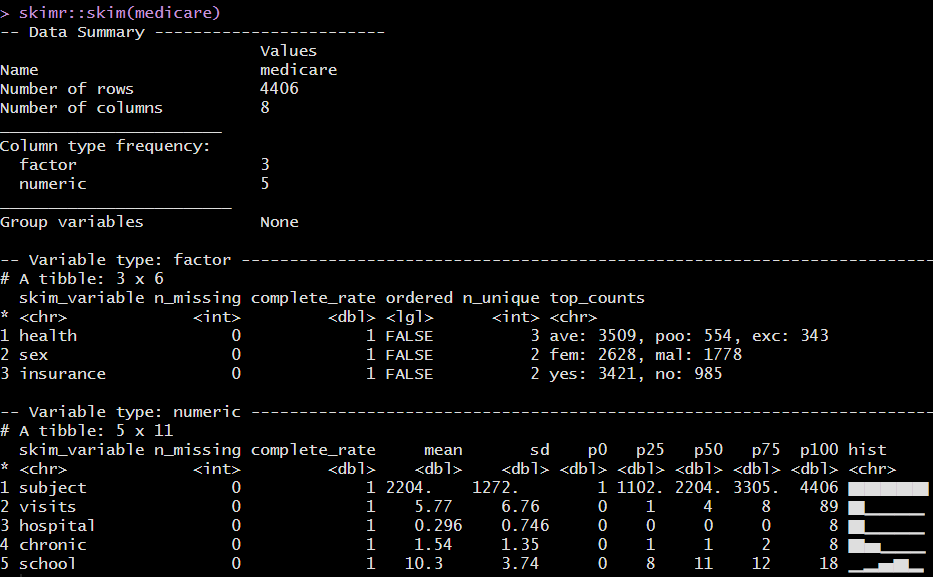
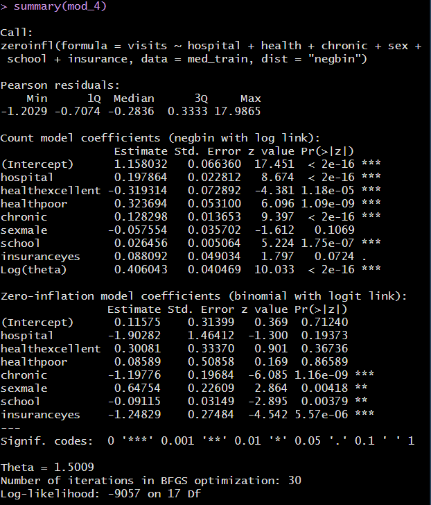
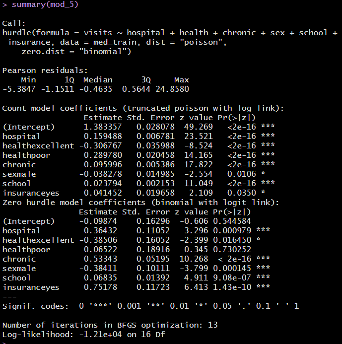
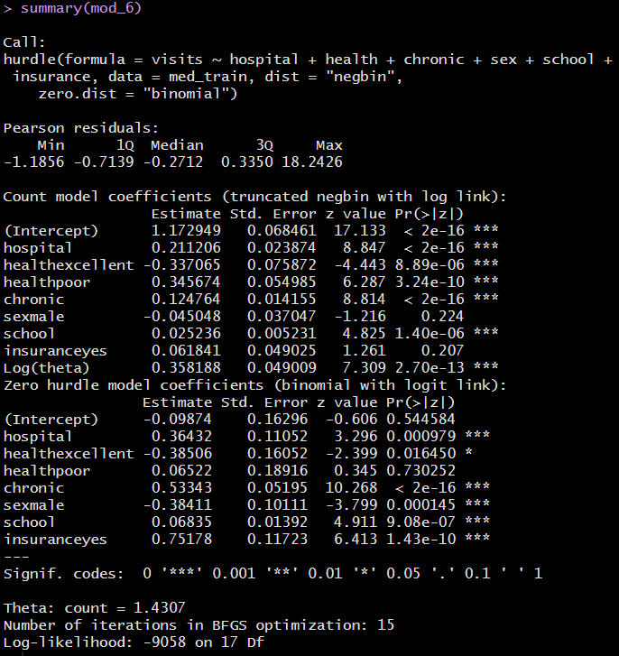

```{r set-options, echo=FALSE, cache=FALSE}
knitr::opts_chunk$set(comment=NA)
options(width = 60)
```

## Today's Topic

**Regression Models for Count Outcomes**

- Six modeling approaches are illustrated in these slides.
  - Poisson Regression 
  - Negative Binomial Regression 
  - Two types of Zero-inflated model
      - ZIP (Zero-inflated Poisson)
      - ZINB (Zero-inflated Neg. Binomial)
  - Two types of Hurdle model
      - using a Poisson approach
      - using a Negative Binomial approach

Chapter 19 of the Course Notes describes this material.

## Setup

We've previously installed the `countreg` package from R-Forge.

```{r, warning = FALSE, message = FALSE}
library(magrittr); library(here); library(janitor)
library(knitr)
library(caret)
library(MASS)
library(pscl)
library(VGAM)
library(broom)
library(tidyverse)

theme_set(theme_bw())
```

# An Overview

## Generalized Linear Models for Count Outcomes

We want to build a generalized linear model to predict count data using one or more predictors.

In count data, the observations are non-negative integers (0, 1, 2, 3, ...)

- the number of COVID-19 hospitalizations in Ohio yesterday
- the number of mutations within a particular search grid
- the number of days in the past 30 where your mental health was poor

The Poisson and the Negative Binomial probability distributions will be useful.

## The Poisson Probability Distribution

The Poisson probability model describes the probability of a given number of events occurring in a fixed interval of time or space.

- If events occur with a constant mean rate, and independently of the time since the last event, the Poisson model is appropriate.
- The probability mass function for a discrete random variable with Poisson distribution follows.

$$
Pr(Y = k) = \frac{\lambda^k e^{-\lambda}}{k!}
$$

- $k$ is the number of times an event occurs in an interval, and $k$ can take the values 0, 1, 2, 3, ...
- The parameter $\lambda$ (lambda) is equal to the expected value (mean) of $Y$ and is also equal to the variance of $Y$.

## The Negative Binomial Probability Distribution

The Negative Binomial distribution models the number of failures in a sequence of independent and identically distributed Bernoulli trials before a specified number of successes occurs. 

- The probability mass function for a discrete random variable with a negative binomial distribution follows.

$$
Pr(Y = k) = {{k + r - 1} \choose {k}} p^r(1-p)^{k}
$$

- $k$ is the number of failures (units of time) before the $r$th event occurs, and $k$ can take the values 0, 1, 2, 3, ...

- The mean of the random variable Y which follows a negative binomial distribution is $rp/(1-p)$ and the variance is $rp/(1-p)^2$. 


## Poisson Regression and the possibility of overdispersion

- Poisson regression assumes that the outcome Y follows a Poisson distribution, and that the logarithm of the expected value of Y (its mean) can be modeled by a linear combination of a set of predictors. 
  - A Poisson regression makes the strong assumption that the variance of Y is equal to its mean.
  - A Poisson model might fit poorly due to **overdispersion**, where the variance of Y is larger than we'd expect based on the mean of Y.
  - Quasipoisson models are available which estimate an overdispersion parameter, but we'll skip those.

We will show the use of `glm` to fit Poisson models, by using `family = "Poisson"`.


## Negative Binomial Regression to generalize the Poisson

- Negative binomial regression is a generalization of Poisson regression which loosens the assumption that the variance of Y is equal to its mean, and thus produces models which fit a broader class of data.

We will demonstrate the use of `glm.nb` from the `MASS` package to fit negative binomial regression models.

## Zero-inflated approaches

- Both the Poisson and Negative Binomial regression approaches may under-estimate the number of zeros compared to the data.
- To better match up the counts of zero, zero-inflated models fit:
  - a logistic regression to predict the extra zeros, along with
  - a Poisson or Negative Binomial model to predict the counts, including some zeros.

We will demonstrate the use of `zeroinfl` from the `pscl` package to fit zero-inflated Poisson (or ZIP) and zero-inflated negative binomial (or ZINB) regressions.

## Hurdle models

A hurdle model predicts the count outcome by making an assumption that there are two processes at work:

- a process that determines whether the count is zero or not zero (usually using logistic regression), and
- a process that determines the count when we know the subject has a positive count (usually using a truncated Poisson or Negative Binomial model where no zeros are predicted)

We'll use the `hurdle` function from the `pscl` package to fit these models.

## Comparing Models

1. A key tool will be a graphical representation of the fit of the models to the count outcome, called a **rootogram**. We'll use the rootograms produced by the `countreg` package to help us.
2. We'll also demonstrate a Vuong hypothesis testing approach (from the `lmtest` package) to help us make decisions between various types of Poisson models or various types of Negative Binomial models on the basis of improvement in fit of things like bias-corrected AIC or BIC.
3. We'll also demonstrate the calculation of pseudo-R square statistics for comparing models, which can be compared in a validation sample as well as in the original modeling sample.

# The `medicare` data

## The `medicare` example

The data we will use come from the `NMES1988` data set in R's `AER` package, although I have built a cleaner version for you in the `medicare.csv` file on our web site. These are essentially the same data as are used in [\textcolor{blue}{my main resource}](http://data.library.virginia.edu/getting-started-with-hurdle-models/) from the University of Virginia for hurdle models.

These data are a cross-section originating from the US National Medical Expenditure Survey (NMES) conducted in 1987 and 1988. The NMES is based upon a representative, national probability sample of the civilian non-institutionalized population and individuals admitted to long-term care facilities during 1987. The data are a subsample of individuals ages 66 and over all of whom are covered by Medicare (a public insurance program providing substantial protection against health-care costs), and some of whom also have private supplemental insurance.

```{r}
medicare <- read.csv(here("data/medicare.csv")) %>% tbl_df
```

## The `medicare` code book

Variable | Description
---------: | --------------------------
`subject`  | subject number (code)
`visits`   | outcome of interest: number of physician office visits
`hospital` | number of hospital stays
`health`   | self-perceived health status (poor, average, excellent)
`chronic`  | number of chronic conditions
`sex`      | male or female
`school`   | number of years of education
`insurance` | is the subject (also) covered by private insurance? (yes or no)

### Today's Goal

Predict `visits` using main effects of the 6 predictors (excluding `subject`)

## Skimming the `medicare` tibble



## Our outcome, `visits`

```{r, echo = FALSE, fig.height = 4}
ggplot(medicare, aes(x = visits)) +
    geom_histogram(binwidth = 1, fill = "royalblue", 
                   col = "white") +
    labs(y = "Number of Patients", x = "Number of Visits")
```

```{r, message = FALSE}
mosaic::favstats(~ visits, data = medicare)
```

## `visits` numerical summaries

```{r}
medicare %$% Hmisc::describe(visits)
```

## Reiterating the Goal

Predict `visits` using some combination of these 6 predictors...

Predictor | Description
---------: | ----------------------------------------------
`hospital` | number of hospital stays
`health`   | self-perceived health status (poor, average, excellent)
`chronic`  | number of chronic conditions
`sex`      | male or female
`school`   | number of years of education
`insurance` | is the subject (also) covered by private insurance? (yes or no)

We'll build separate training and test samples to help us validate.

## Partitioning the Data into Training vs. Test Samples

```{r}
set.seed(432)
validation_samples <- medicare$visits %>%
  createDataPartition(p = 0.75, list = FALSE)

med_train = medicare[validation_samples,]
med_test = medicare[-validation_samples,]
```

I've held out 25% of the `medicare` data for the test sample.

```{r}
dim(med_train)
dim(med_test)
```

# `mod_1`: A Poisson Regression

## Poisson Regression

Assume our count data (`visits`) follows a Poisson distribution with a mean conditional on our predictors.

```{r}
mod_1 <- glm(visits ~ hospital + health + chronic +
                  sex + school + insurance,
              data = med_train, family = "poisson")
```

The Poisson model uses a logarithm as its link function, so the model is actually predicting log(`visits`).

Note that we're fitting the model here using the training sample alone.

## `mod_1` (Poisson) model coefficients

```{r}
tidy(mod_1) %>% kable(digits = c(0, 3, 3, 1, 3))
```

If Harry and Larry have the same values for all other predictors but only Harry has private insurance, the model predicts Harry to have a 0.153 point larger value of log(`visits`) than Larry.

## Visualize fit with a (Hanging) Rootogram

```{r, message = FALSE, fig.height = 5}
countreg::rootogram(mod_1)
```

See the next slide for details on how to interpret this...

## Interpreting the Rootogram

- The red curved line is the theoretical Poisson fit. 
- "Hanging" from each point on the red line is a bar, the height of which represents the observed counts. 
    - A bar hanging below 0 indicates that the model under-predicts that value. (Model predicts fewer values than the data show.)
    - A bar hanging above 0 indicates over-prediction of that value. (Model predicts more values than the data show.)
- The counts have been transformed with a square root transformation to prevent smaller counts from getting obscured and overwhelmed by larger counts. 

For more information on rootograms, check out \color{blue}{https://arxiv.org/pdf/1605.01311}.

## The Complete Rootogram for `mod_1` 

```{r, fig.height = 5}
countreg::rootogram(mod_1, max = 90, 
                    main = "Rootogram for Poisson mod_1")
```

This shows what happens with the subject with 89 visits.

## Interpreting the Rootogram for `mod_1`

In `mod_1`, we see a great deal of underfitting for counts of 0 and 1, then overfitting for visit counts in the 3-10 range, with some underfitting again at more than a dozen or so visits.

- Our Poisson model (`mod_1`) doesn't fit enough zeros or ones, and fits too many 3-12 values, then not enough of the higher values.


## Store Training Sample `mod_1` Predictions

We'll use the `augment` function to store the predictions within our training sample. Note the use of `"response"` to predict `visits`, not log(`visits`).

```{r}
mod_1_aug <- augment(mod_1, med_train, 
                     type.predict = "response",
                     type.residuals = "response")

mod_1_aug %>% select(subject, visits, .fitted, .resid) %>% 
  head(3)
```

## Summarizing Training Sample `mod_1` Fit

Within our training sample, `mod_1_aug` now contains both the actual counts (`visits`) and the predicted counts (in `.fitted`) from `mod_1`. We'll summarize the fit...

```{r}
mod_1_summary <- tibble(
  model = "mod_1 (Poisson)",
  R2 = R2(mod_1_aug$.fitted, mod_1_aug$visits),
  RMSE = RMSE(mod_1_aug$.fitted, mod_1_aug$visits),
  MAE = MAE(mod_1_aug$.fitted, mod_1_aug$visits))

mod_1_summary %>% kable(digits = 3)
```

These will become interesting as we build additional models.

# `mod_2`: A Negative Binomial Regression

## Fitting the Negative Binomial Model

The negative binomial model requires the estimation of an additional parameter, called $\theta$ (theta). The default link for this generalized linear model is also a logarithm, like the Poisson.

```{r}
mod_2 <- MASS::glm.nb(visits ~ hospital + health + chronic +
                  sex + school + insurance,
              data = med_train)
```

The estimated dispersion parameter value $\theta$ is...

```{r}
summary(mod_2)$theta
```

The Poisson model is essentially the negative binomial model assuming a known $\theta = 1$.

## `mod_2` (Negative Binomial) coefficients

```{r}
tidy(mod_2) %>% kable(digits = c(0, 3, 3, 1, 3))
```

## Rootogram for Negative Binomial Model

```{r, fig.height = 5}
countreg::rootogram(mod_2, max = 90, 
                    main = "Rootogram for mod_2")
```

Does this look better than the Poisson rootogram?

## Store Training Sample `mod_2` Predictions

```{r}
mod_2_aug <- augment(mod_2, med_train,
                     type.predict = "response",
                     type.residuals = "response")

mod_2_aug %>% select(subject, visits, .fitted, .resid) %>% 
  head(3)
```

## Summarizing Training Sample `mod_2` Fit

As before, `mod_2_aug` now has actual (`visits`) and predicted counts (in `.fitted`) from `mod_2`. 

```{r}
mod_2_summary <- tibble(
  model = "mod_2 (Neg. Binomial)",
  R2 = R2(mod_2_aug$.fitted, mod_2_aug$visits),
  RMSE = RMSE(mod_2_aug$.fitted, mod_2_aug$visits),
  MAE = MAE(mod_2_aug$.fitted, mod_2_aug$visits))

mod_2_summary %>% kable(digits = 3)
```

## So Far in our Training Sample

The reasonable things to summarize in sample look like the impressions from the rootograms and the summaries we've prepared so far.

```{r}
bind_rows(mod_1_summary, mod_2_summary) %>% 
  kable(digits = 3)
```

Model | Rootogram impressions
-----: | -------------------------------------------
`mod_1` | Many problems. Data appear overdispersed.
`mod_2` | Still not enough zeros; some big predictions.

# `mod_3`: Zero-Inflated Poisson (ZIP) Model

## Zero-Inflated Poisson (ZIP) model

The zero-inflated Poisson model describes count data with an excess of zero counts. 

The model posits that there are two processes involved:

- a logistic regression model is used to predict excess zeros
- while a Poisson model is used to predict the counts

We'll use the `pscl` package to fit zero-inflated models.

```{r}
mod_3 <- pscl::zeroinfl(visits ~ hospital + health + 
                    chronic + sex + school + insurance,
                    data = med_train)
```

## `mod_3` ZIP coefficients

Sadly, there's no `broom` tidying functions for these zero-inflated models.

```{r, eval = FALSE}
summary(mod_3)
```

Screenshot on next slide...

---


## Rootogram for ZIP model

```{r, fig.height = 5}
countreg::rootogram(mod_3, max = 90,
                    main = "ZIP model Rootogram: mod_3")
```

What do you think? Next slide shows all models so far.

## First Three Rootograms - Which Looks Best?

```{r, echo = FALSE}
par(mfrow = c(2,2))

countreg::rootogram(mod_1, max = 90, 
                    main = "Poisson mod_1")
countreg::rootogram(mod_2, max = 90, 
                    main = "Negative Binomial mod_2")
countreg::rootogram(mod_3, max = 90,
                    main = "ZIP mod_3")

par(mfrow = c(1,1))
```

## Store Training Sample `mod_3` Predictions

We have no `augment` or other `broom` functions available for zero-inflated models, so ...

```{r}
mod_3_aug <- med_train %>%
    mutate(".fitted" = predict(mod_3, type = "response"),
           ".resid" = resid(mod_3, type = "response"))

mod_3_aug %>% select(subject, visits, .fitted, .resid) %>%
  head(3)
```

## Summarizing Training Sample `mod_3` Fit

`mod_3_aug` now has actual (`visits`) and predicted counts (in `.fitted`) from `mod_3`, just as we set up for the previous two models. 

```{r}
mod_3_summary <- tibble(
  model = "mod_3 (ZIP)",
  R2 = R2(mod_3_aug$.fitted, mod_3_aug$visits),
  RMSE = RMSE(mod_3_aug$.fitted, mod_3_aug$visits),
  MAE = MAE(mod_3_aug$.fitted, mod_3_aug$visits))

mod_3_summary %>% kable(digits = 3)
```

## Training Sample Results through `mod_3`

```{r}
bind_rows(mod_1_summary, mod_2_summary, mod_3_summary) %>% 
  kable(digits = 3)
```

Remember we want a larger $R^2$ and smaller values of RMSE and MAE.

## Comparing models with Vuong's procedure

Vuong's test compares predicted probabilities (for each count) in two non-nested models. How about Poisson vs. ZIP?

```{r}
vuong(mod_1, mod_3)
```

The large negative z-statistic indicates `mod_3` (ZIP) fits detectably better than `mod_1` (Poisson) in our training sample.

Reference: Vuong, QH (1989) Likelihood ratio tests for model selection and non-nested hypotheses. *Econometrica*, 57:307-333.

# `mod_4`: Zero-Inflated Negative Binomial (ZINB) Model

## Zero-Inflated Negative Binomial (ZINB) model

As in the ZIP, we assume there are two processes involved:

- a logistic regression model is used to predict excess zeros
- while a negative binomial model is used to predict the counts

We'll use the `pscl` package again and the `zeroinfl` function.

```{r}
mod_4 <- zeroinfl(visits ~ hospital + health + chronic +
                  sex + school + insurance,
              dist = "negbin", data = med_train)
```

`summary(mod_4)` results on next slide...

---



## Rootogram for ZIP model

```{r, fig.height = 5}
countreg::rootogram(mod_4, max = 90,
                    main = "ZINB model Rootogram: mod_4")
```

Again, next slide shows all models so far.

## First Four Rootograms - Which Looks Best?

```{r, echo = FALSE}
par(mfrow = c(2,2))

countreg::rootogram(mod_1, max = 90, 
                    main = "Poisson mod_1")
countreg::rootogram(mod_2, max = 90, 
                    main = "Negative Binomial mod_2")
countreg::rootogram(mod_3, max = 90,
                    main = "ZIP mod_3")
countreg::rootogram(mod_4, max = 90,
                    main = "ZINB mod_4")

par(mfrow = c(1,1))
```

## Store Training Sample `mod_4` Predictions

Again, there is no `augment` or other `broom` functions available for zero-inflated models, so ...

```{r}
mod_4_aug <- med_train %>%
    mutate(".fitted" = predict(mod_4, type = "response"),
           ".resid" = resid(mod_4, type = "response"))

mod_4_aug %>% select(subject, visits, .fitted, .resid) %>%
  head(3)
```

## Summarizing Training Sample `mod_4` Fit

`mod_4_aug` now has actual (`visits`) and predicted counts (in `.fitted`) from `mod_4`. 

```{r}
mod_4_summary <- tibble(
  model = "mod_4 (ZINB)",
  R2 = R2(mod_4_aug$.fitted, mod_4_aug$visits),
  RMSE = RMSE(mod_4_aug$.fitted, mod_4_aug$visits),
  MAE = MAE(mod_4_aug$.fitted, mod_4_aug$visits))

mod_4_summary %>% kable(digits = 3)
```

## Training Sample Results through `mod_4`

```{r}
bind_rows(mod_1_summary, mod_2_summary, 
          mod_3_summary, mod_4_summary) %>% 
  kable(digits = 3)
```

What do you think?

## Comparing models with Vuong's procedure

Vuong's test compares predicted probabilities (for each count) in two non-nested models. How about Negative Binomial vs. ZINB?

```{r}
vuong(mod_4, mod_2)
```

The large positive z-statistics indicate `mod_4` (ZINB) fits detectably better than `mod_2` (Negative Binomial) in our training sample.

# `mod_5`: Poisson-Logistic Hurdle Model

## The Hurdle Model 

The hurdle model is a two-part model that specifies one process for zero counts and another process for positive counts. The idea is that positive counts occur once a threshold is crossed, or put another way, a hurdle is cleared. If the hurdle is not cleared, then we have a count of 0.

- The first part of the model is typically a **binary logistic regression** model. This models whether an observation takes a positive count or not. 
- The second part of the model is usually a truncated Poisson or Negative Binomial model. Truncated means we're only fitting positive counts, and not zeros. 

## Fitting a Hurdle Model / Poisson-Logistic

In fitting a hurdle model to our medicare training data, the interpretation would be that one process governs whether a patient visits a doctor or not, and another process governs how many visits are made.

```{r}
mod_5 <- hurdle(visits ~ hospital + health + chronic +
                  sex + school + insurance,
              dist = "poisson", zero.dist = "binomial", 
              data = med_train)
```

`summary(mod_5)` results follow...

---



## Rootogram for Poisson-Logistic Hurdle model

```{r, fig.height = 5}
countreg::rootogram(mod_5, max = 90,
                main = "Poisson-Logistic Hurdle: mod_5")
```

## Poisson-Based Rootograms - Which Looks Best?

```{r, echo = FALSE}
par(mfrow = c(2,1))

countreg::rootogram(mod_3, max = 90,
                    main = "ZIP mod_3")
countreg::rootogram(mod_5, max = 90,
                    main = "Poisson-Logistic Hurdle mod_5")

par(mfrow = c(1,1))
```

## Store Training Sample `mod_5` Predictions

No `augment` or other `broom` functions for hurdle models, so ...

```{r}
mod_5_aug <- med_train %>%
    mutate(".fitted" = predict(mod_5, type = "response"),
           ".resid" = resid(mod_5, type = "response"))

mod_5_aug %>% select(subject, visits, .fitted, .resid) %>%
  head(3)
```

## Summarizing Training Sample `mod_5` Fit

`mod_5_aug` has actual (`visits`) and `mod_5` predicted (in `.fitted`) counts.

```{r}
mod_5_summary <- tibble(
  model = "mod_5 (Poisson Hurdle)",
  R2 = R2(mod_5_aug$.fitted, mod_5_aug$visits),
  RMSE = RMSE(mod_5_aug$.fitted, mod_5_aug$visits),
  MAE = MAE(mod_5_aug$.fitted, mod_5_aug$visits))

mod_5_summary %>% kable(digits = 3)
```

## Training Sample Results through `mod_5`

```{r}
bind_rows(mod_1_summary, mod_2_summary, 
          mod_3_summary, mod_4_summary,
          mod_5_summary) %>% 
  kable(digits = 3)
```

What do you think?

## Are ZIP and Poisson-Logistic Hurdle the Same?

```{r}
temp_check <- tibble(
  subject = mod_3_aug$subject,
  visits = mod_3_aug$visits,
  pred_zip = mod_3_aug$.fitted,
  pred_hur = mod_5_aug$.fitted,
  diff = pred_hur - pred_zip)

mosaic::favstats(~ diff, data = temp_check)
```

## Vuong test: Comparing `mod_3` and `mod_5`

```{r}
vuong(mod_3, mod_5)
```

There's some evidence `mod_5` (Hurdle) fits better than `mod_3` (ZIP) in our training sample.

# `mod_6`: Negative Binomial-Logistic Hurdle Model

## Fitting a Hurdle Model / NB-Logistic

```{r}
mod_6 <- hurdle(visits ~ hospital + health + chronic +
                  sex + school + insurance,
              dist = "negbin", zero.dist = "binomial", 
              data = med_train)
```

`summary(mod_6)` results follow...

---




## Rootogram for NB-Logistic Hurdle model

```{r, fig.height = 5}
countreg::rootogram(mod_6, max = 90,
                main = "NB-Logistic Hurdle: mod_6")
```

## NB-Based Rootograms - Which Looks Best?

```{r, echo = FALSE}
par(mfrow = c(2,1))

countreg::rootogram(mod_3, max = 90,
                    main = "ZINB mod_3")
countreg::rootogram(mod_6, max = 90,
                    main = "NB-Logistic Hurdle mod_6")

par(mfrow = c(1,1))
```

## Store Training Sample `mod_6` Predictions

```{r}
mod_6_aug <- med_train %>%
    mutate(".fitted" = predict(mod_6, type = "response"),
           ".resid" = resid(mod_6, type = "response"))

mod_6_aug %>% select(subject, visits, .fitted, .resid) %>%
  head(3)
```

## Summarizing Training Sample `mod_6` Fit

`mod_6_aug` has actual (`visits`) and `mod_6` predicted (in `.fitted`) counts.

```{r}
mod_6_summary <- tibble(
  model = "mod_6 (NB Hurdle)",
  R2 = R2(mod_6_aug$.fitted, mod_6_aug$visits),
  RMSE = RMSE(mod_6_aug$.fitted, mod_6_aug$visits),
  MAE = MAE(mod_6_aug$.fitted, mod_6_aug$visits))

mod_6_summary %>% kable(digits = 3)
```

## Training Sample Results through `mod_6`

```{r}
bind_rows(mod_1_summary, mod_2_summary, 
          mod_3_summary, mod_4_summary,
          mod_5_summary, mod_6_summary) %>% 
  kable(digits = 3)
```

## Vuong test: Comparing `mod_4` and `mod_6`

```{r}
vuong(mod_4, mod_6)
```

There's some evidence `mod_4` (ZINB) fits better than `mod_6` (NB Hurdle) in our training sample.

# Cross-Validation

## Validation: Test Sample Predictions

Predict the `visit` counts for each subject in our test sample.

- Use `mod_1` as a model for `mod_2`.
- Use `mod_3` as a model for `mod_4`, `mod_5` and `mod_6`.
- The other models are included with `echo = FALSE`.

```{r}
test_1_aug <- augment(mod_1, newdata = med_test, 
                      type.predict = "response")

test_2_aug <- augment(mod_2, newdata = med_test, 
                      type.predict = "response")

test_3_aug <- med_test %>%
    mutate(".fitted" = predict(mod_3, newdata = med_test, 
                        type = "response"))

```

```{r, echo = FALSE}
test_4_aug <- med_test %>%
    mutate(".fitted" = predict(mod_4, newdata = med_test, 
                        type = "response"))

test_5_aug <- med_test %>%
    mutate(".fitted" = predict(mod_5, newdata = med_test, 
                        type = "response"))

test_6_aug <- med_test %>%
    mutate(".fitted" = predict(mod_6, newdata = med_test, 
                        type = "response"))
```

## Validation: Test Sample Fit Summaries 

I'll show `mod_1` and `mod_2`. The others are in the code with `echo = FALSE`.

```{r}
mod_1_val <- tibble(
  model = "mod_1 (Poisson)",
  R2 = R2(test_1_aug$.fitted, test_1_aug$visits),
  RMSE = RMSE(test_1_aug$.fitted, test_1_aug$visits),
  MAE = MAE(test_1_aug$.fitted, test_1_aug$visits))

mod_2_val <- tibble(
  model = "mod_2 (Negative Binomial)",
  R2 = R2(test_2_aug$.fitted, test_2_aug$visits),
  RMSE = RMSE(test_2_aug$.fitted, test_2_aug$visits),
  MAE = MAE(test_2_aug$.fitted, test_2_aug$visits))
```

```{r, echo = FALSE}
mod_3_val <- tibble(
  model = "mod_3 (ZIP)",
  R2 = R2(test_3_aug$.fitted, test_3_aug$visits),
  RMSE = RMSE(test_3_aug$.fitted, test_3_aug$visits),
  MAE = MAE(test_3_aug$.fitted, test_3_aug$visits))

mod_4_val <- tibble(
  model = "mod_4 (ZINB)",
  R2 = R2(test_4_aug$.fitted, test_4_aug$visits),
  RMSE = RMSE(test_4_aug$.fitted, test_4_aug$visits),
  MAE = MAE(test_4_aug$.fitted, test_4_aug$visits))

mod_5_val <- tibble(
  model = "mod_5 (Poisson Hurdle)",
  R2 = R2(test_5_aug$.fitted, test_5_aug$visits),
  RMSE = RMSE(test_5_aug$.fitted, test_5_aug$visits),
  MAE = MAE(test_5_aug$.fitted, test_5_aug$visits))

mod_6_val <- tibble(
  model = "mod_6 (NB Hurdle)",
  R2 = R2(test_6_aug$.fitted, test_6_aug$visits),
  RMSE = RMSE(test_6_aug$.fitted, test_6_aug$visits),
  MAE = MAE(test_6_aug$.fitted, test_6_aug$visits))
```

Results on the Next Slide

## Validation Results in Test Sample: All Models

```{r}
bind_rows(mod_1_val, mod_2_val, mod_3_val, 
          mod_4_val, mod_5_val, mod_6_val) %>% 
  kable(digits = 3)
```

Now which model would you choose based on test sample performance?

## Next Time

Modeling Multi-Categorical Outcomes
