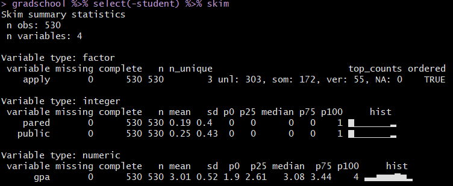

```{r set-options, echo=FALSE, cache=FALSE}
knitr::opts_chunk$set(comment=NA)
options(width = 60)
```

## Setup

```{r, warning = FALSE, message = FALSE}
library(here); library(magrittr); library(janitor)
library(skimr)
library(rms)
library(MASS)
library(nnet)
library(tidyverse)

theme_set(theme_bw())
```

## Today's Materials

**Regression Models for Ordered Multi-Categorical Outcomes**

- Proportional Odds Logistic Regression Models
- Using `polr`
- Using `lrm`
- Understanding and Interpreting the Model
- Testing the Proportional Odds Assumption
- Picturing the Model Fit

# Applying to Graduate School

## These are **simulated** data

This is a simulated data set of 530 students. 

A study looks at factors that influence the decision of whether to apply to graduate school. 

College juniors are asked if they are unlikely, somewhat likely, or very likely to apply to graduate school. Hence, our outcome variable has three categories. Data on parental educational status, whether the undergraduate institution is public or private, and current GPA is also collected. The researchers have reason to believe that the "distances" between these three points are not equal. For example, the "distance" between "unlikely" and "somewhat likely" may be shorter than the distance between "somewhat likely" and "very likely".

```{r}
gradschool <- 
  read.csv(here("data" , "gradschool_new.csv")) %>% tbl_df
```

## The `gradschool` data and my **Source**

The **gradschool** example is adapted from [\textcolor{blue}{this UCLA site}](http://stats.idre.ucla.edu/r/dae/ordinal-logistic-regression/). 

- There, they look at 400 students. 
- I simulated a new data set containing 530 students.

Variable | Description
---------: | ----------------------------------------------
`student` | subject identifying code (A001 - A530)
`apply`   | 3-level ordered outcome: "unlikely", "somewhat likely" and "very likely" to apply
`pared`   | 1 = at least one parent has a graduate degree, else 0
`public`  | 1 = undergraduate institution is public, else 0
`gpa`     | student's undergraduate grade point average (max 4.00)

## Cleanup

```{r}
gradschool <- gradschool %>%
    mutate(apply = fct_relevel(apply, "unlikely", 
                        "somewhat likely", "very likely"),
           apply = factor(apply, ordered = TRUE))

is.ordered(gradschool$apply)
```

## `gradschool %>% select(-student) %>% skim`



# Displaying Categorical Data

## Data (besides `gpa`) as Cross-Tabulation

```{r}
ftable(xtabs(~ public + apply + pared, data = gradschool))
```

## Bar Chart of `apply` classifications

```{r, echo = FALSE}
ggplot(gradschool, aes(x = apply, fill = apply)) + 
    geom_bar() +
    scale_fill_brewer(palette = "Set1") +
    guides(fill = FALSE)
```

## Bar Chart of `apply` classifications (code)

```{r, eval = FALSE}
ggplot(gradschool, aes(x = apply, fill = apply)) + 
    geom_bar() +
    scale_fill_brewer(palette = "Set1") +
    guides(fill = FALSE)
```

## Maybe you'd prefer to show the percentages?

```{r, echo = FALSE}
ggplot(gradschool, aes(x = apply, fill = apply)) + 
    geom_bar(aes(y = (..count..)/sum(..count..))) +
    geom_text(aes(y = (..count..)/sum(..count..), 
                  label = scales::percent((..count..) / 
                                        sum(..count..))),
              stat = "count", vjust = 1, 
              color = "white", size = 5) +
    scale_y_continuous(labels = scales::percent) +
    scale_fill_brewer(palette = "Set1") +
    guides(fill = FALSE) + 
    labs(y = "Percentage")
```

## Maybe you'd prefer to show the percentages? (code)

```{r, eval = FALSE}
ggplot(gradschool, aes(x = apply, fill = apply)) + 
    geom_bar(aes(y = (..count..)/sum(..count..))) +
    geom_text(aes(y = (..count..)/sum(..count..), 
                  label = scales::percent((..count..) / 
                                        sum(..count..))),
              stat = "count", vjust = 1, 
              color = "white", size = 5) +
    scale_y_continuous(labels = scales::percent) +
    scale_fill_brewer(palette = "Set1") +
    guides(fill = FALSE) + 
    labs(y = "Percentage")
```

## Faceted Counts Chart: 3-way Cross-Tab

```{r, echo = FALSE, fig.height = 6}
ggplot(gradschool, aes(x = apply, y = public)) +
    geom_count() + 
    facet_wrap(~ pared, labeller = "label_both")
```

## Faceted Counts Chart: 3-way Cross-Tab (code)

```{r, eval = FALSE}
ggplot(gradschool, aes(x = apply, y = public)) +
    geom_count() + 
    facet_wrap(~ pared, labeller = "label_both")
```

## Breakdown of `apply` percentages by `public`, `pared`

```{r, echo = FALSE}
ggplot(gradschool, aes(x = apply, fill = apply)) + 
    geom_bar() +
    scale_fill_brewer(palette = "Set1") +
    guides(fill = FALSE) + 
    facet_grid(pared ~ public, labeller = "label_both")
```

## Breakdown of `apply` percentages by `public`, `pared` (code)

```{r, eval = FALSE}
ggplot(gradschool, aes(x = apply, fill = apply)) + 
    geom_bar() +
    scale_fill_brewer(palette = "Set1") +
    guides(fill = FALSE) + 
    facet_grid(pared ~ public, labeller = "label_both")
```

## Breakdown of `gpa` by `apply`

```{r, echo = FALSE}
ggplot(gradschool, aes(x = apply, y = gpa, fill = apply)) + 
    geom_violin(trim = TRUE) +
    geom_boxplot(col = "white", width = 0.2) +
    scale_fill_brewer(palette = "Set1") +
    guides(fill = FALSE)
```

## Breakdown of `gpa` by `apply` (code)

```{r, eval = FALSE}
ggplot(gradschool, aes(x = apply, y = gpa, fill = apply)) + 
    geom_violin(trim = TRUE) +
    geom_boxplot(col = "white", width = 0.2) +
    scale_fill_brewer(palette = "Set1") +
    guides(fill = FALSE)
```

## Breakdown of `gpa` by all 3 other variables

```{r, echo = FALSE}
ggplot(gradschool, aes(x = apply, y = gpa)) +
    geom_boxplot(aes(fill = apply), size = .75) +
    geom_jitter(alpha = .25) +
    facet_grid(pared ~ public, margins = TRUE, 
               labeller = "label_both") +
    scale_fill_brewer(palette = "Set1") +
    guides(fill = FALSE) +
    theme(axis.text.x = 
            element_text(angle = 45, hjust = 1, vjust = 1))
```

## Breakdown of `gpa` by all 3 other variables (code)

```{r, eval = FALSE}
ggplot(gradschool, aes(x = apply, y = gpa)) +
    geom_boxplot(aes(fill = apply), size = .75) +
    geom_jitter(alpha = .25) +
    facet_grid(pared ~ public, margins = TRUE, 
               labeller = "label_both") +
    scale_fill_brewer(palette = "Set1") +
    guides(fill = FALSE) +
    theme(axis.text.x = 
            element_text(angle = 45, hjust = 1, vjust = 1))
```

# Proportional Odds Logit Model via `polr`

## Scatterplot Matrix (run with `message = F`)

```{r, echo = FALSE, message = FALSE}
GGally::ggpairs(gradschool %>% 
                    select(gpa, pared, public, apply))
```

## Scatterplot Matrix (code, run with `message = F`)

```{r, eval = FALSE, message = FALSE}
GGally::ggpairs(gradschool %>% 
                    select(gpa, pared, public, apply))
```

## Fitting the Model

We use the `polr` function from the `MASS` package:

```{r}
m <- polr(apply ~ pared + public + gpa, 
          data = gradschool, Hess=TRUE)
```

The `polr` name comes from proportional odds logistic regression, highlighting a key assumption of this model. 

`polr` uses the standard formula interface in R for specifying a regression model with outcome followed by predictors. We also specify `Hess=TRUE` to have the model return the observed information matrix from optimization (called the Hessian) which is used to get standard errors.

## Obtaining Predicted Probabilities from `m`

To start we'll obtain predicted probabilities, which are usually the best way to understand the model.

For example, we can vary `gpa` for each level of `pared` and `public` and calculate the model's estimated probability of being in each category of `apply`. 

First, create a new dataset of values to use for prediction.

```{r}
newdat <- data.frame(
  pared = rep(0:1, 200),
  public = rep(0:1, each = 200),
  gpa = rep(seq(from = 1.9, to = 4, length.out = 100), 4))
```

## Obtaining Predicted Probabilities from `m`

Now, make predictions using model `m`

```{r}
newdat1 <- cbind(newdat, predict(m, newdat, type = "probs"))
head(newdat1, 5)
```

## Reshape data

Now, we reshape the data with `gather`

```{r}
newdat.long <- gather(newdat1, "Level", "Probability", 4:6)
newdat.long <- newdat.long %>% 
    mutate(Level = fct_relevel(Level, "unlikely", 
                               "somewhat likely"))
head(newdat.long)
```

## Plot the prediction results...

```{r, echo = FALSE}
ggplot(newdat.long, aes(x = gpa, y = Probability, 
                        color = Level)) +
    geom_line(size = 1.5) + 
    scale_color_brewer(palette = "Set1") +
    theme_bw() +
    facet_grid(pared ~ public, labeller="label_both")
```

## Plot the prediction results... (code)

```{r, eval = FALSE}
ggplot(newdat.long, aes(x = gpa, y = Probability, 
                        color = Level)) +
    geom_line(size = 1.5) + 
    scale_color_brewer(palette = "Set1") +
    theme_bw() +
    facet_grid(pared ~ public, labeller="label_both")
```

## Cross-Tabulation of Predicted/Observed Classifications

Predictions in the rows, Observed in the columns

```{r}
addmargins(table(predict(m), gradschool$apply))
```

We only predict one subject to be in the "very likely" group by modal prediction.

## Describing the Proportional Odds Logistic Model

Our outcome, `apply`, has three levels. Our model has two logit equations: 

- one estimating the log odds that `apply` will be less than or equal to 1 (`apply` = unlikely) 
- one estimating the log odds that `apply` $\leq$ 2 (`apply` = unlikely or somewhat likely)

That's all we need to estimate the three categories, since Pr(`apply` $\leq$ 3) = 1, because very likely is the maximum category for `apply`.

- The parameters to be fit include two intercepts:
    - $\zeta_1$ will be the `unlikely|somewhat likely` parameter
    - $\zeta_2$ will be the `somewhat likely|very likely` parameter
- We'll have a total of five free parameters when we add in the slopes ($\beta$) for `pared`, `public` and `gpa`.

The two logistic equations that will be fit differ only by their intercepts.

## `summary(m)`

```{r, echo = F}
summary(m)
```

## Understanding the Model

$$ 
logit[Pr(apply \leq 1)] = \zeta_1 - \beta_1 pared - \beta_2 public - \beta_3 gpa
$$

$$ 
logit[Pr(apply \leq 2)] = \zeta_2 - \beta_1 pared - \beta_2 public - \beta_3 gpa
$$

So we have:
$$ 
logit[Pr(apply \leq unlikely)] = 3.87 - 1.15 pared - (-0.49) public - 1.14 gpa
$$
and
$$
logit[Pr(apply \leq somewhat)] = 5.94 - 1.15 pared - (-0.49) public - 1.14 gpa
$$

## `confint(m)`

Confidence intervals for the slope coefficients on the log odds scale can be estimated in the usual way.

```{r, echo = F}
confint(m)
```

These CIs describe results in units of ordered log odds.

- For example, for a one unit increase in `gpa`, we expect a 1.14 increase in the expected value of `apply` (95% CI 0.78, 1.51) in the log odds scale, holding `pared` and `public` constant.
- This would be more straightforward if we exponentiated.

## Exponentiating the Coefficients

```{r}
exp(coef(m))
exp(confint(m))
```

## Interpreting the Coefficients

Variable | Estimate | 95% CI
--------: | -------: | --------------:
`gpa` | 3.13 | (2.19, 4.53)
`public` | 0.61 | (0.39, 0.93)
`pared` | 3.17 | (2.07, 4.87)

- When a student's `gpa` increases by 1 unit, the odds of moving from "unlikely" applying to "somewhat likely" or "very likely" applying are multiplied by 3.13 (95% CI 2.19, 4.52). 
- For `public`, the odds of moving from a lower to higher status are multiplied by 0.61 (95% CI 0.39, 0.93) as we move from private to public.
- How about `pared`?

## Comparison to a Null Model

```{r}
m0 <- polr(apply ~ 1, data = gradschool)

anova(m, m0)
```

## AIC and BIC are available, too

We could also compare model `m1` to the null model `m0` with AIC or BIC.

```{r}
AIC(m, m0)
```

```{r}
BIC(m, m0)
```

## Testing the Proportional Odds Assumption

One way to test the proportional odds assumption is to compare the fit of the proportional odds logistic regression to a model that does not make that assumption. A natural candidate is a **multinomial logit** model, which is typically used to model unordered multi-categorical outcomes, and fits a slope to each level of the `apply` outcome in this case, as opposed to the proportional odds logit, which fits only one slope across all levels.

Since the proportional odds logistic regression model is nested in the multinomial logit, we can perform a likelihood ratio test. To do this, we first fit the multinomial logit model, with the `multinom` function from the `nnet` package.

## Fitting the multinomial model

```{r}
m1_multi <- multinom(apply ~ pared + public + gpa, 
                      data = gradschool)
```

## The multinomial model

```{r}
m1_multi
```

## Comparing the Models

The multinomial logit fits two intercepts and six slopes, for a total of 8 estimated parameters. 

The proportional odds logit, as we've seen, fits two intercepts and three slopes, for a total of 5. The difference is 3, and we use that number in the sequence below to build our test of the proportional odds assumption.

## Testing the Proportional Odds Assumption

```{r}
LL_1 <- logLik(m)
LL_1m <- logLik(m1_multi)
(G <- -2 * (LL_1[1] - LL_1m[1]))
pchisq(G, 3, lower.tail = FALSE)
```

The *p* value is 0.018, so it indicates that the proportional odds model fits less well than the more complex multinomial logit. 

## What to do in light of this test...

- A non-significant *p* value here isn't always the best way to assess the proportional odds assumption, but it does provide some evidence of model adequacy.
- Given the significant result here, we have concerns about the proportional odds assumption. 
    - One alternative would be to fit the multinomial model instead. 
    - Another would be to fit a check of residuals (see Frank Harrell's RMS text.)
    - Another would be to fit a different model for ordinal regression. Several are available (check out `orm` in the `rms` package, for instance.)

# Fitting the Proportional Odds Logistic Regression with `lrm`

## Using `lrm` to work through this model

```{r}
d <- datadist(gradschool)
options(datadist = "d")
mod <- lrm(apply ~ pared + public + gpa, 
           data = gradschool, x = T, y = T)
```

## `mod` output


## `summary(mod)`

```{r, echo = FALSE}
summary(mod)
```

## `plot(summary(mod))`

```{r, echo = FALSE}
plot(summary(mod))
```

## Coefficients in our equation

```{r}
mod$coef
```

## Nomogram of `mod` (code)

```{r, eval = FALSE}
fun.1 <- function(x) 1 - plogis(x)
fun.3 <- function(x) 
    plogis(x - mod$coef[1] + mod$coef[2])

plot(nomogram(mod,
    fun=list('Prob Y = 1 (unlikely)' = fun.1, 
             'Prob Y = 3 (very likely)' = fun.3)))
```

## Nomogram of `mod` (result)

```{r, echo = FALSE}
fun.1 <- function(x) 1 - plogis(x)
fun.3 <- function(x) 
    plogis(x - mod$coef[1] + mod$coef[2])

plot(nomogram(mod,
    fun=list('Prob Y = 1 (unlikely)' = fun.1, 
             'Prob Y = 3 (very likely)' = fun.3)))
```

## `set.seed(432); validate(mod)`

```{r, echo = FALSE}
set.seed(432); validate(mod)
```

## Next Time

- Multinomial Models for Nominal multi-categorical responses


