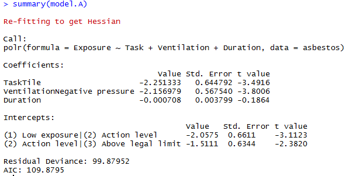

```{r set-options, echo=FALSE, cache=FALSE}
knitr::opts_chunk$set(comment=NA)
options(width = 60)
```

# Today: Ordinal Logistic Regression and Using `rms`

## Setup

```{r packages, message=FALSE, warning=FALSE}
library(knitr); library(janitor); library(magrittr)
library(caret)
library(rms)
library(nnet)
library(MASS)
library(broom)
library(tidyverse)
```

```{r data, message = FALSE}
asbestos <- read_csv("data/asbestos.csv") %>% type.convert()
```

## Asbestos Exposure in the U.S. Navy

These data describe 83 Navy workers, engaged in jobs involving potential asbestos exposure. 

- The workers were either removing asbestos tile or asbestos insulation, and we might reasonably expect that those exposures would be different (with more exposure associated with insulation removal). 
- The workers either worked with general ventilation (like a fan or naturally occurring wind) or negative pressure (where a pump with a High Efficiency Particulate Air filter is used to draw air (and fibers) from the work area.) 
- The duration of a sampling period (in minutes) was recorded, and their asbestos exposure was measured and classified in three categories: 
    + low exposure (< 0.05 fibers per cubic centimeter), 
    + action level (between 0.05 and 0.1) and 
    + above the legal limit (more than 0.1 fibers per cc).

**Source** Simonoff JS (2003) *Analyzing Categorical Data*. New York: Springer, Chapter 10.

## Our Outcome and Modeling Task

We'll predict the ordinal Exposure variable, in an ordinal logistic regression model with a proportional odds assumption, using the three predictors 

- Task (Insulation or Tile), 
- Ventilation (General or Negative pressure) and 
- Duration (in minutes). 

Exposure is determined by taking air samples in a circle of diameter 2.5 feet around the worker's mouth and nose.

## Summarizing the Asbestos Data

We'll make sure the Exposure factor is ordinal...

```{r asbestos summary}
asbestos$Exposure <- factor(asbestos$Exposure, ordered=T)
summary(asbestos[,2:5])
```

## The Proportional-Odds Cumulative Logit Model

We'll use the `polr` function in the `MASS` library to fit our ordinal logistic regression.

- Clearly, Exposure group (3) Above legal limit, is worst, followed by group (2) Action level, and then group (1) Low exposure.
- We'll have two indicator variables (one for Task and one for Ventilation) and then one continuous variable (for Duration). 
- The model will have two logit equations: one comparing group (1) to group (2) and one comparing group (2) to group (3), and three slopes, for a total of five free parameters. 

## Equations to be Fit

The equations to be fit are:

\[
log(\frac{Pr(Exposure \leq 1)}{Pr(Exposure > 1)}) = \beta_{0[1]} + \beta_1 Task + \beta_2 Ventilation + \beta_3 Duration
\]

and

\[
log(\frac{Pr(Exposure \leq 2)}{Pr(Exposure > 2)}) = \beta_{0[2]} + \beta_1 Task + \beta_2 Ventilation + \beta_3 Duration
\]

where the intercept term is the only piece that varies across the two equations.

- A positive coefficient $\beta$ means that increasing the value of that predictor tends to *lower* the Exposure category, and thus the asbestos exposure.

## Fitting the Model with the `polr` function in `MASS`

```{r fit model.A}
model.A <- polr(Exposure ~ Task + Ventilation + Duration, 
                data=asbestos)
```

## Model Summary



## Explaining the Model Summary

The first part of the output provides coefficient estimates for the three predictors. 

```
                                 Value Std. Error t value
TaskTile                     -2.251333   0.644792 -3.4916
VentilationNegative pressure -2.156979   0.567540 -3.8006
Duration                     -0.000708   0.003799 -0.1864
```

- The estimated slope for Task = Tile is -2.25. This means that Task = Tile provides less exposure than does the other Task (Insulation) so long as the other predictors are held constant. 
- Typically, we would express this in terms of an odds ratio.

## Odds Ratios and CI for Model A

```{r odds ratios for A}
exp(coef(model.A))
exp(confint(model.A))
```

## `tidy` for `polr` models exponentiates by default...

```{r, eval = FALSE}
tidy(model.A, conf.int = TRUE)
```

```{r, echo = FALSE}
a <- tidy(model.A, conf.int = TRUE) 

a %>% select(term, estimate, std.error, statistic) %>%
  kable(digits = 3)

a %>% select(term, conf.low, conf.high, coefficient_type) %>% kable(digits = 3) 
```


## Assessing the Ventilation Coefficient

```
                                 Value Std. Error t value
TaskTile                     -2.251333   0.644792 -3.4916
VentilationNegative pressure -2.156979   0.567540 -3.8006
Duration                     -0.000708   0.003799 -0.1864
```

Similarly, the estimated slope for Ventilation = Negative pressure (-2.16) means that Negative pressure provides less exposure than does General Ventilation. We see a relatively modest effect (near zero) associated with Duration.

## Summary of Model A: Estimated Intercepts

```
Intercepts:
                                       Value   Std. Error t value
(1) Low exposure|(2) Action level      -2.0575  0.6611    -3.1123
(2) Action level|(3) Above legal limit -1.5111  0.6344    -2.3820
```

The first parameter (-2.06) is the estimated log odds of falling into category (1) low exposure versus all other categories, when all of the predictor variables (Task, Ventilation and Duration) are zero. So the first estimated logit equation is:

\[
log(\frac{Pr(Exposure \leq 1)}{Pr(Exposure > 1)}) = 
\]

\[
-2.06 - 2.25 [Task=Tile] -2.16 [Vent=NP] - 0.0007 Duration
\]


## Summary of Model A: Estimated Intercepts

```
Intercepts:
                                       Value   Std. Error t value
(1) Low exposure|(2) Action level      -2.0575  0.6611    -3.1123
(2) Action level|(3) Above legal limit -1.5111  0.6344    -2.3820
```

The second parameter (-1.51) is the estimated log odds of category (1) or (2) vs. (3). The estimated logit equation is:

\[
log(\frac{Pr(Exposure \leq 2)}{Pr(Exposure > 2)}) = 
\]

\[
-1.51 - 2.25 [Task=Tile] -2.16 [Vent=NP] - 0.0007 Duration
\]

## Comparing Model A to an "Intercept only" Model

```{r }
model.1 <- polr(Exposure ~ 1, data=asbestos)
anova(model.1, model.A)
```

## Comparing Model A to Model without Duration

```{r}
model.TV <- polr(Exposure ~ Task + Ventilation, data=asbestos)
anova(model.A, model.TV)
```

## Is a Task*Ventilation Interaction helpful?

```{r}
model.TxV <- polr(Exposure ~ Task * Ventilation, data=asbestos)
anova(model.TV, model.TxV)
```

## `asbestos` Likelihood Ratio Tests

Model | Elements | DF | Deviance | Test | *p*
---: | --- | ---: | ---: | ---: | ---:
1 | Intercept | 81 |  147.62 | -- | --
2 | D | 80 | 142.29 | vs 1 | 0.021
3 | T | 80 | 115.36 | vs 1 | < 0.0001
4 | V | 80 | 115.45 | vs 1 | < 0.0001
5 | T+V | 79 | 99.91 | vs 4 | < 0.0001
6 | T*V | 78 | 99.64 | vs 5 | 0.60
7 | T+V+D | 78 | 99.88 | vs 5 | 0.85

- T = Task
- V = Ventilation
- D = Duration

## In-Sample Predictions with our `T+V` model

```{r}
model.TV <- polr(Exposure ~ Task + Ventilation, 
                 data=asbestos)

asbestos <- asbestos %>%
  mutate(TV_preds = predict(model.TV))

asbestos %>% tabyl(TV_preds, Exposure) %>% 
  adorn_title() %>% kable()
```

## Accuracy of These Classifications?

```{r}
asbestos %>% tabyl(TV_preds, Exposure) %>% 
  adorn_title() %>% kable()
```

- Predicting Low exposure led to 42 right and 13 wrong.
- We never predicted Action Level
- Predicting Above Legal Limit led to 22 right and 6 wrong.

Total: 64 right, 19 wrong. Accuracy = 64/83 = 77.1%

## 5-fold cross-validation for `polr` model?

```{r}
set.seed(2020432)
train.control <- trainControl(method = "cv", number = 5)
modTV_cv <- train(Exposure ~ Task + Ventilation, 
                       data = asbestos, method = "polr",
                  trControl = train.control)
```

## Results of 5-fold cross-validation `modTV_cv`

```{r, echo = FALSE}
modTV_cv
```

## Which `kappa` is that?

Fleiss' `kappa`, or $\kappa$ describes the extent to which the observed agreement between the predicted classifications and the actual classifications exceeds what would be expected if the predictions were made at random. 

- Larger values of $\kappa$ indicate better model performance ($\kappa$ = 0 indicates very poor agreement between model and reality, $\kappa$ near 1 indicates almost perfect agreement.)

```
Resampling results across tuning parameters:

  method    Accuracy   Kappa    
  cauchit   0.7477941  0.5069165
  cloglog   0.7125000  0.4463752
  logistic  0.7477941  0.5069165
  loglog    0.7713235  0.5470383
  probit    0.7477941  0.5069165
```

## Is the proportional odds assumption reasonable?

Alternative: fit a multinomial model?

```{r}
mult_TV <- multinom(Exposure ~ Task + Ventilation, 
                       data = asbestos, trace = FALSE)
```

## View the Multinomial Model?

```{r}
mult_TV
```

## In-Sample Predictions with the multinomial `T+V` model

```{r}
asbestos <- asbestos %>%
  mutate(TVmult_preds = predict(mult_TV))

asbestos %>% tabyl(TVmult_preds, Exposure) %>% 
  adorn_title() %>% kable()
```

## Compare Models with Likelihood Ratio Test?

```{r}
(LL_multTV <- logLik(mult_TV)) # multinomial model: 6 df
(LL_polrTV <- logLik(model.TV)) # polr model: 4 df

(G = -2 * (LL_polrTV[1] - LL_multTV[1]))

pchisq(G, 2, lower.tail = FALSE)

```

No statistically detectable difference in quality of fit (*p* = 0.4) between the proportional odds model and the more complex multinomial logistic regression model.


# Using `rms` to fit ordinal logistic regression models

## Proportional Odds Ordinal Logistic Regression with `lrm`

```{r}
d <- datadist(asbestos)
options(datadist = "d")

model_TV_LRM <- lrm(Exposure ~ Task + Ventilation,
                 data = asbestos, x = TRUE, y = TRUE)

# note that Exposure must be an ordered factor
```

## POLR results via `lrm` (slide 1)

```{r, eval = FALSE}
model_TV_LRM
```

```
Logistic Regression Model
 
 lrm(formula = Exposure ~ Task + Ventilation, 
      data = asbestos, x = TRUE, y = TRUE)
 
                                     Model Likelihood     
                                        Ratio Test        
 Obs                       83       LR chi2      47.71        
  (1) Low exposure         45       d.f.             2        
  (2) Action level          6       Pr(> chi2) <0.0001        
  (3) Above legal limit    32                                 
 max |deriv|            3e-10                             
```

## POLR results via `lrm` (slide 2)

```
 lrm(formula = Exposure ~ Task + Ventilation + Duration, 
      data = asbestos, x = TRUE, y = TRUE)

  Discrimination    Rank Discrim.    
     Indexes          Indexes       
  R2       0.526    C       0.854    
  g        2.064    Dxy     0.708    
  gr       7.877    gamma   0.839    
  gp       0.371    tau-a   0.396    
  Brier    0.127                     
```

## POLR results via `lrm` (slide 3)

```
 lrm(formula = Exposure ~ Task + Ventilation + Duration, 
      data = asbestos, x = TRUE, y = TRUE)

                               Coef   S.E.  Wald Z Pr(>|Z|)
y>=(2) Action level            1.9713 0.4695  4.20  <0.0001 
y>=(3) Above legal limit       1.4256 0.4348  3.28   0.0010  
Task=Tile                     -2.2868 0.6173 -3.70   0.0002  
Ventilation=Negative pressure -2.1596 0.5675 -3.81   0.0001  
```

## Ordinal Logistic Regression for `T+V` with `orm`

```{r}
d <- datadist(asbestos)
options(datadist = "d")

model_TV_ORM <- orm(Exposure ~ Task + Ventilation,
                 data = asbestos, x = TRUE, y = TRUE)

# note that Exposure must be an ordered factor
```

## Results for `model_TV_ORM` fit with `orm`

**(I'll neaten these up on the next two slides.)**

```{r}
model_TV_ORM
```

## `orm` fit for `T+V` model (slide 1 of 2)

```{r, eval = FALSE}
model_TV_ORM
```

```
Logistic (Proportional Odds) Ordinal Regression Model

orm(formula = Exposure ~ Task + Ventilation, 
       data = asbestos, x = TRUE, y = TRUE)
 
                              Model Likelihood
                                 Ratio Test   
 Obs                    83  LR chi2      47.71
  (1) Low exposure      45  d.f.             2                     
  (2) Action level       6  Pr(> chi2) <0.0001                     
  (3) Above legal limit 32  Score chi2   42.42                     
 Distinct Y      3          Pr(> chi2) <0.0001                                                  
 Median Y        1                                                                               
 max |deriv| 6e-05                                                                           
```

## `orm` fit for `T+V` model (slide 2 of 2)

```
Logistic (Proportional Odds) Ordinal Regression Model

Discrimination Indexes 
R2  0.526    rho  0.697
g   2.064    gr   7.877   |Pr(Y>=median)-0.5| 0.301                   

                                Coef   S.E.  Wald Z Pr(>|Z|)
 y>=(2) Action level            1.9713 0.4695  4.20  <0.0001 
 y>=(3) Above legal limit       1.4256 0.4348  3.28   0.0010  
 Task=Tile                     -2.2868 0.6173 -3.70   0.0002  
 Ventilation=Negative pressure -2.1596 0.5675 -3.81   0.0001  
```

## Plot effects of the coefficients

```{r}
plot(summary(model_TV_LRM))
```

## `rms::validate` results from `lrm`

```{r, eval = FALSE}
set.seed(432)
validate(model_TV_LRM)
```

```
            index.                              index.
              orig training    test optimism corrected  n
Dxy         0.7077   0.7175  0.7082   0.0093    0.6984 40
R2          0.5260   0.5426  0.5183   0.0243    0.5017 40
Intercept   0.0000   0.0000 -0.0279   0.0279   -0.0279 40
Slope       1.0000   1.0000  0.9464   0.0536    0.9464 40
Emax        0.0000   0.0000  0.0169   0.0169    0.0169 40
D           0.5627   0.5944  0.5515   0.0429    0.5199 40
U          -0.0241  -0.0241 -0.4004   0.3763   -0.4004 40
Q           0.5868   0.6185  0.9519  -0.3335    0.9203 40
B           0.1270   0.1234  0.1319  -0.0086    0.1356 40
g           2.0639   2.1722  2.0250   0.1472    1.9167 40
gp          0.3709   0.3746  0.3691   0.0055    0.3654 40
```


## `rms::validate` results from `orm`

```{r}
set.seed(432)
validate(model_TV_ORM)
```

## Predictions (greater than or equal to)

```{r}
head(predict(model_TV_LRM, type = "fitted"),3)
```

## Predictions (individual)

```{r}
head(predict(model_TV_LRM, type = "fitted.ind"),3)
```


## Nomogram?

First, we'll create the functions to estimate the probabilities of falling into groups 1, 2, and 3.

```{r}
model_TV_LRM$coef
```

So `plogis` by default uses the first intercept shown, and to get the machine to instead use the second one, we need:

```{r}
fun3 <- function(x) plogis(x - model_TV_LRM$coef[2])
```

## Plot the Nomogram

```{r, eval = FALSE}
plot(nomogram(model_TV_LRM, 
         fun = list( 'Pr(y >= 2)' = plogis,
                     'Pr(y >= 3)' = fun3)))
```

Shown on next slide.

---

```{r, echo = FALSE}
plot(nomogram(model_TV_LRM, 
         fun = list( 'Pr(y >= 2)' = plogis,
                     'Pr(y >= 3)' = fun3)))

```

## Some Sources for Ordinal Logistic Regression

- A good source of information on fitting these models is https://stats.idre.ucla.edu/r/dae/ordinal-logistic-regression/
    + Another good source, that I leaned on heavily here, using a simple example, is 
https://onlinecourses.science.psu.edu/stat504/node/177. 
    + Also helpful is https://onlinecourses.science.psu.edu/stat504/node/178 which shows a more complex example nicely.

