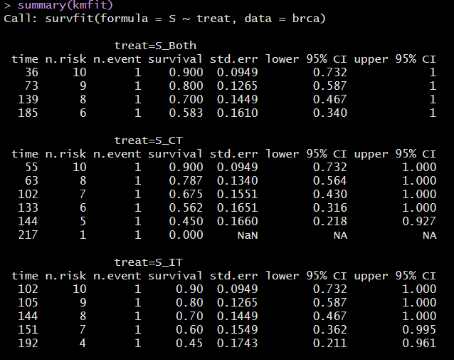
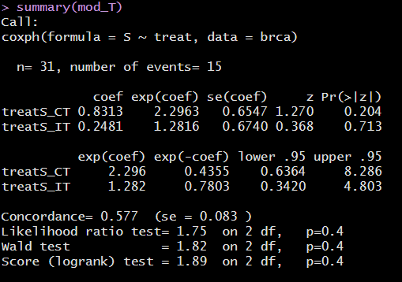
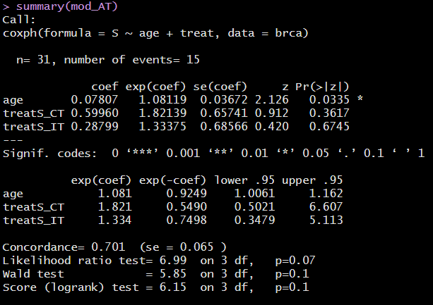
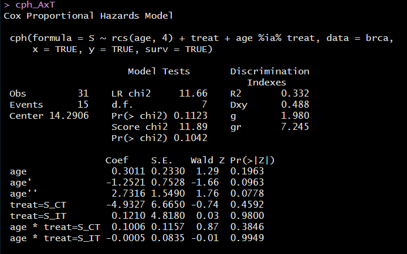
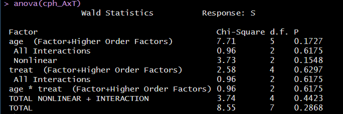

```{r set-options, echo=FALSE, cache=FALSE}
knitr::opts_chunk$set(comment=NA)
options(width = 60)
```

## Preliminaries

```{r packages, message=FALSE, warning=FALSE}
library(here); library(janitor); library(magrittr)
library(broom); library(knitr); library(rms)
library(survival); library(survminer)
library(tidyverse)

theme_set(theme_bw())
```

```{r, message = FALSE}
brca <- read_csv(here("data", "brca.csv")) %>% 
    type.convert()
```

## Working with Time-to-Event Data

- The `brca` trial of three treatments for Breast Cancer
- Cox Proportional Hazards Regression with `coxph`
- Diagnostics for Cox Proportional Hazards Regression
- Using `cph` from the `rms` package to fit a Cox model

# The `brca` trial

## The `brca` trial

The `brca` data describes a parallel randomized trial of three treatments, adjuvant to surgery in the treatment of patients with stage-2 carcinoma of the breast. The three treatment groups are:

- `S_CT` = Surgery plus one year of chemotherapy
- `S_IT` = Surgery plus one year of immunotherapy
- `S_Both` = Surgery plus one year of chemotherapy and immunotherapy

The measure of efficacy were "time to death" in weeks. In addition to `treat`, our variables are:

- `trial_weeks`: time in the study, in weeks, to death or censoring
- `last_alive`: 1 if alive at last follow-up (and thus censored), 0 if dead
- `age`: age in years at the start of the trial

## `brca` tibble (note big problem: n = 31!)

Source: Chen and Peace (2011) *Clinical Trial Data Analysis Using R*, CRC Press, section 5.1

```{r, echo = FALSE}
brca
```

## Analytic Objectives

This is a typical right-censored survival data set with interest in the comparative analysis of the three treatments.

1. Does immunotherapy added to surgery plus chemotherapy improve survival? (Comparing S_Both to S_CT)
2. Does chemotherapy add efficacy to surgery plus immunotherapy? (S_Both vs. S_IT)
3. What is the effect of age on survival?

## Create survival object

- `trial_weeks`: time in the study, in weeks, to death or censoring
- `last_alive`: 1 if alive at last follow-up (and thus censored), 0 if dead

So `last_alive` = 0 if the event (death) occurs.

> What's next?

## Create survival object

- `trial_weeks`: time in the study, in weeks, to death or censoring
- `last_alive`: 1 if alive at last follow-up (and thus censored), 0 if dead

So `last_alive` = 0 if the event (death) occurs.

```{r}
brca$S <- with(brca, Surv(trial_weeks, last_alive == 0))

head(brca$S)
```

## Build Kaplan-Meier Estimator

```{r}
kmfit <- survfit(S ~ treat, dat = brca)

print(kmfit, print.rmean = TRUE)
```

---




## K-M Plot via `survminer`

```{r, echo = FALSE, warning = FALSE}
ggsurvplot(kmfit, data = brca,
           risk.table = TRUE,
           risk.table.height = 0.25,
           xlab = "Time in weeks")
```

## K-M Plot via `survminer` (code)

```{r, eval = FALSE, warning = FALSE}
ggsurvplot(kmfit, data = brca,
           risk.table = TRUE,
           risk.table.height = 0.25,
           xlab = "Time in weeks")
```

## Testing the difference between curves

```{r}
survdiff(S ~ treat, dat = brca)
```

What do we conclude?

# A Cox Model for Treatment

## Fit Cox Model `mod_T`: Treatment alone

```{r}
mod_T <- coxph(S ~ treat, data = brca)
mod_T
```

---



## Interpreting the Summaries

```{r}
tidy(mod_T, exponentiate = TRUE) %>%
    select(term, estimate, std.error, conf.low, conf.high) %>%
    kable(digits = 3)
```

- A subject treated with `S_CT` is estimated to have 2.296 times the hazard (95% CI: 0.636, 8.286) of a subject treated with `S_Both` (the baseline).
- A subject treated with `S_IT` is estimated to have 1.282 times the hazard (95% CI 0.342, 4.803) of a subject treated with `S_Both`.

## `ggforest(mod_T, data = brca)`

```{r, echo = FALSE}
ggforest(mod_T, data = brca)
```


## Summarizing `mod_T`

All of this comes from `glance(mod_T)`

- `n` = 31 cases, with `nevent` = 15 events (so 16 censored)
- log rank test statistic = 1.752, *p* = 0.416
- Score test statistic = 1.895, *p* = 0.388
- Wald test statistic = 1.820, *p* = 0.403
    - Each tests $H_0$: Treatment adds no value
- (Cox-Snell) R-Squared = 0.055, Maximum Pseudo R-Square = 0.944
    - Cox and Snell's pseudo-$R^2$ reflects the improvement of this model over the model with the intercept alone, with higher values indicating more substantial improvement over an intercept-only model.
    - Not really a percentage of anything: often the maximum value here is less than 1.

## Summarizing `mod_T`

Again, all of this comes from `glance(mod_T)` - see next slide

- Concordance = 0.577 (standard error = 0.083)
    - Really only appropriate when we have at least one quantitative predictor in the Cox model
    - Assesses probability of agreement between survival time and the risk score generated by the predictors
    - 1 indicates perfect agreement, 0.5 indicates no better than chance
- log Likelihood = -43.886, AIC = 91.773, BIC = 93.189
    - Usual summaries, used to compare models, mostly


## `glance(mod_T)` Fit Quality Summaries (edited)

```{r, echo = FALSE}
t(glance(mod_T)) %>% kable(digits = 3)
```

## Checking the Proportional Hazards Assumption

- If the proportional hazards assumption is appropriate, we should see a slope of essentially zero in the residuals that are plotted against time on the next slide.
- If we see a slope that seriously different from zero, that will suggest a violation of the proportional hazards assumption.
- A hypothesis test is also performed, where a significant result also indicates a potential problem with the assumption.

If we did see a violation of assumptions, we could either add a non-linear predictor term or use a different kind of survival model.

## Graphical PH Check `ggcoxzph(cox.zph(mod_T))`

```{r, echo = FALSE}
ggcoxzph(cox.zph(mod_T))
```

# A Two-Predictor Cox Model (Age + Treatment)

## Fit Cox Model `mod_AT`: Age + Treatment

```{r}
mod_AT <- coxph(S ~ age + treat, data = brca)
mod_AT
```

---



## Interpreting the Coefficients of `mod_AT`

```{r}
tidy(mod_AT, exponentiate = TRUE) %>%
  select(term, estimate, std.error, conf.low, conf.high) %>%
  kable(digits = 2)
```

- If Harry and Sally receive the same `treat` but Harry is one year older, the model estimates Harry will have 1.08 times the hazard of Sally (95% CI 1.01, 1.16).

## Interpreting the Coefficients of `mod_AT`

```{r}
tidy(mod_AT, exponentiate = TRUE) %>%
  select(term, estimate, std.error, conf.low, conf.high) %>%
  kable(digits = 2)
```

- If Harry receives S_CT and Sally receives S_Both, and they are the same age, the model estimates Harry will have 1.82 times the hazard of Sally (95% CI 0.50, 6.61).
- If Cyrus receives S_IT and Sally receives S_Both, and they are the same age, the model estimates Cyrus will have 1.33 times the hazard of Sally (95% CI 0.33, 5.11).


## `ggforest(mod_AT, data = brca)`

```{r, echo = FALSE}
ggforest(mod_AT, data = brca)
```

## Comparing the Two Models

`n` = 31, `nevent` = 15 for each model. 

```{r}
bind_rows(glance(mod_T), glance(mod_AT)) %>%
    mutate(model = c("mod_T", "mod_AT")) %>%
    select(model, p.value.log, concordance, r.squared, 
           max_r2 = r.squared.max, AIC, BIC) %>% 
  kable(digits = c(0,3,3,3,3,1,1))
```

What do the `glance` results indicate?

## Significance Test via Likelihood Ratio ANOVA

```{r}
anova(mod_AT, mod_T)
```

## Graphical PH Check `ggcoxzph(cox.zph(mod_AT))`

```{r, echo = FALSE}
ggcoxzph(cox.zph(mod_AT))
```

## Back to the Analytic Objectives

1. Does immunotherapy added to surgery plus chemotherapy improve survival? (Comparing S_Both to S_CT)
2. Does chemotherapy add efficacy to surgery plus immunotherapy? (S_Both vs. S_IT)
3. What is the effect of age on survival?

So ... what do you think?

# Building a Cox Model with `cph` from the `rms` package

## Using `rms::cph` to fit a fancier `AxT`

```{r, message = FALSE}
brca <- read_csv(here("data/brca.csv")) %>% type.convert()

d <- datadist(brca)
options(datadist="d")

brca$S <- with(brca, Surv(trial_weeks, last_alive == 0))

cph_AxT <- cph(S ~ rcs(age, 4) + treat + age %ia% treat, 
               data = brca, 
               x = TRUE, y = TRUE, surv = TRUE)
```

## `cph_AxT` (and see next slide)

```{r, echo = FALSE}
cph_AxT
```

---



## `summary(cph_AxT)`

```{r, echo = FALSE}
summary(cph_AxT)
```

## `plot(summary(cph_AxT))`

```{r, echo = FALSE}
plot(summary(cph_AxT))
```

---

```{r}
set.seed(432)
validate(cph_AxT)
```

## ANOVA for `cph_AxT` model



## `survplot` in `rms` (code)

For `age` comparison:

```{r, eval = FALSE}
survplot(cph_AxT,
         age = c(35, 45, 55, 65),
         time.inc = 26,
         type = "kaplan-meier",
         xlab = "Study Survival Time in weeks")
```

For `treat` comparison:

```{r, eval = FALSE}
survplot(cph_AxT,
         treat,         
         time.inc = 26,
         type = "kaplan-meier",
         xlab = "Study Survival Time in weeks")
```

## `survplot` in `rms` (Result)

```{r, echo = FALSE}
survplot(cph_AxT,
         age = c(35, 45, 55, 65),
         time.inc = 26,
         type = "kaplan-meier",
         xlab = "Study Survival Time in weeks")
```

## `survplot` for `treat` in `rms` (Result)

```{r, echo = FALSE}
survplot(cph_AxT,
         treat,
         time.inc = 26,
         type = "kaplan-meier",
         xlab = "Study Survival Time in weeks")
```

## `cph_AxT` nomogram (code)

```{r, eval = FALSE}
sv <- Survival(cph_AxT)
surv4 <- function(x) sv(208, lp = x)

plot(nomogram(cph_AxT,
              fun = surv3,
              funlabel = c("4 year survival")))
```

## Plotting `age` effect implied by `cph_AxT` model

```{r, fig.height = 5}
ggplot(Predict(cph_AxT, age))
```

## Plotting `treat` effect implied by `cph_AxT` model

```{r, fig.height = 5}
ggplot(Predict(cph_AxT, treat))
```

## `cph_AxT` nomogram (Results)

```{r, echo = FALSE}
sv <- Survival(cph_AxT)
surv4 <- function(x) sv(208, lp = x)

plot(nomogram(cph_AxT,
              fun = surv4,
              funlabel = c("4 year survival")))
```

## Checking the Proportional Hazards Assumption

```{r}
cox.zph(cph_AxT, transform = "km", global = TRUE)
```

---

```{r}
ggcoxzph(cox.zph(cph_AxT))
```

## Additional Diagnostic Plots for your Cox model?

- `survminer` has a function called `ggcoxdiagnostics()` which plots different types of residuals as a function of time, linear predictor or observation id. 
- The type of residual can be "martingale", "deviance", "score", "schoenfeld", "dfbeta"', "dfbetas", or "scaledsch".
  

## What to do if the PH assumption is violated

- If the PH assumption fails on a categorical predictor, fit a Cox model stratified by that predictor (use `strata(var)` rather than `var` in the specification of the `coxph` model.)
- If the PH assumption is violated, this means the hazard isn't constant over time, so we could fit separate Cox models for a series of time intervals.
- Use an extension of the Cox model that permits covariates to vary over time.

Visit https://cran.r-project.org/web/packages/survival/vignettes/timedep.pdf for details on building the relevant data sets and models, with examples.

