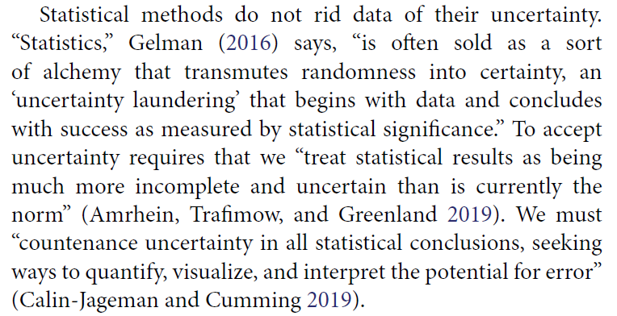

```{r set-options, echo=FALSE, cache=FALSE}
knitr::opts_chunk$set(comment=NA)
options(width = 60)
```

```{r, echo = FALSE, message = FALSE}
library(tidyverse)
```

## Replicable Research and the Crisis in Science

- ASA 2016 Statement on P values (Context, Process, Purpose)
- Is changing the *p* value cutoff the right strategy?
- Second-generation *p* values: A next step?
- ASA 2019 Statement on Statistical Inference in the 21st Century

---


---


---


---


## Roger Peng's description of a successful data analysis

> A data analysis is successful if the audience to which it is presented accepts the results.

- "What is a Successful Data Analysis?" [$\textcolor{blue}{simplystatistics.org}$](https://simplystatistics.org/2018/04/17/what-is-a-successful-data-analysis/) (2018-04-17).

So what makes a data analysis more believable / more acceptable?


## The American Statistical Association

2016

- Ronald L. Wasserstein & Nicole A. Lazar (2016) [The ASA's Statement on p-Values: Context, Process, and Purpose](https://www.tandfonline.com/doi/full/10.1080/00031305.2016.1154108), *The American Statistician*, 70:2, 129-133, DOI: [10.1080/00031305.2016.1154108](https://doi.org/10.1080/00031305.2016.1154108)


2019

- Ronald L. Wasserstein, Allen L. Schirm & Nicole A. Lazar (2019) [Moving to a World Beyond "p < 0.05"](https://www.tandfonline.com/doi/full/10.1080/00031305.2019.1583913), *The American Statistician*, 73:sup1, 1-19, DOI: [10.1080/00031305.2019.1583913](https://doi.org/10.1080/00031305.2019.1583913). 

## Statistical Inference in the 21st Century

> ... a world learning to venture beyond "p < 0.05"

> This is a world where researchers are free to treat "p = 0.051" and "p = 0.049" as not being categorically different, where authors no longer find themselves constrained to selectively publish their results based on a single magic number. 

> In this world, where studies with "p < 0.05" and studies with "p > 0.05" are not automatically in conflict, researchers will see their results more easily replicated -- and, even when not, they will better understand why.

> The 2016 ASA Statement on P-Values and Statistical Significance started moving us toward this world. As of the date of publication of this special issue, the statement has been viewed over 294,000 times and cited over 1700 times-an average of about 11 citations per week since its release. Now we must go further.

## The American Statistical Association Statement on P values and Statistical Significance

The ASA Statement (2016) was mostly about what **not** to do.

The 2019 effort represents an attempt to explain what to do.

> Some of you exploring this special issue of The American Statistician might be wondering if it's a scolding from pedantic statisticians lecturing you about what not to dowith p-values, without
offering any real ideas of what to do about the very hard problem of separating signal from noise in data and making decisions under uncertainty. Fear not. In this issue, thanks to 43 innovative
and thought-provoking papers from forward-looking statisticians, help is on the way.

## "Don't" is not enough. 

> If you're just arriving to the debate, here's a sampling of what not to do.

- Don't base your conclusions solely on whether an association or effect was found to be "statistically significant" (i.e., the *p* value passed some arbitrary threshold such as p < 0.05).
- Don't believe that an association or effect exists just because it was statistically significant.
- Don't believe that an association or effect is absent just because it was not statistically significant.
- Don't believe that your p-value gives the probability that chance alone produced the observed association or effect or the probability that your test hypothesis is true.
- Don't conclude anything about scientific or practical importance based on statistical significance (or lack thereof).

## One More Don't...


> A label of statistical significance adds nothing to what is already conveyed by the value of *p*; in fact, this dichotomization of *p*-values makes matters worse.

## Problems with *P* Values

1. *P* values are inherently unstable
2. The *p* value, or statistical significance, does not measure the size of an effect or the importance of a result
3. Scientific conclusions should not be based only on whether a *p* value passes a specific threshold
4. Proper inference requires full reporting and transparency
5. By itself, a *p* value does not provide a good measure of evidence regarding a model or hypothesis

[$\textcolor{blue}{Link}$](http://jamanetwork.com/journals/jamaotolaryngology/fullarticle/2546529)

## Solutions to the *P* Value Problems

1. Estimation of the Size of the Effect
2. Precision of the Estimate (Confidence Intervals)
3. Inference About the Target Population
4. Determination of Whether the Results Are Compatible With a Clinically Meaningful Effect
5. Replication and Steady Accumulation of Knowledge

[$\textcolor{blue}{Link}$](http://jamanetwork.com/journals/jamaotolaryngology/fullarticle/2546529)

## Importance of Meta-Analytic Thinking

> In JAMA Otolaryngology: Head & Neck Surgery, we look to publish original investigations where the investigators planned the study with sufficient sample size to have adequate power to detect a clinically meaningful effect and report the results with effect sizes and CIs. Authors should interpret the effect sizes in relation to previous research and use CIs to help determine whether the results are compatible with clinically meaningful effects. And finally, we acknowledge that no single study can define truth and that the advancement of medical knowledge and patient care depends on the steady accumulation of reliable clinical information.

[$\textcolor{blue}{Link}$](http://jamanetwork.com/journals/jamaotolaryngology/fullarticle/2546529)

## The Value of a *p*-Valueless Paper

Jason T. Connor (2004) *American J of Gastroenterology* 99(9): 1638-40.

Abstract: As is common in current bio-medical research, about 85% of original contributions in *The American Journal of Gastroenterology* in 2004 have reported *p*-values. However, none are reported in this issue's article by Abraham et al. who, instead, rely exclusively on effect size estimates and associated confidence intervals to summarize their findings. **Authors using confidence intervals communicate much more information in a clear and efficient manner than those using** *p*-**values. This strategy also prevents readers from drawing erroneous conclusions caused by common misunderstandings about** *p*-**values**. I outline how standard, two-sided confidence intervals can be used to measure whether two treatments differ or test whether they are clinically equivalent.

[$\textcolor{blue}{Link}$](https://www.nature.com/ajg/journal/v99/n9/pdf/ajg2004321a.pdf?origin=ppub&foxtrotcallback=true)

## Editorial from JAMA Cardiology 2016-10-12


## Mark, Lee, Harrell JAMA Cardiol 2016-10-12


[$\textcolor{blue}{Link}$](doi:10.1001/jamacardio.2016.3312)

# Dividing Data Comparisons into Categories based on p values

## Regina Nuzzo in Nature on Statistical Errors


## Gelman on *p* values, 1

> The common practice of dividing data comparisons into categories based on significance levels is terrible, but it happens all the time.... so it's worth examining the prevalence of this error.

Consider, for example, this division: 

- "really significant" for *p* < .01, 
- "significant" for *p* < .05, 
- "marginally significant" for *p* < .1, and 
- "not at all significant" otherwise. 

Now consider some typical *p*-values in these ranges: say, *p* = .005, *p* = .03, *p* = .08, and *p* = .2. 

Translate these two-sided *p*-values back into z-scores...

[$\textcolor{blue}{Gelman}$](http://andrewgelman.com/2016/10/15/marginally-significant-effects-as-evidence-for-hypotheses-changing-attitudes-over-four-decades/) 2016-10-15

## Gelman on *p* values, 2

Description | really sig. | sig. | marginally sig.| not at all sig.
---------: | ----: | ----: | ----: | ----:
*p* value | 0.005 | 0.03 | 0.08 | 0.20
Z score | 2.8 | 2.2 | 1.8 | 1.3

The seemingly yawning gap in p-values comparing the not at all significant *p*-value of .2 to the really significant *p*-value of .005, is only a z score of 1.5. 

If you had two independent experiments with z-scores of 2.8 and 1.3 and with equal standard errors and you wanted to compare them, you'd get a difference of 1.5 with a standard error of 1.4, which is completely consistent with noise.

## Gelman on *p* values, 3

From a **statistical** point of view, the trouble with using the p-value as a data summary is that the p-value can only be interpreted in the context of the null hypothesis of zero effect, and (much of the time), nobody's interested in the null hypothesis. 

Indeed, once you see comparisons between large, marginal, and small effects, the null hypothesis is irrelevant, as you want to be comparing effect sizes.

From a **psychological** point of view, the trouble with using the p-value as a data summary is that this is a kind of deterministic thinking, an attempt to convert real uncertainty into firm statements that are just not possible (or, as we would say now, just not replicable).

**The key point**: The difference between statistically significant and NOT statistically significant is not, generally, statistically significant.


# p-Hacking

## Hack Your Way To Scientific Glory (fivethirtyeight)


## "Researcher Degrees of Freedom", 1

> [I]t is unacceptably easy to publish *statistically significant* evidence consistent with any hypothesis.

> The culprit is a construct we refer to as **researcher degrees of freedom**. In the course of collecting and analyzing data, researchers have many decisions to make: Should more data be collected? Should some observations be excluded? Which conditions should be combined and which ones compared? Which control variables should be considered? Should specific measures be combined or transformed or both?

Simmons et al. [$\textcolor{blue}{link}$](http://journals.sagepub.com/doi/abs/10.1177/0956797611417632) 

## "Researcher Degrees of Freedom", 2

> ... It is rare, and sometimes impractical, for researchers to make all these decisions beforehand. Rather, it is common (and accepted practice) for researchers to explore various analytic alternatives, to search for a combination that yields statistical significance, and to then report only what worked. The problem, of course, is that the likelihood of at least one (of many) analyses producing a falsely positive finding at the 5% level is necessarily greater than 5%.

For more, see 

- Gelman's blog [$\textcolor{blue}{2012-11-01}$](http://andrewgelman.com/2012/11/01/researcher-degrees-of-freedom/) "Researcher Degrees of Freedom", 
- Paper by [$\textcolor{blue}{Simmons}$](http://journals.sagepub.com/doi/abs/10.1177/0956797611417632) and others, defining the term.

## And this is really hard to deal with...

**The garden of forking paths**: Why multiple comparisons can be a problem, even when there is no "fishing expedition" or p-hacking and the research hypothesis was posited ahead of time

> Researcher degrees of freedom can lead to a multiple comparisons problem, even in settings
where researchers perform only a single analysis on their data. The problem is there can be a
large number of potential comparisons when the details of data analysis are highly contingent on
data, without the researcher having to perform any conscious procedure of fishing or examining
multiple p-values. We discuss in the context of several examples of published papers where
data-analysis decisions were theoretically-motivated based on previous literature, but where the
details of data selection and analysis were not pre-specified and, as a result, were contingent on
data.

- [$\textcolor{blue}{Link}$](http://www.stat.columbia.edu/~gelman/research/unpublished/p_hacking.pdf) to the paper from Gelman and Loken

## Are P values all that bad?


---


# Do Confidence Intervals get us out of this mess?

## Confidence Intervals - do they solve our problem?


## Confidence Intervals - do they solve our problem?


## Confidence Intervals - do they solve our problem?


## Confidence Intervals - do they solve our problem?


## Confidence Intervals - do they solve our problem?


## Using Bayesian Ideas: Confidence Intervals

> My current favorite (hypothetical) example is an epidemiology study of some small effect where the point estimate of the odds ratio is 3.0 with a 95% conf interval of [1.1, 8.2]. 

> As a 95% conf interval, this is fine (assuming the underlying assumptions regarding sampling, causal identification, etc. are valid). 

(but on some level you need to deal with the fact that...)

> ... real-world odds ratios are much more likely to be near 1.1 than to be near 8.2. 

See [\textcolor{blue}{Gelman}](http://andrewgelman.com/2014/12/11/fallacy-placing-confidence-confidence-intervals/) 2014-12-11.

## Uncertainty intervals?

I've (Gelman) become increasingly uncomfortable with the term "confidence interval" for several reasons:

- The well-known difficulties in interpretation (officially the confidence statement can be interpreted only on average, but people typically implicitly give the Bayesian interpretation to each case.)
- The ambiguity between confidence intervals and predictive intervals.
- The awkwardness of explaining that confidence intervals are big in noisy situations where you have less confidence, and confidence intervals are small when you have more confidence.

> So here's my proposal. Let's use the term "uncertainty interval" instead. The uncertainty interval tells you how much uncertainty you have. 

See [\textcolor{blue}{Gelman}](http://andrewgelman.com/2010/12/21/lets_say_uncert/) 2010-12-21.

# Some Noisy Recent Suggestions

## Benjamin et al 2017 Redefine Statistical Significance

We propose to change the default P-value threshold for statistical significance for claims of new discoveries from 0.05 to 0.005.

Motivations:

- links to Bayes Factor interpretation
- 0.005 is stringent enough to "break" the current system - makes it very difficult for researchers to reach threshold with noisy, useless studies.

Visit the main [$\textcolor{blue}{article}$](https://psyarxiv.com/mky9j/). Visit an explanatory piece in [$\textcolor{blue}{Science}$](http://www.sciencemag.org/news/2017/07/it-will-be-much-harder-call-new-findings-significant-if-team-gets-its-way).

## Lakens et al. Justify Your Alpha

"In response to recommendations to redefine statistical significance to $p \leq .005$, we propose that researchers should transparently report and justify all choices they make when designing a study, including the alpha level." Visit [$\textcolor{blue}{link}$](https://psyarxiv.com/9s3y6).

## Abandon Statistical Significance

Gelman blog [$\textcolor{blue}{2017-09-26}$](http://andrewgelman.com/2017/09/26/abandon-statistical-significance/) on "Abandon Statistical Significance"

"Measurement error and variation are concerns even if your estimate is more than 2 standard errors from zero. Indeed, if variation or measurement error are high, then you learn almost nothing from an estimate even if it happens to be 'statistically significant.'"

Read the whole paper [$\textcolor{blue}{here}$](http://www.stat.columbia.edu/~gelman/research/unpublished/abandon.pdf)

## JAMA 2018-04-10 


## Blume et al. PLoS ONE (2018) 13(3): e0188299


## Second-generation *p* values


## *Nature* P values are just the tip of the iceberg!


## OK, so what SHOULD we do?

*The American Statistician* Volume 73, 2019, Supplement 1

Articles on:

1. Getting to a Post "*p* < 0.05" Era
2. Interpreting and Using *p*
3. Supplementing or Replacing *p*
4. Adopting more holistic approaches
5. Reforming Institutions: Changing Publication Policies and Statistical Education

- Note that there is an enormous list of "things to do" in Section 7 of the main editorial, too.

## Statistical Inference in the 21st Century


## ATOM: **A**ccept uncertainty. Be **T**houghtful, **O**pen and **M**odest.

- Statistical methods do not rid data of their uncertainty.




## ATOM: **A**ccept uncertainty. Be **T**houghtful, **O**pen and **M**odest.

> We can make acceptance of uncertainty more natural to our thinking by accompanying every point estimate in our research with a measure of its uncertainty such as a standard error or interval estimate. Reporting and interpreting point and interval estimates should be routine.

> How will accepting uncertainty change anything? To begin, it will prompt us to seek better measures, more sensitive designs, and larger samples, all of which increase the rigor of research.

> It also helps us be modest ... [and] leads us to be thoughtful.

## ATOM: **A**ccept uncertainty. Be **T**houghtful, **O**pen and **M**odest.


## ATOM: **A**ccept uncertainty. Be **T**houghtful, **O**pen and **M**odest.


## ATOM: **A**ccept uncertainty. Be **T**houghtful, **O**pen and **M**odest.


## ATOM: **A**ccept uncertainty. Be **T**houghtful, **O**pen and **M**odest.


## ATOM: **A**ccept uncertainty. Be **T**houghtful, **O**pen and **M**odest.


## ATOM: **A**ccept uncertainty. Be **T**houghtful, **O**pen and **M**odest.


## ATOM: **A**ccept uncertainty. Be **T**houghtful, **O**pen and **M**odest.


## ATOM: **A**ccept uncertainty. Be **T**houghtful, **O**pen and **M**odest.


## ATOM: **A**ccept uncertainty. Be **T**houghtful, **O**pen and **M**odest.


## ATOM: **A**ccept uncertainty. Be **T**houghtful, **O**pen and **M**odest.

> The nexus of openness and modesty is to report everything while at the same time not concluding anything from a single study with unwarranted certainty. Because of the strong desire to inform and be informed, there is a relentless demand to state results with certainty. Again, accept uncertainty and embrace variation in associations and effects, because they are always there, like it or not. Understand that expressions of uncertainty are themselves uncertain. Accept that one study is rarely definitive, so encourage, sponsor, conduct, and publish replication studies.

> Be modest by encouraging others to reproduce your work. Of course, for it to be reproduced readily, you will necessarily have been thoughtful in conducting the research and open in presenting it.

## Grim Reality

- Editorial, Educational and Other Institutional Practices Will Have to Change
- It Is Going to Take Work, and It Is Going to Take Time
- Why Will Change Finally Happen Now?

## Next Time

Gelman and Carlin (2014) Power and Retrospective Design


