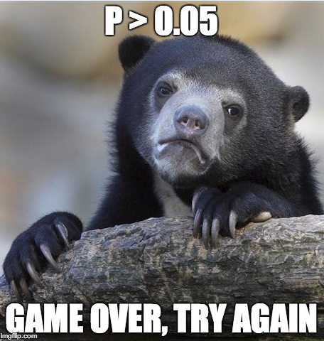

```{r set-options, echo=FALSE, cache=FALSE}
knitr::opts_chunk$set(comment=NA)
options(width = 60)
```

```{r, echo = FALSE, message = FALSE}
library(tidyverse)
```

## Today's Topics

- What I Taught for Many Years
- Replicable Research and the Crisis in Science
- Retrospective Power and why most smart folks avoid it
    - Type S and Type M error: Saying something more useful

## What I Taught for Many Years

- Null hypothesis significance testing is here to stay.
    - Learn how to present your p value so it looks like what everyone else does
    - Think about "statistically detectable" rather than "statistically significant"
    - Don't accept a null hypothesis, just retain it.
- Use point **and** interval estimates
    - Try to get your statements about confidence intervals right (right = just like I said it)
- Use Bayesian approaches/simulation/hierarchical models when they seem appropriate or for "non-standard" designs
    - But look elsewhere for people to teach/do that stuff
- Power is basically a hurdle to overcome in a grant application

## Conventions for Reporting *p* Values

1. Use an italicized, lower-case *p* to specify the *p* value. Don't use *p* for anything else.
2. For *p* values above 0.10, round to two decimal places, at most. 
3. For *p* values near $\alpha$, include only enough decimal places to clarify the reject/retain decision. 
4. For very small *p* values, always report either *p* < 0.0001 or even just *p* < 0.001, rather than specifying the result in scientific notation, or, worse, as $p = 0$ which is glaringly inappropriate.
5. Report *p* values above 0.99 as *p* > 0.99, rather than *p* = 1.

# American Statistical Association to the rescue!?!

## ASA Statement on *p* Values

ASA Statement: "Informally, a p-value is the probability under a specified statistical model that a statistical summary of the data (e.g., the sample mean difference between two compared groups) would be equal to or more extreme than its observed value."

[$\textcolor{blue}{fivethirtyeight.com}$](http://fivethirtyeight.com/features/not-even-scientists-can-easily-explain-p-values/) "Not Even Scientists Can Easily Explain *p* Values"

... Try to distill the p-value down to an intuitive concept and it loses all its nuances and complexity, said science journalist Regina Nuzzo, a statistics professor at Gallaudet University. "Then people get it wrong, and this is why statisticians are upset and scientists are confused." **You can get it right, or you can make it intuitive, but it's all but impossible to do both.**

[$\textcolor{blue}{fivethirtyeight.com}$](http://fivethirtyeight.com/features/statisticians-found-one-thing-they-can-agree-on-its-time-to-stop-misusing-p-values/) "Statisticians found one thing they can agree on"

## A Few Comments on Significance

- **A significant effect is not necessarily the same thing as an interesting effect.**  For example, results calculated from large samples are nearly always "significant" even when the effects are quite small in magnitude.  Before doing a test, always ask if the effect is large enough to be of any practical interest.  If not, why do the test?

- **A non-significant effect is not necessarily the same thing as no difference.**  A large effect of real practical interest may still produce a non-significant result simply because the sample is too small.

- **There are assumptions behind all statistical inferences.** Checking assumptions is crucial to validating the inference made by any test or confidence interval.

- "**Scientific conclusions and business or policy decisions should not be based only on whether a p-value passes a specific threshold.**"

ASA [$\textcolor{blue}{statement}$](http://amstat.tandfonline.com/doi/pdf/10.1080/00031305.2016.1154108) on *p* values

## From George Cobb - on why *p* values deserve to be re-evaluated

The **idea** of a p-value as one possible summary of evidence

morphed into a

- **rule** for authors:  reject the null hypothesis if p < .05.

## From George Cobb - on why *p* values deserve to be re-evaluated

The **idea** of a p-value as one possible summary of evidence

morphed into a

- **rule** for authors:  reject the null hypothesis if p < .05,

which morphed into a

- **rule** for editors:  reject the submitted article if p > .05.

## From George Cobb - on why *p* values deserve to be re-evaluated

The **idea** of a p-value as one possible summary of evidence

morphed into a

- **rule** for authors:  reject the null hypothesis if p < .05,

which morphed into a

- **rule** for editors:  reject the submitted article if p > .05,

which morphed into a

- **rule** for journals:  reject all articles that report p-values\footnote{http://www.nature.com/news/psychology-journal-bans-p-values-1.17001 describes the recent banning of null hypothesis significance testing by {\it Basic and Applied Psychology}.} 

## From George Cobb - on why *p* values deserve to be re-evaluated

The **idea** of a p-value as one possible summary of evidence

morphed into a

- **rule** for authors:  reject the null hypothesis if p < .05, which morphed into a

- **rule** for editors:  reject the submitted article if p > .05, which morphed into a

- **rule** for journals:  reject all articles that report p-values. 

Bottom line:  **Reject rules.  Ideas matter.**

---



## p = 0.05?

> "For decades, the conventional p-value threshold has been 0.05," says Dr. Paul Wakim, chief of the biostatistics and clinical epidemiology service at the National Institutes of Health Clinical Center, "but it is extremely important to understand that this 0.05, there's nothing rigorous about it. It wasn't derived from statisticians who got together, calculated the best threshold, and then found that it is 0.05. No, it's Ronald Fisher, who basically said, 'Let's use 0.05,' and he admitted that it was arbitrary."

- NOVA "[\textcolor{blue}{Rethinking Science's Magic Number}](http://www.pbs.org/wgbh/nova/next/body/rethinking-sciences-magic-number/)" by Tiffany Dill 2018-02-28. See especially the video labeled "Science's most important (and controversial) number has its origins in a British experiment involving milk and tea."

## More from Dr. Wakim...

> "People say, 'Ugh, it's above 0.05, I wasted my time.' No, you didn't waste your time." says Dr. Wakim. "If the research question is important, the result is important. Whatever it is."

- NOVA Season 45 Episode 6 [\textcolor{blue}{Prediction by the Numbers}](http://www.pbs.org/video/prediction-by-the-numbers-hg2znc/) 2018-02-28.


## p values don't trend...


## George Cobb's Questions (with Answers)

In February 2014, George Cobb, Professor Emeritus of Mathematics and Statistics at Mount Holyoke College, posed these questions to an ASA discussion forum:

Q: Why do so many colleges and grad schools teach *p* = 0.05?

A: Because that's **still** what the scientific community and journal editors use.

Q: Why do so many people still use *p* = 0.05?

A: Because that's what they were taught in college or grad school.

## All the p values

> The p-value is the most widely-known statistic. P-values are reported in a large majority of scientific publications that measure and report data. R.A. Fisher is widely credited with inventing the p-value. If he was cited every time a p-value was reported his paper would have, at the very least, 3 million citations - making it the most highly cited paper of all time.

- Visit Jeff Leek's [\textcolor{blue}{Github for tidypvals package}](https://github.com/jtleek/tidypvals)
    - 2.5 million *p* values in 25 scientific fields

**What do you suppose the distribution of those p values is going to look like?**

## 2.5 million p values in 25 scientific fields: Jeff Leek


## from Michael Lopez


# Evaluation through Retrospective Design

## Gelman, 2016-03-11

Reviewing "The Association Between Men's Sexist Attitudes and Facial Hair" PubMed 26510427 (*Arch Sex Behavior* May 2016)

Headline Finding: A sample of ~500 men from America and India shows a significant relationship between sexist views and the presence of facial hair.

Excerpt 1:

> Since a linear relationship has been found between facial hair thickness and perceived masculinity . . . we explored the relationship between facial hair thickness and sexism. . . . Pearson's correlation found no significant relationships between facial hair thickness and hostile or benevolent sexism, education, age, sexual orientation, or relationship status.

## Facial Hair and Sexist Attitudes

Excerpt 2:

> We conducted pairwise comparisons between clean-shaven men and each facial hair style on hostile and benevolent sexism scores. . . . For the purpose of further analyses, participants were classified as either clean-shaven or having facial hair based on their self- reported facial hair style . . . There was a significant Facial Hair Status by Sexism Type interaction . . .

>- So their headline finding appeared only because, after their first analysis failed, they shook and shook the data until they found something statistically significant. 
>- All credit to the researchers for admitting that they did this, but poor practice of them to present their result in the abstract to their paper without making this clear, and too bad that the journal got suckered into publishing this. 

## How should we react to this?

Gelman:

- Statisticians such as myself should recognize that the point of criticizing a study is, in general, to shed light on statistical errors, maybe with the hope of reforming future statistical education.
- Researchers and policymakers should not just trust what they read in published journals.

### Assessing Type S (Sign) and Type M (Magnitude) Errors

- Gelman and Carlin *Psychological Science* 2014 9(6): 641-651.

# Thinking About Power

## Specifying effect sizes for power calculations

1. **Empirical**: assuming an effect size equal to the estimate from a previous study or from the data at hand (if performed retrospectively).
    + generally based on small samples
    + when preliminary results look interesting, they are more likely biased towards unrealistically large effects

2. **On the basis of goals**: assuming an effect size deemed to be substantively important or more specifically the minimum effect that would be substantively important.
    + Can also lead to specifying effect sizes that are larger than what is likely to be the true effect.

- Both lead to performing studies that are too small or misinterpretation of findings after completion.

## Gelman and Carlin

- The idea of a **design analysis** is to improve the design and evaluation of research, when you want to summarize your inference through concepts related to statistical significance.
- Type 1 and Type 2 errors are tricky concepts and aren't easy to describe before data are collected, and are very difficult to use well after data are collected.
- These problems are made worse when you have
    + Noisy studies, where the signal may be overwhelmed,
    + Small Sample Sizes
    + No pre-registered (prior to data gathering) specifications for analysis
- Top statisticians avoid "post hoc power analysis"...
    + Why? It's usually crummy.

## Why not post hoc power analysis?

So you collected data and analyzed the results. Now you want to do an after data gathering (post hoc) power analysis.

1. What will you use as your "true" effect size? 
    - Often, point estimate from data - yuck - results very misleading - power is generally seriously overestimated when computed on the basis of statistically significant results.
    - Much better (but rarer) to identify plausible effect sizes based on external information rather than on your sparkling new result.
2. What are you trying to do? (too often)
    - get researcher off the hook (I didn't get p < 0.05 because I had low power - an alibi to explain away non-significant findings) or
    - encourage overconfidence in the finding.

## Gelman and Carlin: Broader Design Ideas

- A broader notion of design, though, can be useful before and after data are gathered.

Gelman and Carlin recommend design calculations to estimate

1. Type S (sign) error - the probability of an estimate being in the wrong direction, and
2. Type M (magnitude) error, or exaggeration ratio - the factor by which the magnitude of an effect might be overestimated.

- These can (and should) have value **both** before data collection/analysis and afterwards (especially when an apparently strong and significant effect is found.)
- The big challenge remains identifying plausible effect sizes based on external information. Crucial to base our design analysis on an external estimate.

## The Building Blocks

You perform a study that yields estimate *d* with standard error *s*. Think of *d* as an estimated mean difference, for example.

>- Looks significant if $|d/s| > 2$, which roughly corresponds to *p* < 0.05. Inconclusive otherwise.
>- Now, consider a true effect size *D* (the value that *d* would take if you had an enormous sample)
>- *D* is hypothesized based on *external* information (Other available data, Literature review, Modeling as appropriate, etc.)
>- Define $d^{rep}$ as the estimate that would be observed in a hypothetical replication study with a design identical to our original study.

## Design Analysis (Gelman and Carlin)


## Retrodesign function (shown on next slide)

Inputs to the function:

- `D`, the hypothesized true effect size (actually called `A` in the function)
- `s`, the standard error of the estimate
- `alpha`, the statistical significance threshold (default 0.05)
- `df`, the degrees of freedom (default assumption: infinite)

Output:

- the power
- the Type S error rate
- the exaggeration ratio

## Retrodesign function (Gelman and Carlin)

```{r retrodesign_function_again}
retrodesign <- function(A, s, alpha=.05, df=Inf, 
                        n.sims=10000){
    z <- qt(1-alpha/2, df)
    p.hi <- 1 - pt(z-A/s, df)
    p.lo <- pt(-z-A/s, df)
    power <- p.hi + p.lo
    typeS <- p.lo/power
    estimate <- A + s*rt(n.sims,df)
    significant <- abs(estimate) > s*z
    exaggeration <- mean(abs(estimate)[significant])/A
    return(list(power=power, typeS=typeS, 
                exaggeration=exaggeration))
}
```

## What if we have a beautiful, unbiased study?

Suppose the true effect that is 2.8 standard errors away from zero, in a study built to have 80% power for that effect with 95% confidence.

```{r retro unbiased}
set.seed(201803161)
retrodesign(A = 28, s = 10, alpha = 0.05)
```

## What if we have a beautiful, unbiased study?

power | typeS | exaggeration
----: | -----: | ---------:
0.79956 | 1.2 x 10^-6^ | 1.13

- With the power this high (80%), we have a type S error rate of 1.2 x 10^-6^ and an expected exaggeration factor of 1.13.
- Nothing to worry about with either direction of a statistically significant estimate and the overestimation of the magnitude of the effect will be small.
- What does this look like?

## 80% power; large effect (2.8 SE above $H_0$)

```{r setup for pictures, echo = FALSE}
x <- seq(-40, 40, length = 100)
hx0 <- dnorm(x, mean = 0, sd = 10)
hx3 <- dnorm(x, mean = 3, sd = 10)
hx12 <- dnorm(x, mean = 12, sd = 10)
hx28 <- dnorm(x, mean = 28, sd = 10)
hx2215 <- dnorm(x, mean = 22.15, sd = 10)
dat <- data.frame(x, hx0, hx3, hx12, hx28, hx2215)
```


```{r pic2, echo = FALSE}
ggplot(dat, aes(x, hx28)) +
    geom_line(col = "blue") +
    geom_segment(aes(x = 0, xend = 0, y = 0, yend = dnorm(0, mean = 28, sd = 10)), col = "red") +
    geom_segment(aes(x = 28, xend = 28, y = 0, yend = dnorm(28, mean = 28, sd = 10)), col = "blue") +
    geom_segment(aes(x = -40, xend = 40, y = 0, yend = 0)) +
    geom_ribbon(data = subset(dat, x > 19.6), aes(ymax = hx28), ymin = 0, fill = "red", col = NA, alpha = 0.5) +
    geom_ribbon(data = subset(dat, x < -19.6), aes(ymax = hx28), ymin = 0, fill = "red", col = NA, alpha = 0.5) +
    geom_text(x = 30, y = 0.01, label = "Reject H_0", col = "white", size = 5) +
    geom_text(x = -27, y = 0.003, label = "Reject H_0", col = "red", size = 5) +
    theme(axis.ticks = element_blank(), axis.text.y = element_blank()) +
    labs(x = "Estimated Effect Size", y = "", title = "True Effect 2.8 SE above Null Hypothesis (Strong Effect)", subtitle = "Power = 80%, Risk of Type S error near zero, Exaggeration Ratio near 1")
```

## `retrodesign` for Zero Effect

```{r zero_effect}
set.seed(201803162)
retrodesign(A = 0, s = 10)
```

- Power = 0.5, Pr(Type S error) = 0.5, Exaggeration Ratio is infinite.


## Power, Type S and Type M Errors: Zero Effect

```{r setting1plot, echo = FALSE}
ggplot(dat, aes(x, hx0)) +
    geom_line() +
    geom_segment(aes(x = 0, xend = 0, y = 0, yend = dnorm(0, mean = 0, sd = 10)), col = "red") +
    geom_segment(aes(x = -40, xend = 40, y = 0, yend = 0)) +
    geom_ribbon(data = subset(dat, x > 19.6), aes(ymax = hx0), ymin = 0, fill = "red", col = NA, alpha = 0.5) +
    geom_ribbon(data = subset(dat, x < -19.6), aes(ymax = hx0), ymin = 0, fill = "red", col = NA, alpha = 0.5) +
    geom_text(x = 30, y = 0.005, label = "Reject H_0", col = "red", size = 5) +
    geom_text(x = -30, y = 0.005, label = "Reject H_0", col = "red", size = 5) +
    theme(axis.ticks = element_blank(), axis.text.y = element_blank()) +
    labs(x = "Estimated Effect Size", y = "", title = "True Effect At the Null Hypothesis", subtitle = "Power = 0.05, Type S error rate = 50% and infinite Exaggeration Ratio")
```


## Retrodesign for a true effect 1.2 SE above $H_0$

```{r 1point2_se}
set.seed(201803163)
retrodesign(A = 12, s = 10)
```

## What 22.4% power looks like...

```{r pic3, echo = FALSE}
ggplot(dat, aes(x, hx12)) +
    geom_line(col = "blue") +
    geom_segment(aes(x = 0, xend = 0, y = 0, yend = dnorm(0, mean = 12, sd = 10)), col = "red") +
    geom_segment(aes(x = 12, xend = 12, y = 0, yend = dnorm(12, mean = 12, sd = 10)), col = "blue") +
    geom_segment(aes(x = -40, xend = 40, y = 0, yend = 0)) +
    geom_ribbon(data = subset(dat, x > 19.6), aes(ymax = hx12), ymin = 0, fill = "red", col = NA, alpha = 0.5) +
    geom_ribbon(data = subset(dat, x < -19.6), aes(ymax = hx12), ymin = 0, fill = "red", col = NA, alpha = 0.5) +
    geom_text(x = 35, y = 0.015, label = "Reject H_0", col = "red", size = 5) +
    geom_text(x = -27, y = 0.003, label = "Reject H_0", col = "red", size = 5) +
    theme(axis.ticks = element_blank(), axis.text.y = element_blank()) +
    labs(x = "Estimated Effect Size", y = "", title = "True Effect 1.2 SE above Null Hypothesis", subtitle = "Power = 22.4%, Risk of Type S error is 0.004, Exaggeration Ratio is 2.12")
```

## What 60% Power Looks Like

```{r pic 4, echo = FALSE}
ggplot(dat, aes(x, hx2215)) +
    geom_line(col = "blue") +
    geom_segment(aes(x = 0, xend = 0, y = 0, yend = dnorm(0, mean = 22.15, sd = 10)), col = "red") +
    geom_segment(aes(x = 22.15, xend = 22.15, y = 0, yend = dnorm(22.15, mean = 22.15, sd = 10)), col = "blue") +
    geom_segment(aes(x = -40, xend = 40, y = 0, yend = 0)) +
    geom_ribbon(data = subset(dat, x > 19.6), aes(ymax = hx2215), ymin = 0, fill = "red", col = NA, alpha = 0.5) +
    geom_ribbon(data = subset(dat, x < -19.6), aes(ymax = hx2215), ymin = 0, fill = "red", col = NA, alpha = 0.5) +
    geom_text(x = 30, y = 0.01, label = "Reject H_0", col = "white", size = 5) +
    geom_text(x = -27, y = 0.003, label = "Reject H_0", col = "red", size = 5) +
    theme(axis.ticks = element_blank(), axis.text.y = element_blank()) +
    labs(x = "Estimated Effect Size", y = "", title = "True Effect 2.215 SE above Null Hypothesis", subtitle = "Power = 0.60, Risk of Type S error is <0.01%, Exaggeration Ratio is about 1.3")
```

## Gelman & Carlin, Figure 2


## Example: Beauty and Sex Ratios

Kanazawa study of 2972 respondents from the National Longitudinal Study of Adolescent Health

- Each subject was assigned an attractiveness rating on a 1-5 scale and then, years later, had at least one child.
- Of the first-born children with parents in the most attractive category, 56% were girls, compared with 48% girls in the other groups.
- So the estimated difference was 8 percentage points with a reported *p* = 0.015
- Kanazawa stopped there, but Gelman and Carlin don't.

## Beauty and Sex Ratios

We need to postulate an effect size, which will not be 8 percentage points. Instead, Gelman and colleagues hypothesized a range of true effect sizes using the scientific literature.

> There is a large literature on variation in the sex ratio of human births, and the effects that have
been found have been on the order of 1 percentage point (for example, the probability of a girl birth
shifting from 48.5 percent to 49.5 percent). 
> Variation attributable to factors such as race, parental age, birth order, maternal weight, partnership status and season of birth is estimated at from less than 0.3 percentage points to about 2 percentage points, with larger changes (as high as 3 percentage points) arising under economic conditions of poverty and famine.
> (There are) reliable findings that male fetuses (and also male babies and adults) are more likely than females to die under adverse conditions.

## So, what is a reasonable effect size?

- Small observed differences in sex ratios in a multitude of studies of other issues (much more like 1 percentage point, tops)
- Noisiness of the subjective attractiveness rating (1-5) used in this particular study

So, Gelman and colleagues hypothesized three potential effect sizes (0.1, 0.3 and 1.0 percentage points) and under each effect size, considered what might happen in a study with sample size equal to Kanazawa's study.

### How big is the standard error?

- From the reported estimate of 8 percentage points and p value of 0.015, the standard error of the difference is 3.29 percentage points.
    + If *p* value = 0.015 (two-sided), then Z score =  `qnorm(p = 0.015/2, lower.tail=FALSE)` = 2.432
    + Z = estimate/SE, and if estimate = 8 and Z = 2.432, then SE = 8/2.432 = 3.29

## Retrodesign Results: Option 1

- Assume true difference D = 0.1 percentage point (probability of girl births differing by 0.1 percentage points, comparing attractive with unattractive parents). 
- Standard error assumed to be 3.29, and $\alpha$ = 0.05

```{r retro_beauty}
set.seed(201803164)
retrodesign(A = 0.1, s = 3.29, alpha = 0.05)
```

## Option 1 Conclusions

Assuming the true difference is 0.1 means that probability of girl births differs by 0.1 percentage points, comparing attractive with unattractive parents.

If the estimate is statistically significant, then:

1. There is a 46% chance it will have the wrong sign (from the Type S error rate).
2. The power is 5% and the Type S error rate of 46%. Multiplying those gives a 2.3% probability that we will find a statistically significant result in the wrong direction. 
3. We thus have a power - 2.3% = 2.7% probability of showing statistical significance in the correct direction.
4. In expectation, a statistically significant result will be 78 times too high (the exaggeration ratio).

## Retrodesign Results: Options 2 and 3

Assumption | Power | Type S | Exaggeration Ratio
----------: | ----: | ----: | -------:
D = 0.1 | 0.05 | 0.46 | 78
D = 0.3 | 0.05 | 0.39 | 25
D = 1.0 | 0.06 | 0.19 | 7.8

- Under a true difference of 1.0 percentage point, there would be 
    + a 4.9% chance of the result being statistically significantly positive and a 1.1% chance of a statistically significantly negative result. 
    + A statistically significant finding in this case has a 19% chance of appearing with the wrong sign, and 
    + the magnitude of the true effect would be overestimated by an expected factor of 8.

## What 6% power looks like...

```{r pic 5, echo = FALSE}
ggplot(dat, aes(x, hx3)) +
    geom_line(col = "blue") +
    geom_segment(aes(x = 0, xend = 0, y = 0, yend = dnorm(0, mean = 3, sd = 10)), col = "red") +
    geom_segment(aes(x = 3, xend = 3, y = 0, yend = dnorm(3, mean = 3, sd = 10)), col = "blue") +
    geom_segment(aes(x = -40, xend = 40, y = 0, yend = 0)) +
    geom_ribbon(data = subset(dat, x > 19.6), aes(ymax = hx3), ymin = 0, fill = "red", col = NA, alpha = 0.5) +
    geom_ribbon(data = subset(dat, x < -19.6), aes(ymax = hx3), ymin = 0, fill = "red", col = NA, alpha = 0.5) +
    geom_text(x = 30, y = 0.005, label = "Reject H_0", col = "red", size = 5) +
    geom_text(x = -30, y = 0.005, label = "Reject H_0", col = "red", size = 5) +
    theme(axis.ticks = element_blank(), axis.text.y = element_blank()) +
    labs(x = "Estimated Effect Size", y = "", title = "True Effect 0.3 SE above Null Hypothesis", subtitle = "Power = 6%, Risk of Type S error is 20%, Exaggeration Ratio is 7.9")
```

## Gelman's Chief Criticism: 6% Power = D.O.A.

> Their effect size is tiny and their measurement error is huge. My best analogy is that they are trying to use a bathroom scale to weigh a feather ... and the feather is resting loosely in the pouch of a kangaroo that is vigorously jumping up and down.

---


## What to do?

In advance, **and** after the fact, think hard about what a plausible effect size might be.

Then...

- Analyze *all* your data.
- Present *all* your comparisons, not just a select few.
    + A big table, or even a graph, is what you want.
- Make your data public.
    + If the topic is worth studying, you should want others to be able to make rapid progress.

## But I do studies with 80% power?

Based on some reasonable assumptions regarding main effects and interactions (specifically that the interactions are half the size of the main effects), you need **16 times** the sample size to estimate an interaction that you need to estimate a main effect.

> And this implies a major, major problem with the usual plan of designing a study with a focus on the main effect, maybe even preregistering, and then looking to see what shows up in the interactions. 

> Or, even worse, designing a study, not finding the anticipated main effect, and then using the interactions to bail you out. The problem is not just that this sort of analysis is "exploratory"; it's that these data are a lot noisier than you realize, so what you think of as interesting exploratory findings could be just a bunch of noise.

- Gelman [\textcolor{blue}{2018-03-15}](http://andrewgelman.com/2018/03/15/need-16-times-sample-size-estimate-interaction-estimate-main-effect/)

## What I Think I Think Now

- Null hypothesis significance testing is much harder than I thought.
    - The null hypothesis is almost never a real thing.
    - Rather than rejiggering the cutoff, I would largely abandon the *p* value as a summary
    - Replication is far more useful than I thought it was.
- Some hills aren't worth dying on.
    - Think about uncertainty intervals more than confidence or credible intervals
    - Retrospective calculations about Type S (sign) and Type M (magnitude) errors can help me illustrate ideas.
- Which method to use is far less important than finding better data
    - The biggest mistake I make regularly is throwing away useful data
    - I'm not the only one with this problem.
- The best thing I do most days is communicate more clearly.
    - When stuck in a design, I think about how to get better data.
    - When stuck in an analysis, I try to turn a table into a graph.
- I have A LOT to learn.


