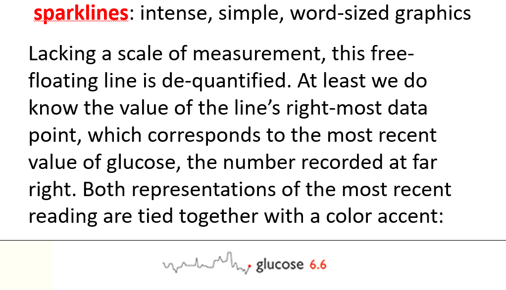

```{r set-options, echo=FALSE, cache=FALSE}
knitr::opts_chunk$set(comment=NA)
options(width = 60)
```

## Sources for Today's Material include

- Howard Wainer *Visual Revelations*
- Andrew Gelman and `andrewgelman.com`
- Christopher Gandrud and his book *Reproducible Research with R and R Studio*
- Karl Broman *Creating Effective Figures and Tables* at tinyurl.com/graphs2017
- Edward Tufte and `edwardtufte.com`
- http://www.datavis.ca/gallery/index.php
- https://www.boredpanda.com/world-war-2-aircraft-survivorship-bias-abraham-wald/
- plus [this link to financialgazette.co/zw](https://www.financialgazette.co.zw/survivorship-bias-how-data-driven-decisions-can-be-wrong/ww2-survivorship-bias-560x333/)


# The Abraham Wald Story

---


---


---


## Presenting Research

- Usually, this is highly abridged
  - Slide shows
  - Abstracts
  - Journal articles
  - Books
  - Websites

Your job is usually to announce the findings and try to convince us that the results are correct.

---


## You Have Ten Minutes?

- No time for subtlety.
- Round, a lot.
- Edit, ruthlessly.
  - One pass through software ("default options") is never enough.
  - Better for people to leave the table hungry than stuffed.
- Have something to say, and say it clearly.
- Some possibilities are never a good choice.


## Stay Away from the Pie!


## Stay Away from the Pie!


## Not that bars are always better


## Not that bars are always better


## What's Wrong With This Picture?


---


## Clearly Communicating Quantitative Information

- Are the most important elements or relationships visually most prominent?
- Are the elements, symbol shapes and colors consistent with their use in previous graphs?
- Are all of the graphical elements necessary to convey the relationships?
- Are the graphical elements accurately positioned and scaled?

Source: http://www.datavis.ca/gallery/index.php

## What are you trying to do?

- Is this **information visualization** (grabby, visually striking - dramatize the problem to draw the casual viewer in deeper) 
- Or **statistical graphics** (reveal patterns and discrepancies for viewers who are already interested in the problem)

Make tradeoffs carefully - meaningful choices.

## from Karl Broman (tinyurl.com/graphs2017)


---


---


---


## You Have Ten Minutes?

- No time for subtlety.
- Round, a lot.
- Edit, ruthlessly.
  - One pass through software ("default options") is never enough.
  - Better for people to leave the table hungry than stuffed.
- Have something to say, and say it clearly.
- Stay away from the pie.


# Data Visualization: Napoleon's Russian Campaign

## Wainer: Chapter 4 of *Visual Revelations*


## The History

It's 1812.

- Napoleon has most of Europe (outside of the United Kingdom) under his control.
- But he cannot break through the defenses of the U.K., so he decides to place an embargo on them.
- The Russian Czar, Alexander, refuses to participate in the embargo.

So Napoleon gathers a massive army of over 400,000 to attack Russia in June 1812.

- Meanwhile, Russia has a plan. As Napoleon's troops advance, the Russian troops burn everything they pass.

## Charles Minard's original map

Napoleon's disastrous Russian Campaign of 1812


## Wainer: Chapter 4 [b]


## A Modern Redrawing of Minard's Original Map


Source: By I$\~n$igo Lopez - Own work, CC BY-SA 4.0, at [\textcolor{blue}{this link}](https://commons.wikimedia.org/w/index.php?curid=39955031)

## What are we looking at?

- The numbers of Napoleon's troops by location (longitude)
    + Organized by group (at one point they divided into three groups) and direction (advance, then retreat)
- The path that his troops took to Moscow and back again
- The temperature experienced by his troops when winter settled in on the return trip
- Historical context, as shown in the passage of time
- Geography (for example, river crossings)


## Wainer: Chapter 4 [c]


# I'll spare you that next example in favor of showing you some of the work of Edward Tufte.

--- 


---


## Slopegraphs!


---


---


---


---



---


---


---


# Do as I do? (Better Health Partnership work)

---


---


---


