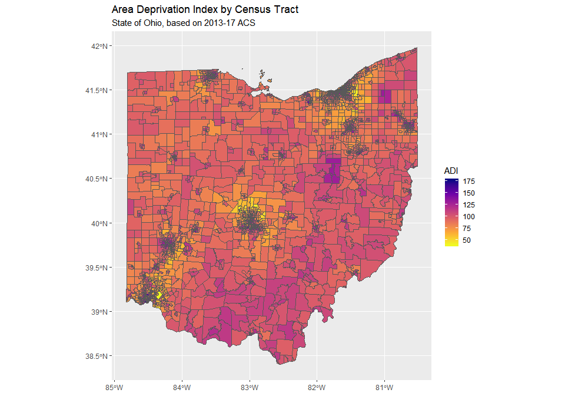
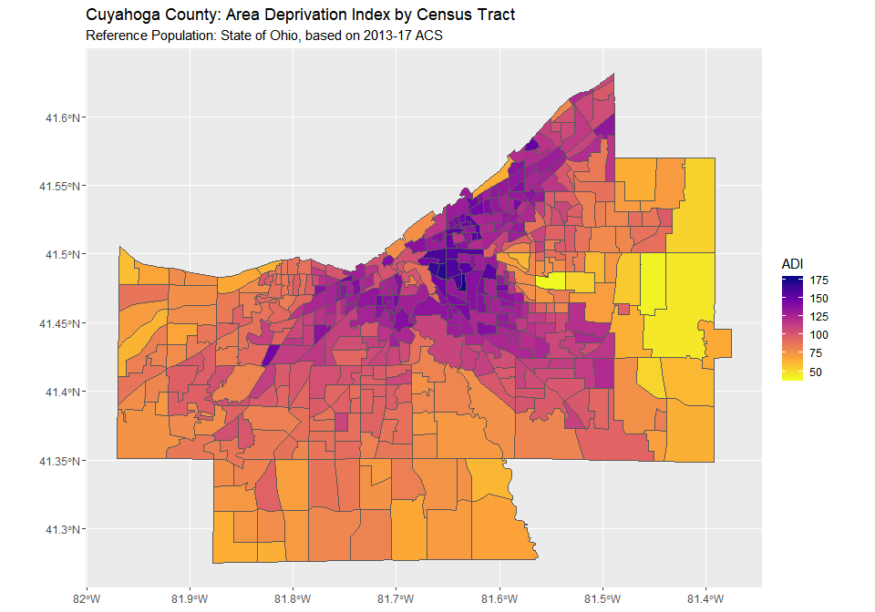

Using Sociome: Ohio ADI by Census Tract
================
Thomas E. Love
2019-04-22

``` r
library(sociome)
library(tidycensus)
library(tidyverse)
```

``` r
set.seed(20190425)
ohio_adi <- get_adi(geography = "tract", 
                        state = "OH")
```

    Getting data from the 2013-2017 5-year ACS

``` 

Single imputation performed
```

``` r
ohio_adi_table <- get_adi(geography = "tract",
                          state = "OH",
                          geometry = FALSE)
```

    Getting data from the 2013-2017 5-year ACS

``` 

Single imputation performed
```

``` r
ohio_adi %>%
    ggplot() +
    geom_sf(aes(fill = ADI), lwd = 0) +
    scale_fill_viridis_c(option = "plasma", direction = -1) + 
    labs(title = "Area Deprivation Index by Census Tract",
         subtitle = "State of Ohio, based on 2013-17 ACS")
```

<!-- -->

``` r
ohio_adi %>%
    filter(substr(GEOID, 1, 5) == "39035") %>% # Cuyahoga County
    ggplot() +
    geom_sf(aes(fill = ADI), lwd = 0) +
    scale_fill_viridis_c(option = "plasma", direction = -1) + 
    labs(title = "Cuyahoga County: Area Deprivation Index by Census Tract",
         subtitle = "Reference Population: State of Ohio, based on 2013-17 ACS")
```

<!-- -->

``` r
cuy_adi <- ohio_adi %>%
    filter(substr(GEOID, 1, 5) == "39035")

cuy_adi_table <- cuy_adi %>% 
    select(GEOID, NAME, ADI)

cuy_adi_table
```

    Simple feature collection with 447 features and 3 fields (with 1 geometry empty)
    geometry type:  MULTIPOLYGON
    dimension:      XY
    bbox:           xmin: -81.97126 ymin: 41.27504 xmax: -81.37477 ymax: 41.63135
    epsg (SRID):    4269
    proj4string:    +proj=longlat +datum=NAD83 +no_defs
    First 10 features:
             GEOID                                        NAME       ADI
    1  39035132200    Census Tract 1322, Cuyahoga County, Ohio  99.83771
    2  39035102102 Census Tract 1021.02, Cuyahoga County, Ohio 118.78214
    3  39035102800    Census Tract 1028, Cuyahoga County, Ohio 143.75370
    4  39035103500    Census Tract 1035, Cuyahoga County, Ohio 102.77723
    5  39035104400    Census Tract 1044, Cuyahoga County, Ohio 111.91846
    6  39035115700    Census Tract 1157, Cuyahoga County, Ohio 130.41671
    7  39035115800    Census Tract 1158, Cuyahoga County, Ohio 129.91256
    8  39035116400    Census Tract 1164, Cuyahoga County, Ohio 144.92224
    9  39035116800    Census Tract 1168, Cuyahoga County, Ohio 125.79163
    10 39035117102 Census Tract 1171.02, Cuyahoga County, Ohio 137.31384
                             geometry
    1  MULTIPOLYGON (((-81.53701 4...
    2  MULTIPOLYGON (((-81.76904 4...
    3  MULTIPOLYGON (((-81.72002 4...
    4  MULTIPOLYGON (((-81.73015 4...
    5  MULTIPOLYGON (((-81.69582 4...
    6  MULTIPOLYGON (((-81.65084 4...
    7  MULTIPOLYGON (((-81.63877 4...
    8  MULTIPOLYGON (((-81.62758 4...
    9  MULTIPOLYGON (((-81.60102 4...
    10 MULTIPOLYGON (((-81.59149 4...

``` r
ohio_loadings <- attr(ohio_adi, "loadings")
ohio_load <- tibble(factor = names(ohio_loadings), loadings = ohio_loadings)

ohio_load
```

    # A tibble: 15 x 2
       factor                                        loadings
       <chr>                                            <dbl>
     1 medianHouseholdIncome                           -0.911
     2 medianMortgage                                  -0.763
     3 medianRent                                      -0.636
     4 medianHouseValue                                -0.794
     5 pctFamiliesInPoverty                             0.868
     6 pctOwnerOccupiedHousing                         -0.727
     7 ratioThoseMakingUnder10kToThoseMakingOver50k     0.902
     8 pctPeopleLivingBelow150PctFederalPovertyLevel    0.931
     9 pctChildrenInSingleParentHouseholds              0.808
    10 pctHouseholdsWithNoVehicle                       0.780
    11 pctPeopleWithWhiteCollarJobs                    -0.759
    12 pctPeopleUnemployed                              0.730
    13 pctPeopleWithAtLeastHSEducation                 -0.797
    14 pctPeopleWithLessThan9thGradeEducation           0.451
    15 pctHouseholdsWithOverOnePersonPerRoom            0.372

``` r
write_csv(cuy_adi_table, "cuy_adi_table.csv")

write_csv(ohio_load, "ohio_loadings.csv")
```
