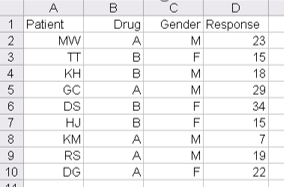

```{r, echo=FALSE, cache=FALSE, message=FALSE}
knitr::opts_chunk$set(comment=NA)
```

## Load R packages

```{r, message = FALSE}
library(Hmisc)
library(Epi)
library(car)
library(naniar)
library(simputation)
library(broom)
library(magrittr); library(janitor); library(here)
library(tidyverse)

theme_set(theme_bw()) # I like the theme_bw() theme for my plots
```

## Read in Three Data Sets

```{r, message = FALSE}
dm401 <- read_csv(here("data", "dm401.csv")) %>%
    type.convert() # converts characters to factors

demodata <- read_csv(here("data", "demodata.csv")) %>%
    type.convert() # converts characters to factors

sep <- read_csv(here("data", "sep.csv")) %>%
    type.convert() # converts characters to factors
```


---

> It is an odd feeling when you love what you do and everyone else seems to hate it. I get to peer into lists of numbers and tease out knowledge that can help people live longer, healthier lives. But if I tell friends I get a kick out of statistics, they inch away as if I have a communicable disease.

> -- Andrew Vickers *What is a P Value, Anyway?*

# Some Opening Thoughts

My goals in this document are to help catalyze your efforts towards ... 

1. Applying statistical methods in evaluating clinical or public health interventions without the use of a , emphasizing activities that might be plausible in a real research project
2. Using the R statistical programming language (free at cran.case.edu) and the R Studio interface (free at rstudio.com) and R Markdown to obtain statistical results for comparison and simple modeling given some data.

This material provides some insight into...

- Gathering, managing and describing data
- How to think about collecting some data
- How to get data into the infernal machine
- How to get some useful graphs/other stuff out of it
- How to fit multiple regression and logistic regression models in R

In fact, though, statistical thinking is about a lot more than this. At the very least, it's about

- planning the study, 
- collecting then cleaning the data, 
- analyzing the results, 
- interpreting the analyses and 
- presenting the study.

**Statistics is far too important to be left to statisticians!**

# Getting R and R Studio onto your computer

See the software page on our web site for some detailed instructions on getting R and R Studio onto your computer. Some tips for using RStudio and, in particular, R Markdown are in the last section of this document.

# Getting Data into R from Excel or another Software Package: The Fundamentals

The easiest way to get data from another software package into R is to save the file (from within the other software package) in a form that R can read.  What you want is to end up with an Excel file that looks like this...



The variable names are in the first row, and the data are in the remaining rows (2-10 in this small example). Categorical variables are most easily indicated by letters (drug A or B, for instance) while continuous variables, like response, are indicated by numbers. Leave missing cells blank or use the symbol `NA`, rather than indicating them with, say, -99.

Within Excel, this file can be saved as a `.csv` (comma-separated text file) or just as an Excel .XLS file, and then imported directly into R, via RStudio by clicking Import Dataset under the Workspace tab, then selecting From Text File. If you've saved the file in Excel as a `.csv` file, RStudio will generally make correct guesses about how to import the file.  Once imported, you just need to save the workspace when you quit RStudio and you'll avoid the need to re-import.

# Describing a Diabetes Pilot Study

Consider the `dm401` data set, which provides (hypothetical) pilot demographic and clinical information for 146 continuity diabetic patients in a large metropolitan health system. The `dm401.csv` file's first ten observations are shown below.


```{r}
dm401

summary(dm401)
```

### A Bare Bones Data Dictionary

All measures are as of the date of study entry. We have:

- insurance `payer` in four categories
- level of hemoglobin `a1c`
- `ldl` cholesterol
- `sbp` is systolic blood pressure
- `pnvax` indicates a recorded pneumococcal vaccine at any time prior to study entry 
- `age` is in years
- `bmi` is body mass index
- `raceeth` is race/ethnicity in three categories
- `female` indicates gender
- `smoking` status (self-report of non-smoker or current smoker at study entry)
- `eyexm` indicates whether an eye examination is recorded in the past 12 months.

```{r}
str(dm401)
```

## Task 1: Cleaning the Data

We'll begin with some elementary cleaning. Is there any missingness in the data?  Do we have any unrealistic values in the data elements?  Do range checks pan out?

```{r}
Hmisc::describe(dm401)
```


## Task 2: Is there an important difference in BMI by gender?

I'll start here by re-creating the `bootdif` function, useful for building bootstrap confidence intervals for the population mean difference using independent samples.

```{r bootdif function}
`bootdif` <-
  function(y, g, conf.level=0.95, B.reps = 2000) {
    require(Hmisc)
    lowq = (1 - conf.level)/2
    g <- as.factor(g)
    a <- attr(smean.cl.boot(y[g==levels(g)[1]], B=B.reps, reps=TRUE),'reps')
    b <- attr(smean.cl.boot(y[g==levels(g)[2]], B=B.reps, reps=TRUE),'reps')
    meandif <- diff(tapply(y, g, mean, na.rm=TRUE))
    a.b <- quantile(b-a, c(lowq,1-lowq))
    res <- c(meandif, a.b)
    names(res) <- c('Mean Difference',lowq, 1-lowq)
    res
  }
```

Let's consider a boxplot of the data.

```{r}
ggplot(dm401, aes(x = female, y = bmi, fill = female)) +
    geom_boxplot() +
    coord_flip() +
    labs(x = "Subject is Female?", 
         y = "Body Mass Index",
         title = "Task 2, dm401 Example")
```

Now, we'll run some numerical comparisons, to obtain uncertainty intervals for the difference in average BMI across the two groups...

```{r}
dm401 %>% group_by(female) %>%
    summarize(n = n(), mean(bmi), median(bmi), sd(bmi))

dm401 %$%
  mosaic::favstats(bmi ~ female)


dm401 %$% t.test(bmi ~ female)
dm401 %$% bootdif(bmi, female)
```

## Task 3: Are the compliance measures (smoking status and eye exam) strongly correlated?

I'll start by re-creating the `twobytwo` function for performing detailed analyses of 2x2 tables.

```{r twobytwo function}
`twobytwo` <-
  function(a,b,c,d, namer1 = "Row1", namer2 = "Row2", namec1 = "Col1", namec2 = "Col2")
    # build 2 by 2 table and run Epi library's twoby2 command to summarize
    # from the row-by-row counts in a cross-tab
    # upper left cell is a, upper right is b, lower left is c, lower right is d
    # names are then given in order down the rows then across the columns
    # use standard epidemiological format - outcomes in columns, treatments in rows
  {
    require(Epi)
    .Table <- matrix(c(a, b, c, d), 2, 2, byrow=T, 
                     dimnames=list(c(namer1, namer2), c(namec1, namec2)))
    twoby2(.Table)
  }
```

```{r}
dm401 %>%
    tabyl(smoking, eyexm)
```

I'd rather change the ordering of the levels of those factors so that the table yielded Non-Smokers with Eye Exams in the top left.

```{r}
dm401 <- dm401 %>%
    mutate(eyexm = fct_relevel(eyexm, "yes", "no"))

dm401 %>%
    tabyl(smoking, eyexm)
```

That's better. Now we can use our `twobytwo` function if we like to obtain uncertainty intervals...

```{r}
twobytwo(33, 73, 8, 32, "Non-Smoker", "Smoker", "Eye Exam", "No Eye Exam")
```

Another option would be:

```{r}
dm401 %$% table(smoking, eyexm) %>% Epi::twoby2()
```

## Task 4: Is insurance status related to pneumovax?

```{r task4 table dm401}
dm401 %$% table(insurance, pnvax)

dm401 %$% table(insurance, pnvax) %>% chisq.test()
```

## Task 5: Is systolic blood pressure related to age? Is this a linear relationship?

```{r}
ggplot(dm401, aes(x = age, y = sbp)) +
    geom_point() +
    geom_smooth(method = "lm", col = "red") +
    geom_smooth(method = "loess", se = FALSE, col = "blue") +
    labs(title = "Task 5, dm401 data")

m5 <- lm(sbp ~ age, data = dm401)
summary(m5)
```

## Task 6: Is hemoglobin A1c linearly related to LDL cholesterol (treating A1c as the outcome?)

```{r}
ggplot(dm401, aes(x = ldl, y = a1c)) +
    geom_point() +
    geom_smooth(method = "lm", col = "red") +
    geom_smooth(method = "loess", se = FALSE, col = "blue") +
    labs(title = "Task 6, dm401 data")

m6 <- lm(a1c ~ ldl, data = dm401)
summary(m6)
```


## Task 7: What can we say about the relationships of insurance and race (separately and together) on A1c? Should we consider collapsing the smallest ``race/ethnicity'' category?

```{r}
summary(lm(a1c ~ insurance, data = dm401))
summary(lm(a1c ~ raceeth, data = dm401))
summary(lm(a1c ~ insurance + raceeth, data = dm401))

dm401 %>% tabyl(raceeth)

summary(lm(a1c ~ raceeth=="White", data = dm401))
summary(lm(a1c ~ insurance + (raceeth=="White"), data = dm401))
summary(lm(a1c ~ insurance * (raceeth=="White"), data = dm401))
```

## Task 8: How does the impact of insurance (ignoring race/ethnicity) on A1c change if we adjust A1c for the effect of LDL?

```{r}
summary(lm(a1c ~ insurance, data = dm401))

summary(lm(a1c ~ insurance + ldl, data = dm401))
```

## Task 9: Build a kitchen sink model to predict A1c using main effects of the other ten variables as predictors. Then use the step function to identify a subset model for further analysis.

```{r}
summary(lm(a1c ~ ldl + sbp + insurance + eyexm + pnvax + age + bmi + raceeth + female + smoking, data = dm401))
step(lm(a1c ~ ldl + sbp + insurance + eyexm + pnvax + age + bmi + raceeth + female + smoking, data = dm401))
```

## Task 10: Does the smaller model produced by the stepwise analysis above look like a useful partition of the original set of predictors? Evaluate this by looking at significance tests, but also model summary statistics.

```{r}
summary(lm(a1c ~ ldl + insurance + eyexm, data = dm401))
summary(lm(a1c ~ ldl + sbp + insurance + eyexm + pnvax + age + bmi + raceeth + female + smoking, data = dm401))
```

# The SEPSIS and Ibuprofen Study: A Logistic Regression Example

> This example is drawn from Dupont WD Statistical Modeling for Biomedical Researchers, Cambridge University Press, 2002: 1st Edition, Exercise 4.25. 
> The original study was Bernard GR et al. (1997) The effects of ibuprofen on the physiology and survival of patients with sepsis. The Ibuprofen in Sepsis Study Group. N Engl J Med 336: 912-918.

## The Data Set

We're going to look now at 30-day mortality in a sample of 350 septic patients as a function of 

- receiving either ibuprofen or placebo treatment, 
- their race (white or African-American), 
- and their baseline APACHE (Acute Physiology and Chronic Health Evaluation) score.

APACHE score is a composite measure of the patient's degree of morbidity collected just prior to recruitment into the study, and is highly correlated with survival. 

```{r}
summary(sep)
```

Note that `death30d` = 0 if patient was alive 30 days after study entry, 1 if patient was dead 30 days after study entry. 

We will estimate a **logistic regression model** to predict the probability of death at 30 days on the basis of these predictors. Overall, 39.14% were dead 30 days after study entry. 

## Is Death Rate related to APACHE scores?

```{r sep plot1}
ggplot(sep, aes(x = factor(death30d), y = apache)) + 
  geom_boxplot() + 
  labs(x = "Death in 30 days? (1 = yes, 0 = no)")
```

```{r}
sep %$%
  mosaic::favstats(apache ~ death30d)
```

It looks like higher APACHE scores (on average) are associated with 30-day mortality. Is this significant? Well, we could do a t test, or the regression equivalent, using APACHE as the outcome variable ...

```{r}
summary(lm(apache ~ death30d, data = sep))
```

But that's backwards: death at 30 days is the *outcome* here, not a predictor. We need a regression model that predicts the probability of death! But, as we can see in the plot below, a straight line regression model won't predict `death30d` from `apache` well at all.

```{r}
ggplot(sep, aes(x = apache, y = death30d)) +
  geom_point() +
  geom_smooth(method = "lm", col = "red", se = FALSE) +
  labs(title = "Predicting death30d using apache",
       subtitle = "The Linear Probability Model")

```


## The Logistic Regression Model

We will develop a logistic regression model to predict prob(x) = the probability that a patient with apache score x will die. In logistic regression, we fit probability functions of the form $prob(x)=exp[a+bx]/(1+exp[a+bx])$, where a and b are unknown parameters (regression coefficients) that we will estimate from the data. So we have the logistic probability function

$$ prob(x) = \frac{exp[a+bx]}{1+exp[a+bx]} $$

This describes a family of curves appropriate for estimating probabilities on a 0-1 scale...


- The two solid curves (in blue and red) have the same value of the $b$ parameter, which gives identical slopes. 
- The different values of the $a$ parameter shift the red curve to the right of the blue curve. 
- The slopes of these curves increase as $b$ gets larger. 
- The magnitude of $b$ determined how quickly prob(x) rises from 0 to 1. 
- For a given $b$, $a$ controls where the 50% survival point is located. 
- Specifically, when $x = -a/b$, it turns out that prob(x) = 0.5, so, for instance, in our blue curve, prob(x) = 0.5 when x = 4/.4 = 10.

We can represent the probabilities in terms of their log odds, using the **logit function**:

$$ logit(prob(x)) = log \frac{(prob(x))}{(1-prob(x))} = a + bx $$

which works from any prob(x) between 0 and 1, where $a$ and $b$ are the regression coefficients for R to estimate, and the right-hand side is called the **linear predictor**. 

## Fitting a Logistic Regression Model

We wish to choose the best curve to fit our data. To do this, we inform R about our binary response variable (`death30d`, which is 1 for dead, 0 for alive), our predictor variable (`apache` score) and our desired regression function (the `logit`), as follows:

```{r sep fitting logistic model}
sep_m1 <- glm(death30d ~ apache, 
              family = binomial(), data = sep)

summary(sep_m1)
```

The logistic regression procedure estimates the two key parameters of the logistic probability function.

- Our intercept $a$ is estimated to be -2.27, and 
- Our slope $b$ for APACHE score is estimated to be 0.113, as can be seen in the coefficient estimates. 

So the fitted prediction model for the probability of death by 30 days based on APACHE score is...

$$ prob(x) = \frac{exp(a + bx)}{1 + exp(a + bx)} = \frac{exp(-2.27 + 0.113 apache)}{1 + exp(-2.27 + 0.113 apache)} $$

and we also know that the linear predictor is:

$$ logit(prob(x)) = log \frac{prob(x)}{1 - prob(x)} = a + bx = -2.27 + 0.113 apache. $$

## Using the Fitted Logistic Regression Model To Make Predictions

We have 350 observations in the `sep` data, and five variables.

```{r sep}
dim(sep)
```

The first patient in the data set, shown below, had an APACHE score of 27, and the second has a score of 14.

```{r first patient}
sep %>% slice(1:2)
```

While we know that patient 1 died, based on their APACHE score and our model, what was their estimated probability of 30-day mortality?

- The linear predictor for patient 1 must be $-2.27 + 0.113 (27)$, or `r -2.27 + 0.113*27`.
- To get to a predicted probability, we'll need to exponentiate that result: 

$exp(-2.27 + 0.113 (27)) = exp(.781)$ or `r round(exp(-2.27 + 0.113*27),3)`

- And the logistic probabilty function yields:

$$prob(x) = \frac{exp(-2.27 + 0.113 apache)}{1 + exp(-2.27 + 0.113 apache)} = \frac{2.184}{1 + 2.184}$$ = `r round(2.184/3.184,2)` 

Similarly, the second patient has an APACHE score of 14. We can calculate their estimated 30-day mortality risk as follows:

- Linear predictor is -2.27 + 0.113 (14) = `r -2.27 + 0.113 * 14`
- Exponentiating, we get exp(-0.688) = `r round(exp(-2.27 + 0.113 * 14),4)`
- And so the probability of death by 30 days is 0.5026/(1 + 0.5026) = `r round(0.5026 / 1.5026, 2)`

The good news is that R will calculate these probabilities for you.

```{r}
fitted(sep_m1)[1:2]
```

Or, we can use the `augment` function from the `broom` package to get even more information...

```{r}
augment(sep_m1, type.predict = "response") %>% slice(1:2)
```

To get the linear predictions, we can use either:

```{r}
augment(sep_m1) %>% slice(1:2) # on linear scale
```

or

```{r}
sep_m1$linear.predictors[1:2]
```

## Interpreting the Logistic Regression Model Summary

Returning to our fitted model, we are left to interpret the remaining logistic regression output.

```{r}
summary(sep_m1)
```

We interpret the coefficients in terms of log odds, or (after exponentiating) as odds ratios.

- For instance, an increase of 1 point in APACHE score is associated with an increase of 0.113 in the log odds of 30-day mortality.
- Or, we can exponentiate the coefficient (i.e. calculate $exp[0.113] = 1.12$) which is interpreted as the odds ratio comparing the odds of death for a patient with APACHE score = x + 1 to the odds of death for a patient with APACHE score = x. 
- In general, $exp(x)$ is the odds ratio for the outcome (here, death) associated with a one-unit increase in x. 
- A property of logistic regression is that this ratio remains constant for all values of x. So in this case, an increase of one point in the APACHE score is associated with an increase by a factor of 1.12 in the odds of death.

Our *p* value is `2.39e-10` (or 2.39 x 10^{-10}, i.e. a very, very small number) for APACHE, indicating (according, technically, to a Wald test) that the APACHE score has statistically significant predictive value (at usual $\alpha$ levels) for 30-day mortality risk. 

- As in simple linear regression, our null hypothesis here is that the predictor is of no help in predicting the outcome, and our alternative is that the predictor is of statistically significant help. 
- Note that, as in simple linear regression, we generally don't interpret the *p* value associated with the intercept term, since we will by default include it in our logistic regression modeling.

## The Analysis of Deviance 

We'll skip the rest of the output here. To assess whether the model (overall) has a statistically significant effect, we can run an Analysis of Deviance table as follows (note that Anova must be capitalized here, and is part of the `car` library)...

```{r}
sep_m1 %$% car::Anova(., type="II")
```

This table provides a *p* value for the improvement in the deviance statistic due to the inclusion of apache score in the model, and is in that sense somewhat comparable to an overall ANOVA F test in linear regression. Here, again, the impact is statistically significant.

# Logistic Regression with Multiple Predictors

Now, suppose we consider including additional information beyond the APACHE score, starting by including the treatment received by the patient. Does adding the treatment statistically significantly improve the quality of the predictions we make?

```{r }
sep_m2 <- glm(death30d ~ apache + treatment, 
              family=binomial(), data = sep)

summary(sep_m2)
```

It looks like the main effect of `treatment` doesn't add statistically significant predictive value (Wald test *p* = 0.248) to the model with APACHE score. What is we add `race` as well?

```{r}
sep_m3 <- glm(death30d ~ apache + treatment + race, 
              family=binomial(), data = sep)

summary(sep_m3)
```

## Making Predictions

We can calculate the fitted probabilities or the linear predictors for the first two patients, using this model, as follows.

```{r}
augment(sep_m3, type.predict = "response") %>% slice(1:2)
augment(sep_m3) %>% slice(1:2) # on linear scale
```

We can also calculate the fitted probabilities and linear predictors associated with the first two patients, using the following.

```{r}
sep_m3$fitted[1:2]
sep_m3$linear.predictors[1:2]
```

# The `demodata` Example: A Data Management Primer

I built a small data set (100 rows, and 18 columns) contained in the `demodata.csv` file. The purpose is to demonstrate ways of importing data of varying types into R in ways that are useful for doing the sorts of analyses you'll do in your projects.

```{r}
str(demodata)
```

## A Quick Summary of the Data, as Initially Imported

```{r}
summary(demodata) ## basic numerical summaries of the eighteen variables
```

# Recoding Continuous Variables, including Time-to-Event and Count Variables

Here are the first 10 rows of the first five variables in the `demodata.csv` file, as they appear in Excel.


Continuous variables are relatively easy to import into R. 

- The `age` variable has no missing values, while `test1`, `test2` and `test3` each contain various ways of representing missing values, indicated by `-999` for `test1`, by `NA` for `test2` and by blank cells (which R converts to NAs) for `test3`. 

When we import the demodata.csv file into R, we'll see from a summary of the first five columns in the data (those are the continuous variables here) that two of these approaches to coding missing data (`NA` and blanks) each work properly, while the use of `-999` causes problems.

After initial import into R, here's what the same part of the `demodata` data frame looks like...

```{r first five vars}
demodata

demodata %>% select(1:5) %>% summary()
## summarizes the first five variables
```

In the `test2` and `test3` cases, we see that R correctly identifies the values `NA` (in the case of `test2`) and ``blank'' (in the case of `test3`) as indicating missingness. 

But, for `test1`, we have a problem, in that R thinks that the code value `-999` is in fact a legitimate value, rather than a placeholder indicating missingness, and includes those values of `-999` when calculating the minimum and other summary statistics. 

So, we need to fix test1 so that it treats the three -999s as missing values. To do this, try the following...

```{r fixing test1}
demodata <- demodata %>%
  mutate(test1 = na_if(test1, -999))

demodata %$% summary(test1)
```

## Imputing Values for the Missing Observations in Continuous Variables

This advice is strictly meant for building a propensity score model, and thus applies to 500 students. For those of you taking 500, here is one potential approach for imputing values for the missing observations in `test1`, `test2` and `test3`. We'll attack this in a different way in 432. The `na.pattern` function is part of the `Hmisc` package.

```{r}
demodata %>% select(test1, test2, test3) %>% na.pattern()
```

For test1 and test2, we have only 3 and 5 missing values, respectively, which is less than 10\% of the data, and less than 20 observations that are missing in each column. Confronted with relatively modest missingness like this, under certain circumstances, like in your class project, I might recommend a simple imputation before including these as covariates in a propensity model.

One option would be to use the random hot deck imputation strategy as implemented in the `simputation` package to accomplish these simple imputations. Note that I'm using the `set.seed()` function here just to guarantee that if I rerun this Markdown file, I'll get the same imputed values.

```{r}
set.seed(500001)

demodata_imp01 <- data.frame(demodata) %>% 
    mutate(test1_imp = test1) %>%
    mutate(test2_imp = test2) %>%
   impute_rhd(., test1_imp ~ 1, pool="univariate") %>%
   impute_rhd(., test2_imp ~ 1, pool="univariate") %>%
  tbl_df()

demodata_imp01 %>% 
  select(test1, test1_imp, test2, test2_imp) %>% summary()
```

On the other hand, for `test3`, we have 57 missing out of 100 values in total. Since this is both more than 20 missing values, and more than 10\% of our data set, my project-specific advice indicates that we should create two new variables:

- one to indicate missingness in `test3`, which I will call `test3.NA` and
- another where we impute the same (I'll use the median) value for each missing observation in `test3`, which I'll call `test3_i` 

```{r}
set.seed(500001)

demodata_imp01 <- demodata %>%
    mutate(test1_imp = test1,
           test2_imp = test2,
           test3_imp = test3,
           test3_NA = 
             as.numeric(is.na(test3)),
           test3_imp = 
             replace_na(test3_imp, 
                        median(test3, na.rm = T))) %>%
  data.frame() %>%
    impute_rhd(., test1_imp ~ 1, pool="univariate") %>%
    impute_rhd(., test2_imp ~ 1, pool="univariate") %>%
  tbl_df()

demodata_imp01 %>% 
  select(test1, test1_imp,
         test2, test2_imp,
         test3, test3_imp, test3_NA) %>% summary()
```

As an alternative, we might consider imputing `test3` more thoroughly, perhaps again with a hot deck...

```{r}
set.seed(500002)

demodata_imp02 <- demodata %>%
    mutate(test1_imp = test1,
           test2_imp = test2,
           test3_imp = test3,
           test3_NA = 
             as.numeric(is.na(test3))) %>%
  data.frame() %>%
   impute_rhd(., test1 ~ 1, pool="univariate") %>%
   impute_rhd(., test2 ~ 1, pool="univariate") %>%
   impute_rhd(., test3 ~ 1, pool="univariate") %>%
  tbl_df()

demodata_imp02 %>% 
  select(test1, test1_imp, test2, test2_imp, 
         test3, test3_imp, test3_NA) %>% summary()
```

In a propensity score setting, we'd use the post-imputation values `test1_imp`, `test2_imp`, and `test3_imp` along with `test3_NA` in our propensity score model to represent the information, while leaving the original variables `test1`, `test2` and `test3` out of the model.

## Creating a Binary Variable from a Continuous one

One more type of recoding is creating a binary or multi-categorical variable from a continuous one. For instance, we might create a binary variable that divides our patients into two groups, based on whether they were above or below the age of, say, 50. Here, I'll make the arbitrary choice to put those with ages equal to 50 into the ``above'' group.

```{r}
demodata <- demodata %>%
  mutate(age_50plus = as.numeric(age >= 50))

demodata %$% 
  mosaic::favstats(age ~ age_50plus) # sanity check on recoding
```

Instead of a 1/0 variable for `age_50plus` we could instead create a factor called `age_cat`.

```{r}
demodata <- demodata %>%
  mutate(age_cat = fct_recode(factor(age >= 50),
                                 Older = "TRUE",
                                 Below50 = "FALSE"))

demodata %$% 
  mosaic::favstats(age ~ age_50plus) # sanity check on recoding
```

## Creating A 4-Category Variable from a Continuous one

Now, what if we wanted to create a four-category factor by age? One approach would be to use the `cut2` function from the `Hmisc` library to select four groups of roughly equal size (these would be quartiles)...

```{r}
demodata <- demodata %>%
  mutate(age_group = cut2(age, g = 4))

demodata %$%
  mosaic::favstats(age ~ age_group)
```

Or, we could pre-specify that we want groups at Up to age 35, then 35 up to 50, and 50 up to 64 and finally 65 or older...

```{r}
demodata <- demodata %>%
  mutate(age_grp = cut2(age, cuts = c(35, 50, 65)))

demodata %$%
  mosaic::favstats(age ~ age_grp)
```

By default, the results of applying the `cut2` function is a single factor that divides the subjects into groups.

# Recoding Binary Categorical Variables

Binary variables can come in many different forms. The easiest thing to deal with is a simple 1-0 numeric variable, where 1 indicates the presence of the characteristic and 0 its absence. But we can see lots of different options. 


- The `histA` variable has Yes and No values, `histB` has 1 for Yes and 2 for No, while `histC` is set up as we'd usually prefer. 
- Then variables `histD` and `histE` have missing values represented by `NA`s and blanks, respectively (which will work smoothly) 
- Yet `histF` has three kinds of missing values: `99` for missing, `88` for no response and `77` for ``don't know.'' We'll assume that all three possibilities should be treated as missing.

When we import the `demodata.csv` file into R, the `NA` and blanks approaches to coding missingness each work properly, but we still have work ahead.

```{r}
demodata %>% 
  select(histA:histF) %>%
  summary()
```

## Creating Factors and 1-0 variables

Most of the time, we're going to want to create both a 1-0 (in standard epidemiological format) and a factor version of a binary variable. The 1-0 version is generally more useful for outcomes, exposures and covariates, but there are times when the factor version is also helpful. So, here's how I might do that.

### Converting `histA`

```{r}
demodata %>% tabyl(histA)
```

For `histA`, we already have a factor variable (Yes/No), but we need to get that into standard epidemiological format (with presence [i.e. Yes] first, and absence [No] second) and I'll label that histA.f, and then we'll also want a 1-0 numeric version, which I'll call `histA`, after I copy the original data to `histA.original`.

```{r}
demodata <- demodata %>%
  mutate(histA_num = as.numeric(histA == "Yes"))

demodata %>% count(histA, histA_num)
```

### Converting `histB`

```{r}
demodata %>% tabyl(histB)
```

For `histB`, we already have a numeric variable, where 1 = Yes, and 2 = No, but we need to get that into 1-0 form, and also build a factor to describe the results in standard epidemiological format. To do so, use the following:

```{r}
demodata <- demodata %>%
  mutate(histB_original = histB,
         histB_num = 2 - histB,
         histB_fac = fct_recode(factor(histB == "1"),
                                Yes = "TRUE",
                                No = "FALSE"))

demodata %>% count(histB_original, histB_num, histB_fac)
```

### Converting `histC`

```{r}
demodata %>% tabyl(histC)
```

For `histC`, we already have a numeric variable, where 1 = Yes, and 0 = No, so that's great, and all we need is to also build a factor to describe the results in standard epidemiological format. To do so, use the following:

```{r}
demodata <- demodata %>%
  mutate(histC_fac = fct_recode(factor(histC == "1"),
                                Yes = "TRUE",
                                No = "FALSE"))

demodata %>% count(histC_fac, histC)
```

If for some reason we wanted to rearrange the levels of the factor to (Yes, No) instead of (No, Yes) we would use `fct_relevel` to do so. 

```{r}
demodata <- demodata %>%
  mutate(histC_fac = fct_recode(factor(histC == "1"),
                                Yes = "TRUE",
                                No = "FALSE"),
         histC_fac2 = fct_relevel(histC_fac, "Yes"))

demodata %>% tabyl(histC_fac)

demodata %>% tabyl(histC_fac2)
```

## Dealing with Missingness in Binary Data

Now, we'll deal with missingness, in binary data, as shown in `histD`, `histE` and `histF`. Again, this advice is strictly meant for building a propensity score model, and thus applies only to students working on project or assignments for 500.

```{r}
demodata %>% select(histD, histE, histF) %>% na.pattern()
```

### Imputation for `histD` for building a propensity model.

```{r}
demodata %>% tabyl(histD)
```

In `histD`, we have a 1-0 numeric variable, and R recognizes 6 missing values. To use this as a covariate, we'll first impute (simply) the 6 missing values, since we have less than 20 missing values (and less than 10% of our data missing, for that matter.)

```{r}
set.seed(500003)

demodata_imp03 <- demodata %>%
  mutate(histD_imp = histD) %>%
  data.frame() %>% 
   impute_rhd(., histD_imp ~ 1, pool="univariate") %>%
  tbl_df()

demodata_imp03 %>% count(histD, histD_imp) 
```

### Working with `histE`

```{r}
demodata %>% tabyl(histE)
```

In `histE`, we again have a 1-0 numeric variable, and R has recognized 27 missing values. To use this as a covariate, we'll create both an indicator of missingness (called `histE_NA`). Then, we'll create a factor called `histE.f` with three levels: Yes, No and Missing. Finally, we'll do a simple imputation of the same value for each of the 27 missing values. 

```{r}
set.seed(500004)

demodata_imp04 <- demodata %>%
    mutate(histE_orig = histE,
           histE_imp = histE,
           histE_na = 
             as.numeric(is.na(histE)),
           histE_fac = 
             fct_recode(factor(histE),
                        Yes = "1", No = "0"),
           histE_fac = 
             fct_explicit_na(histE_fac, 
                             na_level = "Missing")) %>%
  data.frame() %>%
   impute_rhd(., histE_imp ~ 1, pool="univariate") %>%
  tbl_df()
```

```{r}
demodata_imp04 %>% count(histE_orig, histE_na, histE_fac, histE_imp)
```

### Working with `histF`

```{r}
demodata %>% tabyl(histF)
```

In `histF`, we again have a 1-0 numeric variable, but now we have codes `77`, `88` and `99`, all of which we'll take to mean missing values. So, we'll get R to recognize these values as missing in a new variable called `histF_fix`. Then, to use this as a covariate, we'll do a simple imputation (since the missingness rate < 10% and there are less than 20 missing values) into a variable called `histF_imp`. Then, we'll create a factor called `histF_fac` with two levels: Yes and No, based on the imputed values in `histF_imp`.

```{r}
set.seed(500005)

demodata_imp05 <- demodata %>%
    mutate(histF_orig = histF,
           histF_fix = na_if(histF, 77),
           histF_fix = na_if(histF_fix, 88),
           histF_fix = na_if(histF_fix, 99),
           histF_imp = histF_fix) %>%
  data.frame() %>%
    impute_rhd(., histF_imp ~ 1, pool="univariate") %>%
  tbl_df() %>%
    mutate(histF_fac = factor(histF_imp),
           histF_fac = fct_recode(histF_fac, 
                                  Yes = "1",
                                  No = "0"))
```

```{r}
demodata_imp05 %>% count(histF_orig, histF_fix, histF_imp, histF_fac)
```

# Recoding Categorical Variables with More Than Two Categories

There are lots of things we might want to do with a multi-categorical variable, including rearranging its levels, create factors which are labeled properly and appear in a sensible order, create binary 1/0 variables for individual categories, deal with missingness sensibly, and collapse categories. In addition, a multi-categorical variable can be coded originally in several different forms. 


We have five such variables here.

- `race` is coded as 1 = White, 2 = Black, 3 = Asian and 4 = All Other, with no missing values
- `rating` is either Exc, V Good, Good, Fair or Poor. There are 4 missing values, coded by `NA`.
- `return` is either A, B, C, or D. There are 26 missing values, coded in the .csv file by blanks.
- `rotation` is either X, Y or Z. There are 4 missing values, coded in the .csv as ``Unknown''.
- `reason` can take on 12 different values for primary reason why the subject did not go to the doctor. The `reason` variable has no missing values, but we might want to collapse the reasons into three groups, perhaps combining the several reasons pertaining to fear into one category, the reasons related to cost into another category, and reasons related to time into a third category.

```{r}
demodata %>% 
  select(race, rating, return, rotation, reason) %>%
  summary()
```

## Working with `race`

`race` is coded as 1 = White, 2 = Black, 3 = Asian and 4 = Other, with no missing values...

```{r}
demodata %>% tabyl(race)
```

To use race as a covariate, we would want to create a factor...

```{r}
demodata <- demodata %>%
  mutate(race_f = factor(race),
         race_f = 
           fct_recode(factor(race),
                      "White" = "1",
                      "Black" = "2",
                      "Asian" = "3",
                      "Other" = "4"))
```

Here's the sanity check...

```{r}
demodata %>% tabyl(race, race_f)
```

Also, we might need a series of indicator / dummy 1-0 numeric variables, one for each of the four categories of race, although we might only use three of them in modeling.

```{r}
demodata <- demodata %>%
  mutate(race_W = as.numeric(race_f == "White"),
         race_B = as.numeric(race_f == "Black"),
         race_A = as.numeric(race_f == "Asian"),
         race_O = as.numeric(race_f == "Other"))

demodata %>% 
  count(race, race_f, race_W, race_B, race_A, race_O)
```

## Working with `rating`

`rating` is either Exc, V Good, Good, Fair or Poor. There are 4 missing values, coded by `NA`.

```{r}
demodata %>% count(rating)
```

That is a factor, but an annoyingly poor ordering of the variables. We could adjust that...

```{r}
demodata <- demodata %>%
  mutate(rating_f = rating,
         rating_f = 
           fct_relevel(rating_f, 
                       "Exc", "V Good", "Good", "Fair", "Poor"))

demodata %>% tabyl(rating_f)
```

That's a much more meaningful ordering, but we still have four missing values. We could either impute (probably the better choice for your project) or create a new category for Missingness. Given that there are only 4 missing values (much less than 20) I would just impute, simply, as follows...

```{r}
set.seed(500006)
demodata_imp06 <- demodata %>%
  mutate(rating_imp = rating_f) %>%
  data.frame() %>%
    impute_rhd(., rating_imp ~ 1, pool="univariate") %>%
  tbl_df() 

demodata_imp06 %>% count(rating_f, rating_imp)
  
```

And, as before, we could then create a series of indicator variables to represent the various categories.

What if we wanted to compare those with Exc, V Good or Good results to those with Fair or Poor results, in a binary variable? To do that, we could use the following approach:

```{r}
demodata_imp06 <- demodata_imp06 %>%
  mutate(rating_10 = fct_collapse(rating_imp,
                                  High = c("Exc", "V Good", "Good"),
                                  Low = c("Fair", "Poor")))

demodata_imp06 %>% count(rating_10, rating_imp)
```

## Working with `return`

`return` is either A, B, C, or D. There are 26 missing values, coded in the `.csv` file by blanks, which R recognizes as missing.

```{r}
demodata %>% tabyl(return)
```

Imputing here can work as we've done in the past.

```{r}
set.seed(500007)

demodata_imp07 <- demodata %>%
  mutate(return_imp = return) %>%
  data.frame() %>%
    impute_rhd(., return_imp ~ 1, pool="univariate") %>%
  tbl_df() 

demodata_imp07 %>% count(return, return_imp)
  
```

Again, we could then create a series of indicator variables to represent the various categories, should we want them.

## Working with `rotation`

`rotation` is either X, Y or Z. There are 4 missing values, coded in the `.csv` as `"Unknown"`.

```{r}
demodata %>% tabyl(rotation)
```

First, we convert those to NAs, creating `rotation_fix` and then we impute into `rotation_imp`.

```{r}
demodata_imp08 <- demodata %>%
    mutate(rotation_orig = rotation,
           rotation_fix = na_if(rotation_orig, "Unknown"),
           rotation_imp = rotation_fix) %>%
  data.frame() %>%
    impute_rhd(., rotation_imp ~ 1, pool="univariate") %>%
  tbl_df() 
```

```{r}
demodata_imp08 %>% count(rotation_orig, rotation_fix, rotation_imp)
```

Once again, we could create indicator variables to represent the various categories, should we want them.

## Working with `reason`

`reason` can take on 12 different values for primary reason why the subject did not go to the doctor. 

```{r}
demodata %>% tabyl(reason)
```

The `reason` variable has no missing values, but we might want to collapse the reasons into three groups, perhaps combining the several reasons pertaining to fear into one category, the reasons related to cost into another category, and reasons related to time into a third category.

Suppose your desired combination was as follows:

Old Reason (12 categories)          | New Reason (3 categories)
----------------------------------: | :-------------------------:
anxiety, fear, panic, unease, worry | fear
costly, expensive, high priced      | cost
no time, swamped, tied up, too busy | time

So, we'll build a new factor that includes only our three new categories, again using `fct_collapse`...

```{r}
demodata <- demodata %>%
  mutate(reason_3 = 
           fct_collapse(reason, 
                        fear = c("anxiety", "fear", "panic", "unease", "worry"),
                        cost = c("costly", "expensive", "high priced"),
                        time = c("no time", "swamped", "tied up", "too busy")))

demodata %>% count(reason_3, reason)
```

# Date Variables

If you've got a `.csv` file that was built in Excel, there are three likely data formats for dates that you'll see, as demonstrated in the `date1` and `date2` variables. 


Neither import well into R through `read_csv`. 

- `date1` produces an unordered factor, and
- `date2` just produces a set of integers.

```{r dates}
demodata %>% select(date1:date2) %>% str()
```

## The `date` format in Excel yields `date1`

The `date1` approach is obtained using the date format in Excel, and is fine for humans to read, even in R, but R still has no idea how to use it, interpreting it as a factor. The data are provided in month/day/4-digit year format. In order to get R to treat this as a date, we use the following...

```{r}
demodata$date1.fix <- as.Date(demodata$date1, "%m/%d/%Y")
```

The command includes a capital Y since the data include all 4 digits of the year. 

```{r date1 revised}
str(demodata$date1.fix)
summary(demodata$date1.fix)
```

## The `general` format in Excel yields `date2`

For `date2`, which contains **exactly** the same data as `date1`, but using the general format in Excel, R just sees an integer. But what Excel is actually trying to represent is ``days since 12/31/1899'' so that 1 = January 1, 1900. This isn't too useful for a computer or a human, although you can at least calculate differences between two dates in terms of number of days with such an approach. Another problem is that Excel's function for doing this believes that 1900 was a leap year. So, to account for this, we use the following approach to build a date.

```{r reading in date2}
demodata$date2.fix <- as.Date(demodata$date2, origin="1899-12-30")
str(demodata$date2.fix)
summary(demodata$date2.fix)
```


# On Using RStudio and R Markdown

## Use R Studio Projects Whenever You Can

- As the documentation suggests, RStudio Projects make it straightforward to divide your work into multiple contexts, each with their own working directory, workspace, history, and source documents.
- Open R Studio, and either start a new Project (using the File ... New Project menu) or open an existing Project by clicking on the Open Project button at the top right of R Studio. 

## What is R Markdown?

R Markdown is the most useful tool I have. It is...

> an authoring format that enables easy creation of dynamic documents, presentations, and reports from R. It combines the core syntax of markdown (an easy-to-write plain text format) with embedded R code chunks that are run so their output can be included in the final document. R Markdown documents are fully reproducible (they can be automatically regenerated whenever underlying R code or data changes).

Moving from simply writing scripts in R to Markdown files is a short step, and well worth the effort. Within R Studio, you can write R Markdown syntax, run it to see your results, and then produce a final document which looks great, and is completely reproducible. This is a tool you will get a lot of use from in this course, and, I expect, in your future work.

### Learning More about Writing Markdown Files

1. I encourage you to visit the help page linked to directly within R Studio, by clicking on the question mark box in R Studio that appears when you open a Markdown file.
2. To get started, try simply writing your report in plain text. Markdown syntax is used to describe how to format text in the final report, and to embed R code. 
3. To learn more about writing Markdown files, you can look at the examples I'll provide in class (all of my presentations are built using Markdown).
4. R Studio provides [cheat sheets](https://rstudio.com/resources/cheatsheets/) that others have found to be very helpful. They have stuff for R Markdown (including a detailed reference guide), R Studio, Data Wrangling with dplyr and tidyr, Data Visualization, etc.

### Creating an HTML, Word or PDF file

1. An R Markdown file is essentially a text document, with interspersed R code that lets you produce reports that combine narration with results, and that can be easily exported as an HTML, PDF or Word file.
    - Open a new R Markdown file (File ... New File ... R Markdown), or an existing one (File ... Open File), and indicate the desired output type.  
    - R Markdown files use the `.Rmd` extension.
    - Assuming you have Microsoft Office installed on your computer, you should be immediately able to write a Markdown file and render it in either HTML or as a Word document, by creating a Markdown document and then clicking on the Knit HTML or Knit Word button at the top of R Studio.
    - In order to get Markdown to generate a PDF file directly (rather than Word or HTML) you'll want to download an installation of the TeX (TeX is pronounced "tech") software, which builds those relatively pretty documents. I use MacTeX on my Mac, and MikTeX on my PC. This also lets me include LaTeX and TeX commands directly within a Markdown file, which is something you might eventually want to do, and that I did to build this document. 

### Some Specific Tips

1. When using R Markdown, you need to be sure that Markdown is looking for your files in the proper directory. The easiest way for me to do this is to build a separate directory for each new analysis, and open up a new Project in that directory before developing your Markdown code. 
    - The directory being used is almost inevitably the directory in which the Markdown file is stored by RStudio.
    - The `here` package can be [enormously helpful](https://github.com/jennybc/here_here).
2. When writing code in Markdown, you need to name each chunk, and give each chunk a different name. 
    - If you name something `chunkname`, then your next chunk of code needs to be named something different than `chunkname`, like `chunk2`, or whatever. 
    - Good coding practice suggests the use of a name that describes what the chunk of code does. I encourage you to use the underscore to separate words, rather than spaces. 
    - Putting a comma after a chunk name lets you, in addition to naming the chunk, specify commands (after the comma) to R Markdown about what you want it to do with the chunk. Here are a few useful commands, some of which also appear at http://rmarkdown.rstudio.com/authoring_rcodechunks.html:

- **{r chunk01, echo=FALSE}** tells Markdown to execute your code, but simply write the result, rather than the code, into the results file.
- **{r chunk01, eval=FALSE}** tells Markdown to write the code into the results, but not execute the code.
- **{r chunk01, message=FALSE}** tells Markdown to not print any of the messages your code generates.
- **{r chunk01, warning=FALSE}** tells Markdown to not print any of the warnings your code generates.
- **{r chunk01, fig.height=4, fig.width=6}** tells Markdown to keep any figures produced by this chunk to a maximum of 4 inches high, and 6 inches wide. The default values depend on the type of output you are generating. You can use fig.height or fig.width alone if you want to keep the other value at its default.
- **{r chunk01, fig.align=`center`}** tells Markdown to align your figure in the center (other options are left or right.)
- **{r chunk01, tidy=TRUE}** tells Markdown to tidy up your code for presentation, so it will still print, but it will (perhaps) be a bit more organized.

Here's the default header information I use when writing materials for a PDF document with a table of contents...

```
---
title: "Basic R Materials for 432 and 500"
author: "Thomas E. Love"
date: "`r Sys.Date()`"
output:
  pdf_document:
    number_sections: yes
    toc: yes
    toc_depth: 3
fontsize: 12pt
geometry: margin=1in
---
```

To set up R Markdown so it doesn't add any comment symbols before the results, I follow that with this code chunk:

```
knitr::opts_chunk$set(comment=NA)
```

Then I load packages, and data. I usually load `magrittr`, `here`, `janitor` and the `tidyverse` at a minimum.

